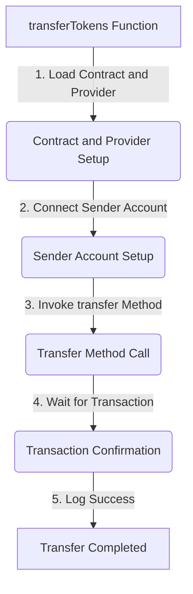

<details>
<summary>Relevant source files</summary>

The following files were used as context for generating this wiki page:

- [scholarship_app/transferTokens.js](https://github.com/agattani123/Fast-Fa/blob/master/scholarship_app/transferTokens.js)

</details>

# Payment Integration

## Introduction

The Payment Integration feature facilitates the transfer of tokens from a scholarship provider to a student recipient within the context of a scholarship management system. It leverages the StarkNet blockchain and utilizes a deployed smart contract to securely execute token transfers.

## Architecture Overview

The Payment Integration functionality is implemented in the `transferTokens.js` file, which imports the necessary modules from the `starknet` library. The key components involved in the token transfer process are:

1. **Contract**: Represents the deployed smart contract on the StarkNet blockchain.
2. **Provider**: Establishes a connection to the StarkNet network (in this case, the Goerli-Alpha testnet).
3. **Account**: Represents the sender's account, which is used to invoke the `transfer` method on the contract.

The overall flow of the token transfer process is as follows:



## Contract and Provider Setup

The `transferTokens` function begins by loading the contract's ABI (Application Binary Interface) from the specified file path (`ABI_PATH`). It then creates a new instance of the `Contract` class, passing the ABI, contract address (`CONTRACT_ADDRESS`), and a `Provider` instance connected to the Goerli-Alpha testnet.

```javascript
const abi = require(ABI_PATH);
const contract = new Contract(abi, CONTRACT_ADDRESS, provider);
```

Sources: [scholarship_app/transferTokens.js:7-9, 13-14]()

## Sender Account Setup

To invoke the `transfer` method on the contract, the sender's account needs to be connected. This is achieved by creating a new instance of the `Contract` class, passing the ABI, contract address, and an object containing the sender's address (`senderAddress`), private key (`senderPrivateKey`), and the `provider` instance.

```javascript
const senderAccount = new Contract(abi, CONTRACT_ADDRESS, {
  address: senderAddress,
  privateKey: senderPrivateKey,
  provider
});
```

Sources: [scholarship_app/transferTokens.js:18-22]()

## Transfer Method Invocation

The `transfer` method is invoked on the `senderAccount` instance, passing the recipient's address (`recipientAddress`) and the amount of tokens to be transferred (`amount`). The `invoke` method returns a promise that resolves with the transaction hash.

```javascript
const { transaction_hash } = await senderAccount.invoke('transfer', [recipientAddress, amount]);
console.log(`Transfer initiated. Transaction hash: ${transaction_hash}`);
```

Sources: [scholarship_app/transferTokens.js:25-26]()

## Transaction Confirmation

After initiating the transfer, the code waits for the transaction to be confirmed on the blockchain by calling the `waitForTransaction` method on the `provider` instance, passing the `transaction_hash`.

```javascript
await provider.waitForTransaction(transaction_hash);
console.log('Transfer completed successfully.');
```

Sources: [scholarship_app/transferTokens.js:29-30]()

## Error Handling

The `transferTokens` function is wrapped in a `try-catch` block to handle any errors that may occur during the token transfer process. If an error occurs, it is logged to the console.

```javascript
try {
  // Token transfer logic...
} catch (error) {
  console.error('Failed to transfer tokens:', error);
}
```

Sources: [scholarship_app/transferTokens.js:16, 32-34]()

## Example Usage

The `transferTokens` function is called with the following parameters:

- `senderPrivateKey`: The private key of the sender's account.
- `senderAddress`: The address of the sender's account.
- `recipientAddress`: The address of the recipient's account.
- `amount`: The amount of tokens to be transferred.

```javascript
const senderPrivateKey = 'SCHOLARSHIP_PRIVATE_KEY';
const senderAddress = 'SCHOLARSHIP_ADDRESS';
const recipientAddress = 'STUDENT_ADDRESS';
const amount = '100';

transferTokens(senderPrivateKey, senderAddress, recipientAddress, amount);
```

Sources: [scholarship_app/transferTokens.js:38-42]()

## Conclusion

The Payment Integration feature provides a secure and reliable mechanism for transferring tokens from a scholarship provider to a student recipient on the StarkNet blockchain. It leverages the deployed smart contract and the StarkNet provider to execute and confirm the token transfer transactions. The `transferTokens` function encapsulates the entire process, handling the necessary setup, invocation, and confirmation steps.