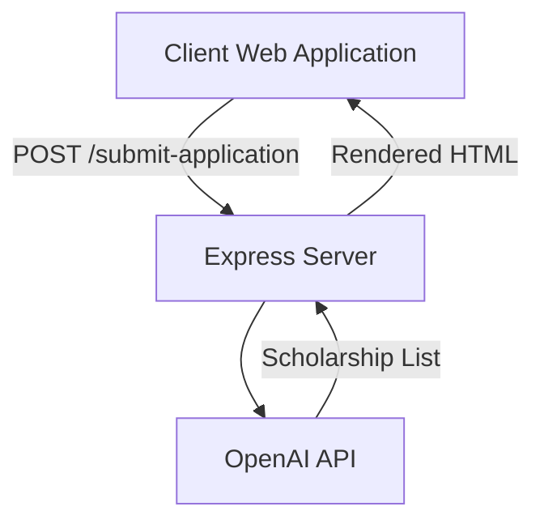
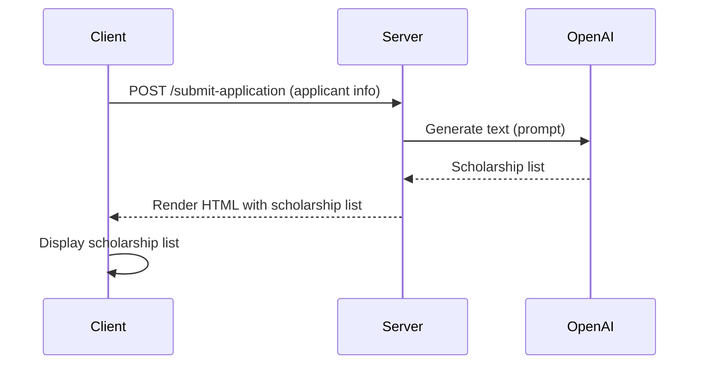

<details>
<summary>Relevant source files</summary>

The following files were used as context for generating this wiki page:

- [scholarship_app/AiHelper.js](https://github.com/agattani123/Fast-Fa/blob/master/scholarship_app/AiHelper.js)
- [scholarship_app/server.js](https://github.com/agattani123/Fast-Fa/blob/master/scholarship_app/server.js)
- [scholarship_app/package.json](https://github.com/agattani123/Fast-Fa/blob/master/scholarship_app/package.json)
- [scholarship_app/public/index.html](https://github.com/agattani123/Fast-Fa/blob/master/scholarship_app/public/index.html)
- [scholarship_app/public/styles.css](https://github.com/agattani123/Fast-Fa/blob/master/scholarship_app/public/styles.css)
</details>

# Scholarship Generation

## Introduction

The "Scholarship Generation" feature is a core component of the scholarship application project. It leverages the OpenAI GPT-4 language model to generate a personalized list of scholarship opportunities tailored to the applicant's specific information and preferences. This feature aims to provide applicants with a curated set of relevant scholarship opportunities, increasing their chances of securing financial aid for their educational pursuits.

Sources: [scholarship_app/server.js:25-42](), [scholarship_app/AiHelper.js:8-26]()

## Architecture Overview

The scholarship generation process follows a client-server architecture, where the client-side (web application) sends a request to the server with the applicant's information. The server then utilizes the OpenAI API to generate a list of scholarship opportunities based on the provided input. The generated list is then returned to the client and rendered on the web page.



Sources: [scholarship_app/server.js:14-16, 29-42, 44-82](), [scholarship_app/AiHelper.js:8-26]()

## Server-side Implementation

The server-side implementation is built using Node.js and the Express.js framework. The main components are:

### Express Server

The Express server handles incoming HTTP requests and responses. It listens for a `POST` request at the `/submit-application` endpoint, which triggers the scholarship generation process.

```javascript
const express = require('express');
const app = express();

app.post('/submit-application', async (req, res) => {
  // Scholarship generation logic
});

app.listen(PORT, () => {
  console.log(`Server running on http://localhost:${PORT}`);
});
```

Sources: [scholarship_app/server.js:3-5, 29-30, 83-85]()

### OpenAI API Integration

The server integrates with the OpenAI API to generate the scholarship list using the GPT-4 language model. The `generateText` function from the `AiHelper` module is used to send the prompt to the OpenAI API and receive the generated text response.

```javascript
const { generateText } = require('./AiHelper');

async function generateScholarshipList(prompt) {
  const output = await generateText(prompt);
  // Process and return the scholarship list
}
```

Sources: [scholarship_app/server.js:25-42](), [scholarship_app/AiHelper.js:8-26]()

### Prompt Generation

The server constructs a prompt based on the applicant's information (e.g., name, financial details) and sends it to the OpenAI API for generating the scholarship list. The prompt includes specific instructions for the desired format and content of the scholarship list.

```javascript
app.post('/submit-application', async (req, res) => {
  const { firstName, lastName, financial_info } = req.body;

  const prompt = `"Take a prompt and give me a list and URLs to specific scholarships that would specifically give me access to opportunities." + 
    // ... (prompt construction logic) ...
    "The prompt is follows: ${financial_info}"`;

  const output = await generateText(prompt);
  // ... (response rendering logic) ...
});
```

Sources: [scholarship_app/server.js:31-42]()

### Response Rendering

The server receives the generated scholarship list from the OpenAI API and renders it as an HTML response. The response includes styling and interactivity elements, such as a gradient background, apply buttons, and navigation buttons.

```javascript
app.post('/submit-application', async (req, res) => {
  // ... (scholarship generation logic) ...

  const modifiedOutput = output.replace(/APPLY/g, `<button class="apply-btn">Apply</button>`);

  res.send(`
    <!DOCTYPE html>
    <html>
    <head>
      <style>
        // ... (CSS styles) ...
      </style>
    </head>
    <body>
      <button class="button-nav home-button" onclick="location.href='index.html';">Home</button>
      <button class="button-nav feedback-button" onclick="window.open('https://forms.gle/2KvT9ztjWGgbKuGX9', '_blank');">Feedback</button>
      <div class="container">
        <h1>we got you, ${firstName} :)</h1>
        <ul class="scholarship-list">${modifiedOutput}</ul>
      </div>
    </body>
    </html>
  `);
});
```

Sources: [scholarship_app/server.js:44-82]()

## Client-side Implementation

The client-side implementation is a web application that interacts with the server to initiate the scholarship generation process and display the results.

### HTML Structure

The main HTML structure consists of a container div where the scholarship list will be rendered. Additionally, there are navigation buttons for the home page and a feedback form.

```html
<body>
  <button class="button-nav home-button" onclick="location.href='index.html';">Home</button>
  <button class="button-nav feedback-button" onclick="window.open('https://forms.gle/2KvT9ztjWGgbKuGX9', '_blank');">Feedback</button>
  <div class="container">
    <!-- Scholarship list will be rendered here -->
  </div>
</body>
```

Sources: [scholarship_app/server.js:62-77](), [scholarship_app/public/index.html]()

### CSS Styling

The CSS styles define the visual appearance of the scholarship list, including background gradients, font styles, and button styles.

```css
body {
  font-family: Arial, sans-serif;
  background: linear-gradient(-45deg, #3d7ec7, #7f91a9, #4b7c86, #ecf0ef);
  background-size: 400% 400%;
  margin: 0;
  padding: 0;
  animation: gradient 10s ease infinite;
  height: 100vh;
  display: flex;
  justify-content: center;
  align-items: center;
  color: #333;
  padding-top: 400px;
}

.container {
  background: white;
  border-radius: 8px;
  padding: 20px;
  max-width: 600px;
  box-shadow: 0 4px 6px rgba(0, 0, 0, 0.1);
  text-align: center;
  margin-top: 400px;
}

.scholarship-list li {
  list-style-type: none;
  background: #f8f8f8;
  margin: 10px 0;
  padding: 15px;
  border-radius: 5px;
  box-shadow: 0 2px 5px rgba(0, 0, 0, 0.1);
  color: midnightblue;
  opacity: 0.75;
}

.apply-btn {
  width: auto;
  padding: 10px 20px;
  background-color: #5b3c88;
  color: white;
  border: none;
  border-radius: 5px;
  cursor: pointer;
  font-size: 16px;
}
```

Sources: [scholarship_app/server.js:47-61](), [scholarship_app/public/styles.css]()

### JavaScript Interactivity

The client-side JavaScript code handles the submission of the application form and the rendering of the scholarship list on the page. It likely includes event listeners and AJAX requests to communicate with the server.

```javascript
// Example client-side code (not provided in the source files)
const form = document.getElementById('application-form');
const scholarshipList = document.getElementById('scholarship-list');

form.addEventListener('submit', async (event) => {
  event.preventDefault();
  const formData = new FormData(form);

  try {
    const response = await fetch('/submit-application', {
      method: 'POST',
      body: formData,
    });

    if (response.ok) {
      const html = await response.text();
      scholarshipList.innerHTML = html;
    } else {
      console.error('Error submitting application');
    }
  } catch (error) {
    console.error('Error:', error);
  }
});
```

Sources: [scholarship_app/public/index.html]() (client-side JavaScript code not provided)

## Sequence Diagram

The following sequence diagram illustrates the flow of the scholarship generation process:



Sources: [scholarship_app/server.js:29-42, 44-82](), [scholarship_app/AiHelper.js:8-26]()

## Key Components and Features

| Component | Description |
| --- | --- |
| Express Server | Handles incoming HTTP requests and responses |
| OpenAI API Integration | Integrates with the OpenAI API for text generation using GPT-4 |
| Prompt Generation | Constructs a prompt based on applicant information for scholarship generation |
| Response Rendering | Renders the generated scholarship list as an HTML response with styling and interactivity |
| Client-side Web Application | Provides a user interface for submitting applications and displaying scholarship lists |

Sources: [scholarship_app/server.js](), [scholarship_app/AiHelper.js](), [scholarship_app/public/index.html](), [scholarship_app/public/styles.css]()

## Conclusion

The "Scholarship Generation" feature leverages the power of OpenAI's GPT-4 language model to provide applicants with a personalized list of scholarship opportunities tailored to their specific information and preferences. By integrating the OpenAI API with a Node.js server and a client-side web application, the system offers a seamless experience for applicants to explore relevant scholarship opportunities and increase their chances of securing financial aid.

Sources: [scholarship_app/server.js](), [scholarship_app/AiHelper.js](), [scholarship_app/public/index.html](), [scholarship_app/public/styles.css]()