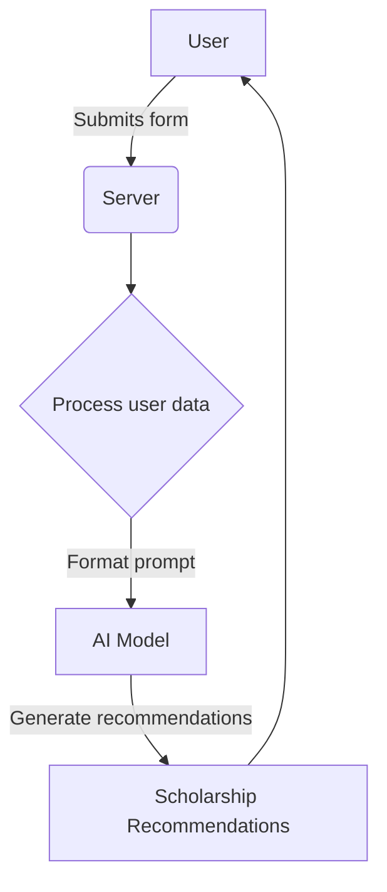

<details>
<summary>Relevant source files</summary>

The following files were used as context for generating this wiki page:

- [scholarship_app/AiHelper.js](https://github.com/agattani123/Fast-Fa/blob/master/scholarship_app/AiHelper.js)
- [scholarship_app/public/form.js](https://github.com/agattani123/Fast-Fa/blob/master/scholarship_app/public/form.js)
- [scholarship_app/public/script.js](https://github.com/agattani123/Fast-Fa/blob/master/scholarship_app/public/script.js)
</details>

# Scholarship Matching

## Introduction

The "Scholarship Matching" feature is a crucial component of the scholarship application project. It aims to assist students in finding and applying for relevant scholarships based on their personal information and financial circumstances. This feature leverages the power of artificial intelligence (AI) to generate personalized scholarship recommendations and potentially automate parts of the application process.

The core functionality of "Scholarship Matching" involves collecting user data through a form, processing the data, and utilizing AI models to generate tailored scholarship suggestions. Additionally, it may provide tools or guidance to streamline the application process for the recommended scholarships.

## User Data Collection

The project includes a form (`scholarshipForm`) for users to input their personal and financial information. This data serves as the basis for the scholarship matching process.

### Form Submission

The form submission process is handled by JavaScript code in two separate files:

1. `scholarship_app/public/form.js`
2. `scholarship_app/public/script.js`

Both files contain event listeners that capture the form submission event and send the form data to a server-side endpoint (`/submit-application`) using the `fetch` API.

```javascript
// scholarship_app/public/form.js
document.getElementById('scholarshipForm').addEventListener('submit', function(event) {
    event.preventDefault();
    const formData = new FormData(this);
    fetch('/submit-application', {
        method: 'POST',
        body: formData
    }).then(response => response.text())
      .then(data => alert(data));
});
```

```javascript
// scholarship_app/public/script.js
document.getElementById('scholarshipForm').addEventListener('submit', function(event) {
    event.preventDefault();

    const firstName = document.querySelector('input[name="firstName"]').value;
    const lastName = document.querySelector('input[name="lastName"]').value;
    const financial_info = document.querySelector('textarea[name="financial_info"]').value;

    fetch('/submit-application', {
        method: 'POST',
        headers: {
            'Content-Type': 'application/json',
        },
        body: JSON.stringify({ firstName, lastName, financial_info }),
    })
    .then(response => response.json())
    .then(data => {
        console.log(data);
    })
    .catch((error) => {
        console.error('Error:', error);
    });
});
```

Sources: [scholarship_app/public/form.js](), [scholarship_app/public/script.js]()

## AI Integration

The project incorporates AI models from OpenAI to assist with various tasks, such as generating text and images. The `AiHelper.js` file contains functions to interact with the OpenAI APIs.

### Text Generation

The `generateText` function sends a user-provided prompt to the OpenAI GPT-4 model and retrieves the generated text response.

```javascript
async function generateText(prompt) {
  const chatUrl = "https://api.openai.com/v1/chat/completions";
  const payload = {
    model: "gpt-4",
    messages: [
      {
        role: "user",
        content: prompt,
      },
    ],
  };

  const data = await fetchFromOpenAI(chatUrl, payload);
  return data.choices[0].message.content;
}
```

Sources: [scholarship_app/AiHelper.js:8-18]()

### Image Generation

The `generateImage` function sends a user-provided prompt to the OpenAI DALL-E 2 model and retrieves the generated image URL.

```javascript
async function generateImage(prompt) {
  const dalleUrl = "https://api.openai.com/v1/images/generations";
  const payload = {
    model: "dall-e-2",
    prompt: prompt,
    n: 1,
    size: "256x256",
  };

  const data = await fetchFromOpenAI(dalleUrl, payload);
  return data.data[0].url;
}
```

Sources: [scholarship_app/AiHelper.js:21-29]()

## Scholarship Matching Process

The scholarship matching process likely involves the following steps:

1. User submits the form with personal and financial information.
2. The server-side application receives the form data.
3. The user's information is processed and formatted into a prompt for the AI model.
4. The AI model (e.g., GPT-4) generates a list of relevant scholarship recommendations based on the prompt.
5. The recommended scholarships are presented to the user, potentially with additional information or guidance for applying.



Sources: [scholarship_app/AiHelper.js](), [scholarship_app/public/form.js](), [scholarship_app/public/script.js]()

## Potential Enhancements

Based on the provided source files, the following enhancements could be considered for the "Scholarship Matching" feature:

1. **Automated Application Assistance**: Leverage the AI models to generate personalized application materials, such as essays or personal statements, based on the user's information and the scholarship requirements.

2. **Scholarship Filtering and Sorting**: Implement filtering and sorting mechanisms to allow users to refine the scholarship recommendations based on criteria like academic performance, extracurricular activities, or financial need.

3. **User Accounts and Tracking**: Introduce user accounts to store and track application progress, allowing users to revisit and update their information over time.

4. **Scholarship Deadline Reminders**: Implement a notification system to remind users of upcoming scholarship deadlines and application due dates.

5. **Integration with External Scholarship Databases**: Explore integrating with external scholarship databases or APIs to expand the pool of available scholarship opportunities.

6. **Scholarship Application Tracking**: Provide a centralized platform for users to track the status of their scholarship applications and receive updates on their progress.

7. **Scholarship Eligibility Verification**: Implement additional checks and validations to ensure users meet the eligibility criteria for the recommended scholarships before applying.

8. **Scholarship Success Rate Tracking**: Collect and analyze data on successful scholarship applications to improve the recommendation algorithms and provide users with insights into their chances of receiving specific scholarships.

Sources: [scholarship_app/AiHelper.js](), [scholarship_app/public/form.js](), [scholarship_app/public/script.js]()

## Conclusion

The "Scholarship Matching" feature leverages AI technology to assist students in finding and applying for relevant scholarships based on their personal and financial information. By integrating with OpenAI models like GPT-4 and DALL-E 2, the project aims to provide personalized scholarship recommendations and potentially automate parts of the application process. While the current implementation focuses on user data collection and AI integration, future enhancements could include automated application assistance, scholarship filtering and sorting, user accounts, deadline reminders, and integration with external scholarship databases.