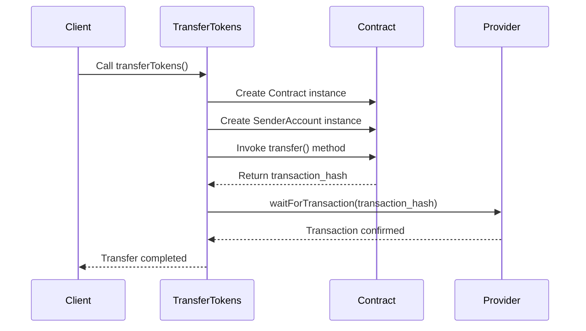

<details>
<summary>Relevant source files</summary>

The following files were used as context for generating this wiki page:

- [scholarship_app/transferTokens.js](https://github.com/agattani123/Fast-Fa/blob/master/scholarship_app/transferTokens.js)

</details>

# Scholarship Payment

## Introduction

The "Scholarship Payment" feature is a crucial component of the project, facilitating the transfer of tokens from a designated scholarship address to student recipients. This functionality enables the seamless distribution of scholarship funds, ensuring that eligible students receive their entitled token amounts. The feature leverages the StarkNet ecosystem, a decentralized and permissionless Layer 2 blockchain solution, to execute secure and efficient token transfers.

## Architecture Overview

The "Scholarship Payment" feature is implemented within the `transferTokens.js` file, which serves as the main entry point for initiating token transfers. The file imports the necessary dependencies, including the `starknet` library, which provides the core functionality for interacting with StarkNet contracts.

## Configuration

The feature relies on several configuration settings defined at the beginning of the `transferTokens.js` file:

```javascript
const CONTRACT_ADDRESS = 'YOUR_CONTRACT_ADDRESS_HERE';  // Replace with your contract's address
const ABI_PATH = './path_to_your_ABI.json';  // Path to your contract's ABI
```

1. `CONTRACT_ADDRESS`: This constant holds the address of the StarkNet contract responsible for managing the scholarship token transfers. It needs to be replaced with the actual contract address deployed on the StarkNet network.

2. `ABI_PATH`: This constant specifies the file path to the Application Binary Interface (ABI) file, which describes the contract's interface and available methods. The ABI file is required to interact with the deployed contract.

Sources: [scholarship_app/transferTokens.js:3-5]()

## StarkNet Provider Setup

```javascript
const provider = new Provider({ sequencer: { network: 'goerli-alpha' } });
```

The code creates a new instance of the `Provider` class from the `starknet` library, which acts as a gateway to the StarkNet network. The `goerli-alpha` network is specified as the target network for the provider.

Sources: [scholarship_app/transferTokens.js:9]()

## Token Transfer Function

The core functionality of the "Scholarship Payment" feature is encapsulated within the `transferTokens` async function:

```javascript
async function transferTokens(senderPrivateKey, senderAddress, recipientAddress, amount) {
  // ...
}
```

This function takes the following parameters:

- `senderPrivateKey`: The private key of the scholarship address, used for authentication and signing transactions.
- `senderAddress`: The address of the scholarship account from which tokens will be transferred.
- `recipientAddress`: The address of the student recipient to whom tokens will be sent.
- `amount`: The amount of tokens to be transferred to the recipient.

Sources: [scholarship_app/transferTokens.js:12]()

### Contract Initialization

```javascript
const abi = require(ABI_PATH);
const contract = new Contract(abi, CONTRACT_ADDRESS, provider);
```

The function starts by loading the contract ABI from the specified file path and creating a new instance of the `Contract` class. This instance represents the deployed contract on the StarkNet network and is initialized with the ABI, contract address, and the provider instance.

Sources: [scholarship_app/transferTokens.js:15-16]()

### Sender Account Setup

```javascript
const senderAccount = new Contract(abi, CONTRACT_ADDRESS, {
  address: senderAddress,
  privateKey: senderPrivateKey,
  provider
});
```

A new instance of the `Contract` class is created to represent the sender account. This instance is initialized with the ABI, contract address, and an object containing the sender's address, private key, and the provider instance. This setup allows the sender account to sign and submit transactions to the contract.

Sources: [scholarship_app/transferTokens.js:19-23]()

### Token Transfer Execution

```javascript
const { transaction_hash } = await senderAccount.invoke('transfer', [recipientAddress, amount]);
console.log(`Transfer initiated. Transaction hash: ${transaction_hash}`);
```

The `invoke` method of the sender account instance is called, passing the string `'transfer'` and an array containing the recipient address and the token amount. This invokes the `transfer` method on the deployed contract, initiating the token transfer from the sender's address to the recipient's address.

The transaction hash returned from the `invoke` method is logged to the console, indicating that the transfer has been initiated.

Sources: [scholarship_app/transferTokens.js:26-27]()

### Transaction Confirmation

```javascript
await provider.waitForTransaction(transaction_hash);
console.log('Transfer completed successfully.');
```

The code waits for the transaction to be confirmed on the StarkNet network by calling the `waitForTransaction` method of the provider instance, passing the transaction hash. Once the transaction is confirmed, a success message is logged to the console.

Sources: [scholarship_app/transferTokens.js:30-31]()

### Error Handling

```javascript
catch (error) {
  console.error('Failed to transfer tokens:', error);
}
```

If any errors occur during the token transfer process, they are caught and logged to the console with an appropriate error message.

Sources: [scholarship_app/transferTokens.js:33-35]()

## Example Usage

The `transferTokens.js` file includes an example usage section at the end:

```javascript
const senderPrivateKey = 'SCHOLARSHIP_PRIVATE_KEY';
const senderAddress = 'SCHOLARSHIP_ADDRESS';
const recipientAddress = 'STUDENT_ADDRESS';
const amount = '100';  // Amount of tokens to transfer

transferTokens(senderPrivateKey, senderAddress, recipientAddress, amount);
```

This section demonstrates how to call the `transferTokens` function with the required parameters:

- `senderPrivateKey`: The private key of the scholarship address.
- `senderAddress`: The address of the scholarship account.
- `recipientAddress`: The address of the student recipient.
- `amount`: The amount of tokens to be transferred (in this example, 100 tokens).

Sources: [scholarship_app/transferTokens.js:38-42]()

## Sequence Diagram

The following sequence diagram illustrates the flow of the "Scholarship Payment" feature:



1. The client initiates the token transfer process by calling the `transferTokens` function.
2. The `transferTokens` function creates an instance of the `Contract` class, representing the deployed contract on the StarkNet network.
3. The function then creates an instance of the `Contract` class for the sender account, using the provided private key and address.
4. The `transfer` method is invoked on the contract instance, passing the recipient address and the token amount.
5. The contract returns the transaction hash for the initiated transfer.
6. The `transferTokens` function waits for the transaction to be confirmed by calling the `waitForTransaction` method on the provider instance, passing the transaction hash.
7. Once the transaction is confirmed, the provider notifies the `transferTokens` function.
8. The `transferTokens` function logs a success message, indicating that the transfer has been completed.

Sources: [scholarship_app/transferTokens.js]()

## Conclusion

The "Scholarship Payment" feature plays a crucial role in the project by enabling the secure and efficient transfer of tokens from a designated scholarship address to student recipients. By leveraging the StarkNet ecosystem and the provided `transferTokens.js` implementation, the project facilitates the distribution of scholarship funds in a decentralized and transparent manner.