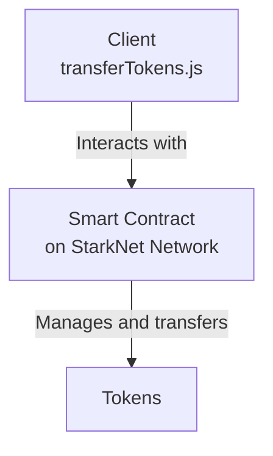
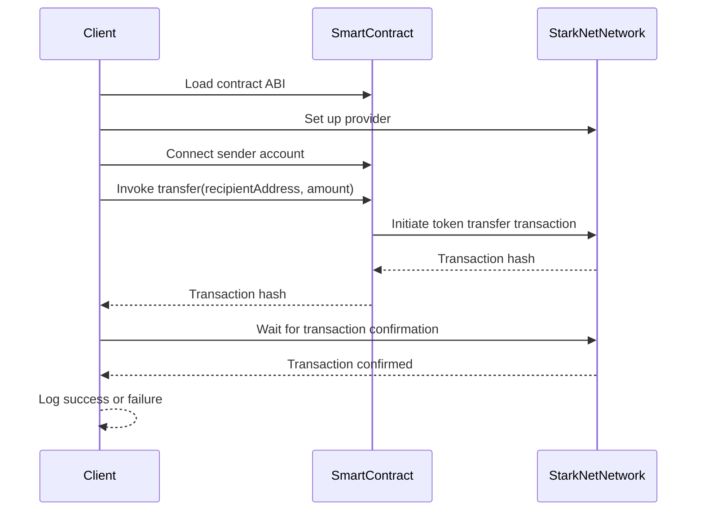

<details>
<summary>Relevant source files</summary>

The following files were used as context for generating this wiki page:

- [scholarship_app/transferTokens.js](https://github.com/agattani123/Fast-Fa/blob/master/scholarship_app/transferTokens.js)

</details>

# Scholarship Payment

## Introduction

The "Scholarship Payment" feature is a critical component of the project, responsible for securely transferring tokens from a designated scholarship address to student recipients. This functionality is implemented in the `transferTokens.js` file, which utilizes the StarkNet library to interact with a smart contract deployed on the StarkNet network.

The primary purpose of this feature is to facilitate the distribution of scholarship funds to eligible students in a transparent and auditable manner. By leveraging the security and immutability of blockchain technology, the system ensures that scholarship payments are recorded on the decentralized ledger, providing a tamper-proof record of transactions.

## Architecture Overview

The "Scholarship Payment" feature follows a client-server architecture, where the client-side code (`transferTokens.js`) interacts with a smart contract deployed on the StarkNet network. The smart contract acts as the central authority for managing and transferring tokens.



Sources: [scholarship_app/transferTokens.js]()

## Token Transfer Process

The token transfer process is orchestrated by the `transferTokens` function in the `transferTokens.js` file. This function takes the following parameters:

- `senderPrivateKey`: The private key of the scholarship address, used for authentication and signing transactions.
- `senderAddress`: The address of the scholarship account from which tokens will be transferred.
- `recipientAddress`: The address of the student recipient to whom tokens will be sent.
- `amount`: The amount of tokens to be transferred.

The token transfer process follows these steps:

1. **Load Contract**: The function loads the contract ABI (Application Binary Interface) from the specified file path (`ABI_PATH`). The ABI defines the interface for interacting with the smart contract.

2. **Set up Provider**: A StarkNet provider is initialized, connecting to the specified network (in this case, `goerli-alpha`).

3. **Connect Sender Account**: The sender account is connected to the contract using the provided private key and address. This step authenticates the sender and allows them to invoke contract methods.

4. **Invoke Transfer Method**: The `transfer` method of the smart contract is invoked, passing the recipient address and the amount of tokens to be transferred. This initiates the token transfer transaction on the StarkNet network.

5. **Wait for Transaction Confirmation**: The code waits for the transaction to be confirmed and included in the blockchain by monitoring the transaction hash.

6. **Log Success or Failure**: Depending on the outcome of the transaction, a success or failure message is logged to the console.



Sources: [scholarship_app/transferTokens.js]()

## Configuration

The "Scholarship Payment" feature relies on the following configuration settings:

| Setting | Type | Description |
| --- | --- | --- |
| `CONTRACT_ADDRESS` | String | The address of the deployed smart contract on the StarkNet network. |
| `ABI_PATH` | String | The file path to the ABI (Application Binary Interface) of the smart contract. |

Sources: [scholarship_app/transferTokens.js:3-4]()

## Example Usage

The `transferTokens.js` file includes an example usage of the `transferTokens` function, demonstrating how to invoke the token transfer process. The example sets the following values:

- `senderPrivateKey`: The private key of the scholarship address.
- `senderAddress`: The address of the scholarship account.
- `recipientAddress`: The address of the student recipient.
- `amount`: The amount of tokens to be transferred (in this case, 100 tokens).

```javascript
const senderPrivateKey = 'SCHOLARSHIP_PRIVATE_KEY';
const senderAddress = 'SCHOLARSHIP_ADDRESS';
const recipientAddress = 'STUDENT_ADDRESS';
const amount = '100';  // Amount of tokens to transfer

transferTokens(senderPrivateKey, senderAddress, recipientAddress, amount);
```

Sources: [scholarship_app/transferTokens.js:32-36]()

## Conclusion

The "Scholarship Payment" feature is a crucial component of the project, enabling secure and transparent token transfers from a designated scholarship address to student recipients. By leveraging the StarkNet network and smart contract technology, the system ensures the integrity and auditability of scholarship payments. The `transferTokens.js` file encapsulates the core functionality, providing a straightforward interface for initiating token transfers while handling the underlying complexities of interacting with the StarkNet network and smart contract.