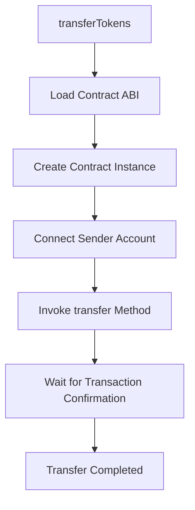

<details>
<summary>Relevant source files</summary>

The following files were used as context for generating this wiki page:

- [scholarship_app/transferTokens.js](https://github.com/agattani123/Fast-Fa/blob/master/scholarship_app/transferTokens.js)

</details>

# Scholarship Payment

## Introduction

The "Scholarship Payment" feature is a part of the scholarship application system, which allows the scholarship provider to transfer tokens (representing scholarship funds) to the recipient student's address. This feature utilizes the StarkNet platform, a decentralized and permissionless Layer 2 solution for Ethereum, to facilitate secure and efficient token transfers.

The primary functionality is implemented in the `transferTokens.js` file, which contains the logic for connecting to the StarkNet network, loading the contract, and invoking the `transfer` method to initiate the token transfer. Sources: [scholarship_app/transferTokens.js](https://github.com/agattani123/Fast-Fa/blob/master/scholarship_app/transferTokens.js)

## Contract Setup

### Contract Deployment

The scholarship payment system relies on a pre-deployed contract on the StarkNet network. The contract address and the path to the contract's ABI (Application Binary Interface) are specified as configuration variables in the `transferTokens.js` file.

```javascript
const CONTRACT_ADDRESS = 'YOUR_CONTRACT_ADDRESS_HERE';  // Replace with your contract's address
const ABI_PATH = './path_to_your_ABI.json';  // Path to your contract's ABI
```

Sources: [scholarship_app/transferTokens.js:3-4](https://github.com/agattani123/Fast-Fa/blob/master/scholarship_app/transferTokens.js#L3-L4)

### StarkNet Provider

The system connects to the StarkNet network using the `Provider` class from the StarkNet library. In this case, the provider is configured to connect to the `goerli-alpha` network, which is a test network for StarkNet.

```javascript
const provider = new Provider({ sequencer: { network: 'goerli-alpha' } });
```

Sources: [scholarship_app/transferTokens.js:8](https://github.com/agattani123/Fast-Fa/blob/master/scholarship_app/transferTokens.js#L8)

## Token Transfer Flow

The token transfer process is encapsulated in the `transferTokens` function, which takes the following parameters:

- `senderPrivateKey`: The private key of the scholarship provider's account.
- `senderAddress`: The address of the scholarship provider's account.
- `recipientAddress`: The address of the student's account to receive the tokens.
- `amount`: The amount of tokens to be transferred.



Sources: [scholarship_app/transferTokens.js:13-35](https://github.com/agattani123/Fast-Fa/blob/master/scholarship_app/transferTokens.js#L13-L35)

### Contract Loading

The contract ABI is loaded from the specified file path using the `require` function.

```javascript
const abi = require(ABI_PATH);
```

A new instance of the contract is created using the `Contract` class from the StarkNet library, with the loaded ABI and the contract address.

```javascript
const contract = new Contract(abi, CONTRACT_ADDRESS, provider);
```

Sources: [scholarship_app/transferTokens.js:18-19](https://github.com/agattani123/Fast-Fa/blob/master/scholarship_app/transferTokens.js#L18-L19)

### Sender Account Connection

The sender's account is connected to the contract by creating a new `Contract` instance with the sender's address and private key.

```javascript
const senderAccount = new Contract(abi, CONTRACT_ADDRESS, {
  address: senderAddress,
  privateKey: senderPrivateKey,
  provider
});
```

Sources: [scholarship_app/transferTokens.js:22-26](https://github.com/agattani123/Fast-Fa/blob/master/scholarship_app/transferTokens.js#L22-L26)

### Token Transfer Execution

The `transfer` method of the contract is invoked using the connected sender account, passing the recipient address and the amount of tokens to be transferred.

```javascript
const { transaction_hash } = await senderAccount.invoke('transfer', [recipientAddress, amount]);
```

The transaction hash is logged to the console for reference.

```javascript
console.log(`Transfer initiated. Transaction hash: ${transaction_hash}`);
```

Sources: [scholarship_app/transferTokens.js:29-30](https://github.com/agattani123/Fast-Fa/blob/master/scholarship_app/transferTokens.js#L29-L30)

### Transaction Confirmation

The system waits for the transaction to be confirmed on the StarkNet network using the `waitForTransaction` method of the provider.

```javascript
await provider.waitForTransaction(transaction_hash);
```

Once the transaction is confirmed, a success message is logged to the console.

```javascript
console.log('Transfer completed successfully.');
```

Sources: [scholarship_app/transferTokens.js:33-34](https://github.com/agattani123/Fast-Fa/blob/master/scholarship_app/transferTokens.js#L33-L34)

### Error Handling

If any errors occur during the token transfer process, they are caught and logged to the console.

```javascript
catch (error) {
  console.error('Failed to transfer tokens:', error);
}
```

Sources: [scholarship_app/transferTokens.js:36-38](https://github.com/agattani123/Fast-Fa/blob/master/scholarship_app/transferTokens.js#L36-L38)

## Example Usage

The `transferTokens` function is called with the following example parameters:

```javascript
const senderPrivateKey = 'SCHOLARSHIP_PRIVATE_KEY';
const senderAddress = 'SCHOLARSHIP_ADDRESS';
const recipientAddress = 'STUDENT_ADDRESS';
const amount = '100';  // Amount of tokens to transfer

transferTokens(senderPrivateKey, senderAddress, recipientAddress, amount);
```

Sources: [scholarship_app/transferTokens.js:41-45](https://github.com/agattani123/Fast-Fa/blob/master/scholarship_app/transferTokens.js#L41-L45)

## Conclusion

The "Scholarship Payment" feature provides a secure and efficient way to transfer tokens (representing scholarship funds) from the scholarship provider's account to the student's account on the StarkNet network. It leverages the StarkNet library to connect to the network, load the contract, and invoke the `transfer` method. The process includes connecting the sender's account, executing the token transfer, and waiting for transaction confirmation. Error handling is also implemented to catch and log any failures during the transfer process.