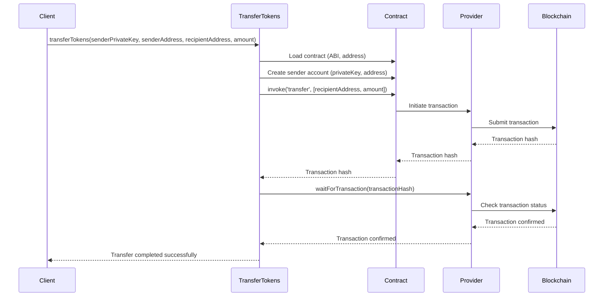

<details>
<summary>Relevant source files</summary>

The following files were used as context for generating this wiki page:

- [scholarship_app/transferTokens.js](https://github.com/agattani123/Fast-Fa/blob/master/scholarship_app/transferTokens.js)

</details>

# Scholarship Payment

## Introduction

The "Scholarship Payment" feature is a critical component of the project, responsible for securely transferring tokens from a designated scholarship address to student recipients. This functionality enables the management and distribution of scholarship funds within the application's ecosystem. The primary purpose of this feature is to facilitate the transfer of tokens, representing scholarship awards, to eligible students or recipients.

## Token Transfer Process

### Initialization

The token transfer process begins with the initialization of the necessary dependencies and configurations. The code imports the required modules, such as the `Contract` and `Provider` classes from the `starknet` library. It also sets up the contract address and the path to the contract's ABI (Application Binary Interface) file.

```javascript
const { Contract, Provider, defaultProvider } = require('starknet');

// Configuration
const CONTRACT_ADDRESS = 'YOUR_CONTRACT_ADDRESS_HERE';  // Replace with your contract's address
const ABI_PATH = './path_to_your_ABI.json';  // Path to your contract's ABI
```

The `Provider` instance is then created, specifying the network (in this case, `goerli-alpha`) to be used for interacting with the StarkNet blockchain.

```javascript
const provider = new Provider({ sequencer: { network: 'goerli-alpha' } });
```

Sources: [scholarship_app/transferTokens.js:1-9]()

### Main Transfer Function

The `transferTokens` function is the core of the "Scholarship Payment" feature. It takes four parameters:

1. `senderPrivateKey`: The private key of the scholarship address (sender).
2. `senderAddress`: The address of the scholarship account (sender).
3. `recipientAddress`: The address of the student or recipient.
4. `amount`: The amount of tokens to be transferred.

```javascript
async function transferTokens(senderPrivateKey, senderAddress, recipientAddress, amount) {
  // ...
}
```

Sources: [scholarship_app/transferTokens.js:12]()

#### Contract Initialization

Within the `transferTokens` function, the contract is loaded using the provided ABI and contract address. The `Contract` instance is created with the ABI, contract address, and the provider instance.

```javascript
const abi = require(ABI_PATH);
const contract = new Contract(abi, CONTRACT_ADDRESS, provider);
```

Sources: [scholarship_app/transferTokens.js:16-17]()

#### Sender Account Setup

To initiate the token transfer, the sender account (scholarship account) is set up by creating a new `Contract` instance with the sender's private key and address. This allows the sender account to invoke contract methods and sign transactions.

```javascript
const senderAccount = new Contract(abi, CONTRACT_ADDRESS, {
  address: senderAddress,
  privateKey: senderPrivateKey,
  provider
});
```

Sources: [scholarship_app/transferTokens.js:21-25]()

#### Token Transfer Execution

The actual token transfer is performed by invoking the `transfer` method on the sender account contract instance. The `transfer` method takes two arguments: the recipient address and the amount of tokens to be transferred.

```javascript
const { transaction_hash } = await senderAccount.invoke('transfer', [recipientAddress, amount]);
console.log(`Transfer initiated. Transaction hash: ${transaction_hash}`);
```

The `invoke` method returns a transaction hash, which is logged to the console for reference.

Sources: [scholarship_app/transferTokens.js:28-29]()

#### Transaction Confirmation

After initiating the token transfer, the code waits for the transaction to be confirmed on the StarkNet blockchain. This is achieved by calling the `waitForTransaction` method on the provider instance, passing the transaction hash.

```javascript
await provider.waitForTransaction(transaction_hash);
console.log('Transfer completed successfully.');
```

Once the transaction is confirmed, a success message is logged to the console.

Sources: [scholarship_app/transferTokens.js:32-33]()

#### Error Handling

The `transferTokens` function is wrapped in a `try-catch` block to handle any potential errors that may occur during the token transfer process. If an error is caught, it is logged to the console with an appropriate error message.

```javascript
} catch (error) {
  console.error('Failed to transfer tokens:', error);
}
```

Sources: [scholarship_app/transferTokens.js:35-37]()

## Example Usage

The code provides an example usage of the `transferTokens` function, where the necessary parameters (sender private key, sender address, recipient address, and amount) are defined and passed to the function call.

```javascript
const senderPrivateKey = 'SCHOLARSHIP_PRIVATE_KEY';
const senderAddress = 'SCHOLARSHIP_ADDRESS';
const recipientAddress = 'STUDENT_ADDRESS';
const amount = '100';  // Amount of tokens to transfer

transferTokens(senderPrivateKey, senderAddress, recipientAddress, amount);
```

Sources: [scholarship_app/transferTokens.js:40-44]()

## Sequence Diagram

The following sequence diagram illustrates the flow of the token transfer process:



This diagram illustrates the sequence of steps involved in the token transfer process, including:

1. The client initiates the `transferTokens` function with the required parameters.
2. The contract is loaded, and the sender account is set up with the provided private key and address.
3. The `transfer` method is invoked on the contract, passing the recipient address and the amount of tokens to be transferred.
4. The transaction is initiated and submitted to the StarkNet blockchain through the provider.
5. The provider waits for the transaction to be confirmed on the blockchain.
6. Once the transaction is confirmed, the success message is returned to the client.

Sources: [scholarship_app/transferTokens.js]()

## Conclusion

The "Scholarship Payment" feature plays a crucial role in the project by enabling the secure transfer of tokens from a designated scholarship address to student recipients. By leveraging the StarkNet blockchain and the provided contract, this feature ensures the integrity and transparency of scholarship fund distributions. The code follows best practices for interacting with smart contracts, handling errors, and providing clear feedback to the user.