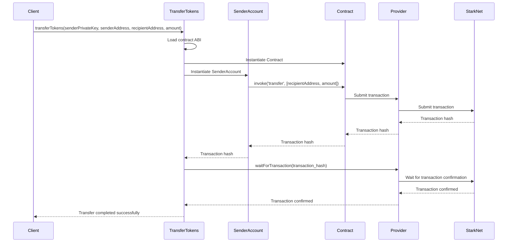

<details>
<summary>Relevant source files</summary>

The following files were used as context for generating this wiki page:

- [wiki/Core Features/Scholarship Payment.md](https://github.com/agattani123/Fast-Fa/blob/master/wiki/Core%20Features/Scholarship%20Payment.md)
- [scholarship_app/transferTokens.js](https://github.com/agattani123/Fast-Fa/blob/master/scholarship_app/transferTokens.js)

</details>

# Scholarship Payment

## Introduction

The "Scholarship Payment" feature is a crucial component of the project, enabling the transfer of tokens from a designated scholarship address to student recipients. This functionality is implemented in the `transferTokens.js` file, which utilizes the StarkNet library to interact with a smart contract deployed on the StarkNet network.

The primary purpose of this feature is to facilitate the distribution of scholarship funds to eligible students in the form of tokens. By automating the token transfer process, the system streamlines the management and disbursement of scholarships, ensuring transparency and efficiency.

Sources: [wiki/Core Features/Scholarship Payment.md](https://github.com/agattani123/Fast-Fa/blob/master/wiki/Core%20Features/Scholarship%20Payment.md)

## Configuration and Setup

### Contract and ABI

The `transferTokens.js` script requires the address of the deployed smart contract and the path to the contract's Application Binary Interface (ABI) file. These configurations are defined at the beginning of the file:

```javascript
const CONTRACT_ADDRESS = 'YOUR_CONTRACT_ADDRESS_HERE';  // Replace with your contract's address
const ABI_PATH = './path_to_your_ABI.json';  // Path to your contract's ABI
```

The `CONTRACT_ADDRESS` constant should be replaced with the actual address of the deployed smart contract responsible for managing the scholarship tokens. The `ABI_PATH` constant specifies the path to the ABI file, which describes the contract's interface and available methods.

Sources: [scholarship_app/transferTokens.js:3-4]()

### Provider Setup

The script establishes a connection to the StarkNet network using the `Provider` class from the StarkNet library. The provider is configured to interact with the `goerli-alpha` network:

```javascript
const provider = new Provider({ sequencer: { network: 'goerli-alpha' } });
```

This provider instance is used to interact with the deployed smart contract and submit transactions to the StarkNet network.

Sources: [scholarship_app/transferTokens.js:8]()

## Token Transfer Process

The core functionality of the "Scholarship Payment" feature is implemented in the `transferTokens` function, which orchestrates the token transfer process.

```javascript
async function transferTokens(senderPrivateKey, senderAddress, recipientAddress, amount) {
  // ...
}
```

This function takes the following parameters:

- `senderPrivateKey`: The private key of the scholarship account, used to sign and authorize the token transfer transaction.
- `senderAddress`: The address of the scholarship account from which the tokens will be transferred.
- `recipientAddress`: The address of the student recipient who will receive the tokens.
- `amount`: The amount of tokens to be transferred.

Sources: [scholarship_app/transferTokens.js:11]()

### Contract Instantiation

Within the `transferTokens` function, the script loads the contract ABI and instantiates a `Contract` object using the provided `CONTRACT_ADDRESS` and the StarkNet provider:

```javascript
const abi = require(ABI_PATH);
const contract = new Contract(abi, CONTRACT_ADDRESS, provider);
```

This `contract` instance represents the deployed smart contract and provides methods for interacting with it.

Sources: [scholarship_app/transferTokens.js:14-15]()

### Sender Account Setup

To initiate the token transfer, the script creates a new `Contract` instance representing the sender account. This instance is configured with the sender's private key, address, and the StarkNet provider:

```javascript
const senderAccount = new Contract(abi, CONTRACT_ADDRESS, {
  address: senderAddress,
  privateKey: senderPrivateKey,
  provider
});
```

The `senderAccount` instance is used to invoke the `transfer` method on the smart contract, allowing the scholarship account to initiate the token transfer transaction.

Sources: [scholarship_app/transferTokens.js:19-23]()

### Token Transfer Execution

The token transfer is initiated by invoking the `transfer` method on the `senderAccount` instance, passing the recipient address and the amount of tokens to be transferred:

```javascript
const { transaction_hash } = await senderAccount.invoke('transfer', [recipientAddress, amount]);
console.log(`Transfer initiated. Transaction hash: ${transaction_hash}`);
```

This line triggers the token transfer transaction on the StarkNet network and logs the transaction hash for reference.

Sources: [scholarship_app/transferTokens.js:26]()

### Transaction Confirmation

After initiating the token transfer transaction, the script waits for the transaction to be confirmed on the StarkNet network:

```javascript
await provider.waitForTransaction(transaction_hash);
console.log('Transfer completed successfully.');
```

This step ensures that the token transfer has been successfully processed and recorded on the blockchain before considering the operation complete.

Sources: [scholarship_app/transferTokens.js:29-30]()

### Error Handling

The `transferTokens` function is wrapped in a `try-catch` block to handle any potential errors that may occur during the token transfer process:

```javascript
try {
  // Token transfer logic...
} catch (error) {
  console.error('Failed to transfer tokens:', error);
}
```

If an error occurs, it is caught and logged to the console, providing visibility into any issues that may arise during the execution of the script.

Sources: [scholarship_app/transferTokens.js:32-35]()

## Example Usage

The `transferTokens.js` script includes an example usage section at the end, demonstrating how to invoke the `transferTokens` function with specific parameters:

```javascript
const senderPrivateKey = 'SCHOLARSHIP_PRIVATE_KEY';
const senderAddress = 'SCHOLARSHIP_ADDRESS';
const recipientAddress = 'STUDENT_ADDRESS';
const amount = '100';  // Amount of tokens to transfer

transferTokens(senderPrivateKey, senderAddress, recipientAddress, amount);
```

In this example, the `senderPrivateKey` and `senderAddress` represent the scholarship account's credentials, while `recipientAddress` is the address of the student recipient. The `amount` variable specifies the number of tokens to be transferred.

Sources: [scholarship_app/transferTokens.js:38-42]()

## Sequence Diagram

The following sequence diagram illustrates the flow of the token transfer process:



This diagram illustrates the interactions between the client, the `transferTokens` function, the `SenderAccount` instance, the `Contract` instance, the `Provider`, and the StarkNet network during the token transfer process.

1. The client invokes the `transferTokens` function with the necessary parameters.
2. The `transferTokens` function loads the contract ABI and instantiates the `Contract` and `SenderAccount` instances.
3. The `SenderAccount` invokes the `transfer` method on the `Contract` instance, passing the recipient address and the amount of tokens to be transferred.
4. The `Contract` instance submits the transaction to the `Provider`.
5. The `Provider` submits the transaction to the StarkNet network and receives a transaction hash.
6. The transaction hash is propagated back to the `transferTokens` function.
7. The `transferTokens` function waits for the transaction to be confirmed on the StarkNet network using the `waitForTransaction` method of the `Provider`.
8. Once the transaction is confirmed, the `transferTokens` function notifies the client that the transfer was completed successfully.

Sources: [scholarship_app/transferTokens.js]()

## Conclusion

The "Scholarship Payment" feature implemented in the `transferTokens.js` file provides a streamlined and automated process for transferring tokens from a designated scholarship account to student recipients. By leveraging the StarkNet library and interacting with a deployed smart contract, the system ensures secure and transparent token transfers, facilitating the efficient management and distribution of scholarship funds.

Sources: [wiki/Core Features/Scholarship Payment.md](https://github.com/agattani123/Fast-Fa/blob/master/wiki/Core%20Features/Scholarship%20Payment.md)