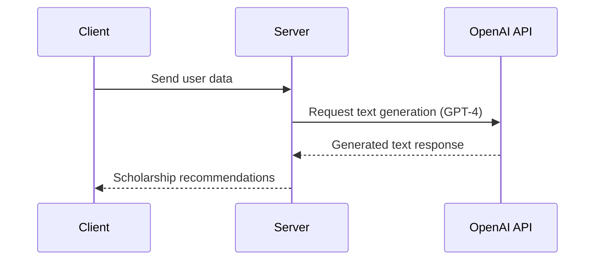

<details>
<summary>Relevant source files</summary>

The following files were used as context for generating this wiki page:

- [scholarship_app/AiHelper.js](https://github.com/agattani123/Fast-Fa/blob/master/scholarship_app/AiHelper.js)
- [scholarship_app/public/script.js](https://github.com/agattani123/Fast-Fa/blob/master/scholarship_app/public/script.js)

</details>

# Scholarship Recommendation

## Introduction

The "Scholarship Recommendation" feature within this project aims to provide personalized scholarship recommendations to users based on their financial information and other relevant criteria. It leverages the power of OpenAI's GPT-4 language model to generate tailored recommendations and suggestions for potential scholarships that users may be eligible for.

The feature consists of two main components: a client-side application that collects user information and sends it to the server, and a server-side module that utilizes the OpenAI API to generate scholarship recommendations based on the provided user data.

## Client-side Application

The client-side application is responsible for collecting user information and submitting it to the server for processing. It is implemented in the `script.js` file located in the `scholarship_app/public/` directory.

### User Input and Form Submission

The `script.js` file contains event listeners and functions to handle user interactions with the scholarship application form.

```javascript
document.getElementById('scholarshipForm').addEventListener('submit', function(event) {
    event.preventDefault();

    const firstName = document.querySelector('input[name="firstName"]').value;
    const lastName = document.querySelector('input[name="lastName"]').value;
    const financial_info = document.querySelector('textarea[name="financial_info"]').value;

    fetch('/submit-application', {
        method: 'POST',
        headers: {
            'Content-Type': 'application/json',
        },
        body: JSON.stringify({ firstName, lastName, financial_info }),
    })
    .then(response => response.json())
    .then(data => {
        // Display the response from the server
        console.log(data);
    })
    .catch((error) => {
        console.error('Error:', error);
    });
});
```

Sources: [scholarship_app/public/script.js:5-22]()

When the user submits the form, the `submit` event listener is triggered, and the following actions occur:

1. The form submission is prevented from reloading the page using `event.preventDefault()`.
2. The user's first name, last name, and financial information are retrieved from the respective form fields.
3. A `POST` request is sent to the `/submit-application` endpoint on the server, with the user data included in the request body as JSON.
4. The server's response is logged to the console.

Additionally, the file includes event listeners for hover effects on the download button, adding and removing a box shadow for visual feedback.

Sources: [scholarship_app/public/script.js:1-4]()

## Server-side Module

The server-side module is responsible for generating scholarship recommendations based on the user's financial information and other relevant data. It is implemented in the `AiHelper.js` file located in the `scholarship_app/` directory.

### OpenAI API Integration

The `AiHelper.js` file contains functions to interact with the OpenAI API for generating text and images using the GPT-4 and DALL-E 2 models, respectively.

```javascript
async function generateText(prompt) {
  const chatUrl = "https://api.openai.com/v1/chat/completions";
  const payload = {
    model: "gpt-4",
    messages: [
      {
        role: "user",
        content: prompt,
      },
    ],
  };

  const data = await fetchFromOpenAI(chatUrl, payload);
  return data.choices[0].message.content;
}
```

Sources: [scholarship_app/AiHelper.js:14-25]()

The `generateText` function takes a prompt as input and sends a request to the OpenAI API's `/chat/completions` endpoint using the GPT-4 model. The API response, which contains the generated text, is then returned.



Sources: [scholarship_app/AiHelper.js:14-25]()

The server likely uses the user's financial information and other relevant data to construct a prompt for the GPT-4 model, which then generates personalized scholarship recommendations based on the provided context.

### Example Usage

The `AiHelper.js` file includes an example usage of the `generateText` and `generateImage` functions, demonstrating how they can be used to generate text and images from OpenAI's APIs.

```javascript
(async () => {
  try {
    const textPrompt = "Explain quantum mechanics in simple terms";
    const imagePrompt = "Picture of a cute cat";

    const textResponse = await generateText(textPrompt);
    console.log("Text Response:", textResponse);

    const imageUrl = await generateImage(imagePrompt);
    console.log("Image URL:", imageUrl);
  } catch (error) {
    console.log(error.message);
  }
})();
```

Sources: [scholarship_app/AiHelper.js:28-40]()

While this example is not directly related to the "Scholarship Recommendation" feature, it demonstrates how the OpenAI API integration works and can be used as a reference for implementing the actual scholarship recommendation functionality.

## Conclusion

The "Scholarship Recommendation" feature combines client-side user input collection and server-side OpenAI API integration to provide personalized scholarship recommendations to users based on their financial information and other relevant data. By leveraging the power of the GPT-4 language model, the feature can generate tailored and contextual recommendations, potentially increasing the chances of users finding and applying for suitable scholarship opportunities.