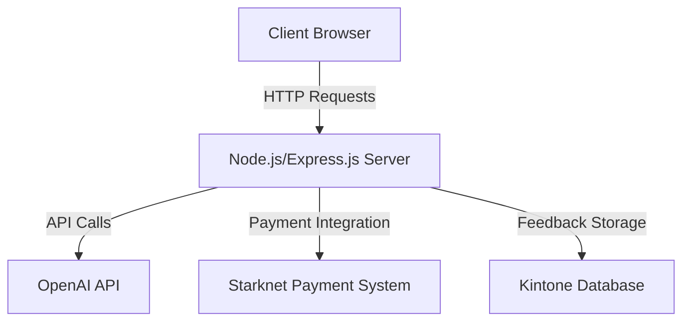
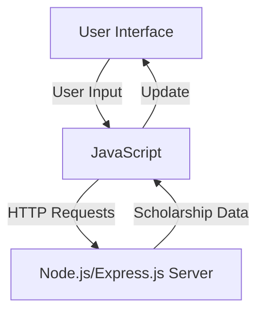
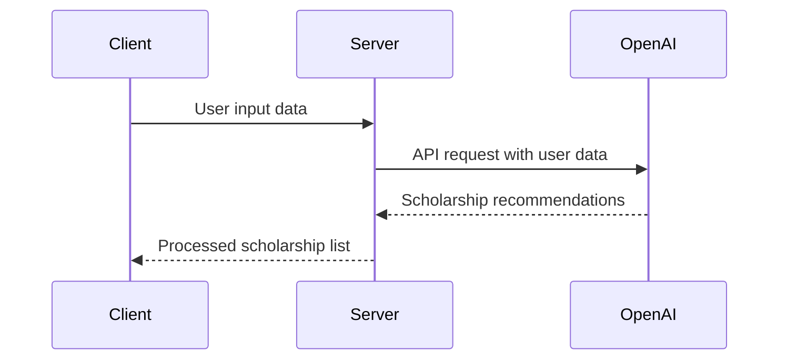
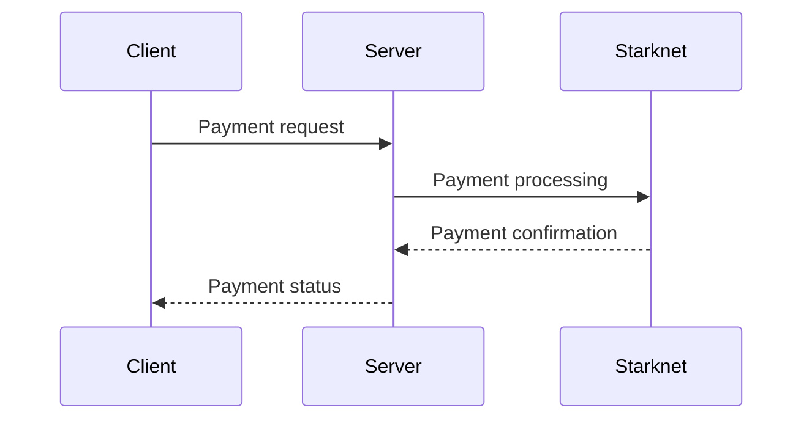

Relevant source files

The following file was used as context for generating this wiki page:

- [README.md](https://github.com/agattani123/Fast-Fa/blob/master/README.md)

# Deployment and Infrastructure

## Introduction

FastFa! is a web application that aims to simplify the process of finding and applying for scholarships by leveraging the power of generative AI. The application takes user input, processes it through OpenAI's GPT-4 model, and generates a personalized list of scholarships tailored to the user's background, interests, and financial situation. Additionally, FastFa! incorporates a secure payment method built on Starknet, allowing students to receive scholarships directly from institutions. The application also includes a feedback system integrated with the Kintone database.

## Architecture Overview

FastFa! follows a client-server architecture, with the frontend built using HTML, CSS, and JavaScript, and the backend implemented using Node.js and Express.js. The application interacts with the OpenAI API to generate scholarship recommendations based on user input. The payment functionality is handled through Starknet, while the feedback system is integrated with the Kintone database.

Sources: [README.md](https://github.com/agattani123/Fast-Fa/blob/master/README.md)

## Frontend

The FastFa! frontend is responsible for rendering the user interface and handling user interactions. It is built using HTML, CSS, and JavaScript.

Sources: [README.md](https://github.com/agattani123/Fast-Fa/blob/master/README.md)

## Backend

The FastFa! backend is built using Node.js and Express.js. It serves as the intermediary between the frontend, the OpenAI API, the Starknet payment system, and the Kintone database.

### OpenAI Integration

The backend integrates with the OpenAI API to generate personalized scholarship recommendations based on user input. It sends user data to the OpenAI API and processes the responses to generate the scholarship list.

Sources: [README.md](https://github.com/agattani123/Fast-Fa/blob/master/README.md)

### Payment Integration

FastFa! incorporates a secure payment method built on Starknet, allowing students to receive scholarships directly from institutions. The backend handles the integration with the Starknet payment system.

Sources: [README.md](https://github.com/agattani123/Fast-Fa/blob/master/README.md)

### Feedback System

The application includes a feedback system integrated with the Kintone database. The backend handles the storage and retrieval of feedback data from the Kintone database.

Sources: [README.md](https://github.com/agattani123/Fast-Fa/blob/master/README.md)

## Conclusion

FastFa! is a web application that leverages generative AI to simplify the process of finding and applying for scholarships. It follows a client-server architecture, with the frontend handling user interactions and the backend integrating with the OpenAI API, Starknet payment system, and Kintone database. The application aims to provide personalized scholarship recommendations, secure payment functionality, and a feedback system to enhance the user experience.