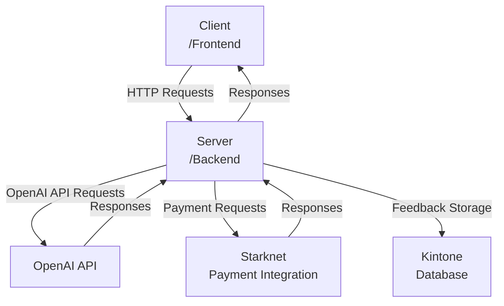
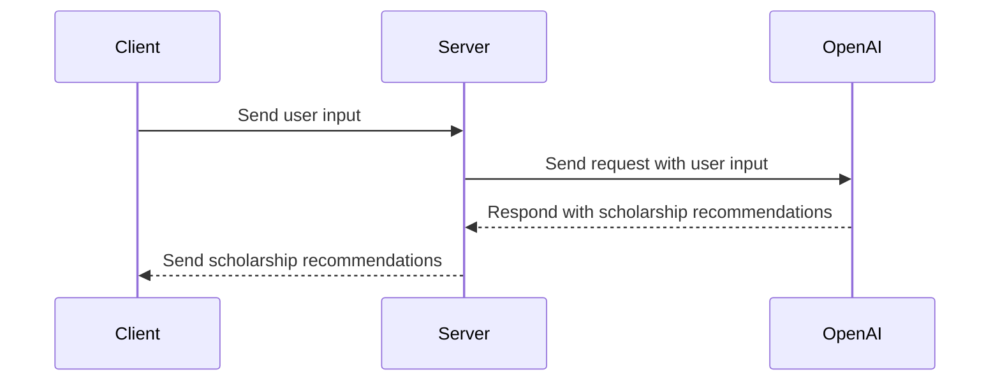
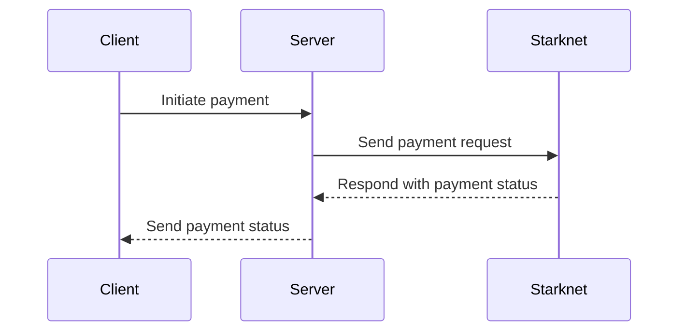
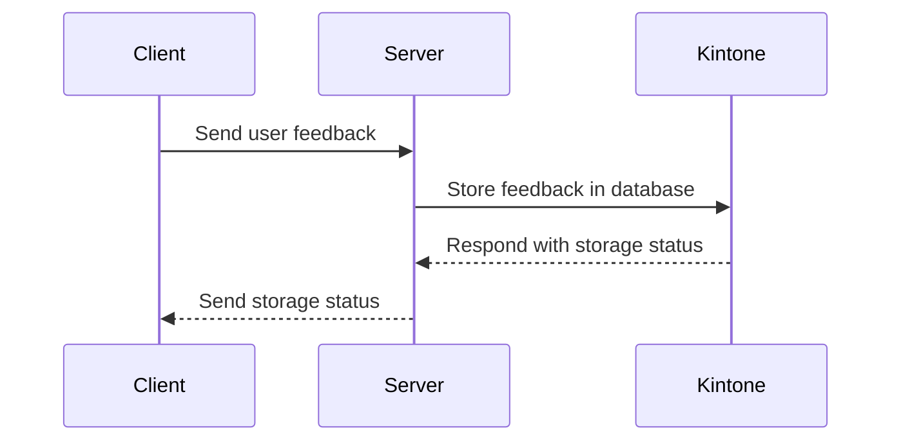

Relevant source files

The following file was used as context for generating this wiki page:

- [README.md](https://github.com/agattani123/Fast-Fa/blob/master/README.md)

# Deployment and Infrastructure

## Introduction

FastFa! is a web application that aims to simplify the process of finding and applying for scholarships. It leverages OpenAI's GPT-4 model to generate a personalized list of scholarships based on the user's input. The application also integrates with Starknet for secure payment processing and Kintone for storing user feedback. This wiki page provides an overview of the deployment and infrastructure aspects of the FastFa! project.

## Tech Stack

### Frontend

The frontend of FastFa! is built using the following technologies:

- **HTML**: For structuring the web pages.
- **CSS**: For styling the user interface.
- **JavaScript**: For adding interactivity and handling user interactions.

### Backend

The backend of FastFa! is built using the following technologies:

- **Node.js**: A JavaScript runtime environment for executing server-side code.
- **Express.js**: A web application framework for Node.js, used for building the API and handling HTTP requests.
- **Fetch API**: A modern interface for making HTTP requests, used for communicating with the OpenAI API.

### AI Integration

FastFa! integrates with the OpenAI API to leverage the GPT-4 model for generating personalized scholarship recommendations. The application sends user input to the OpenAI API and processes the response to display relevant scholarships.

### Payment Integration

FastFa! utilizes Starknet for secure payment processing, allowing users to receive scholarships directly from institutions. The integration with Starknet ensures secure financial transactions within the application.

### User Feedback Storage

User feedback is stored in the Kintone database system, which is integrated into the FastFa! application. This allows the development team to collect and analyze user feedback for future improvements.

Sources: [README.md](https://github.com/agattani123/Fast-Fa/blob/master/README.md)

## Application Architecture

The FastFa! application follows a client-server architecture, where the frontend (client) communicates with the backend (server) to fetch and process data.

1. The client (frontend) sends HTTP requests to the server (backend) for various operations, such as fetching scholarship recommendations or processing payments.
2. The server processes the requests and communicates with external services as needed:
   - It sends requests to the OpenAI API to generate scholarship recommendations based on user input.
   - It interacts with the Starknet payment integration for processing secure financial transactions.
   - It stores user feedback in the Kintone database.
3. The server processes the responses from external services and sends the appropriate data back to the client.
4. The client renders the received data and updates the user interface accordingly.

Sources: [README.md](https://github.com/agattani123/Fast-Fa/blob/master/README.md)

## API Integration

FastFa! integrates with the OpenAI API to leverage the GPT-4 model for generating personalized scholarship recommendations. The application sends user input to the OpenAI API and processes the response to display relevant scholarships.

1. The client (frontend) sends user input to the server.
2. The server processes the user input and sends a request to the OpenAI API with the relevant data.
3. The OpenAI API processes the request using the GPT-4 model and generates personalized scholarship recommendations based on the user input.
4. The OpenAI API responds with the scholarship recommendations.
5. The server processes the response and sends the scholarship recommendations back to the client.
6. The client displays the scholarship recommendations to the user.

Sources: [README.md](https://github.com/agattani123/Fast-Fa/blob/master/README.md)

## Payment Integration

FastFa! integrates with Starknet for secure payment processing, allowing users to receive scholarships directly from institutions. The integration with Starknet ensures secure financial transactions within the application.

1. The client (frontend) initiates a payment request, such as receiving a scholarship from an institution.
2. The server processes the payment request and sends the relevant data to the Starknet payment integration.
3. Starknet processes the payment request and handles the secure financial transaction.
4. Starknet responds with the payment status (success or failure).
5. The server processes the response and sends the payment status back to the client.
6. The client displays the payment status to the user.

Sources: [README.md](https://github.com/agattani123/Fast-Fa/blob/master/README.md)

## User Feedback Storage

FastFa! stores user feedback in the Kintone database system, allowing the development team to collect and analyze feedback for future improvements.

1. The client (frontend) sends user feedback to the server.
2. The server processes the user feedback and sends a request to the Kintone database to store the feedback.
3. The Kintone database stores the user feedback and responds with the storage status (success or failure).
4. The server processes the response and sends the storage status back to the client.
5. The client displays the storage status to the user (optional).

Sources: [README.md](https://github.com/agattani123/Fast-Fa/blob/master/README.md)

## Deployment and Infrastructure Summary

FastFa! is a web application that leverages various technologies and integrations to provide a seamless experience for users seeking scholarship opportunities. The application follows a client-server architecture, with the frontend communicating with the backend to fetch and process data. The backend integrates with the OpenAI API to generate personalized scholarship recommendations, Starknet for secure payment processing, and Kintone for storing user feedback. The deployment and infrastructure of FastFa! ensure a reliable and scalable solution for users to find and apply for scholarships efficiently.