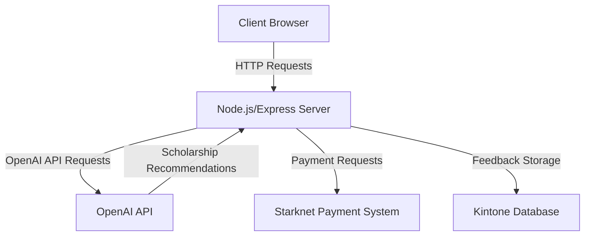
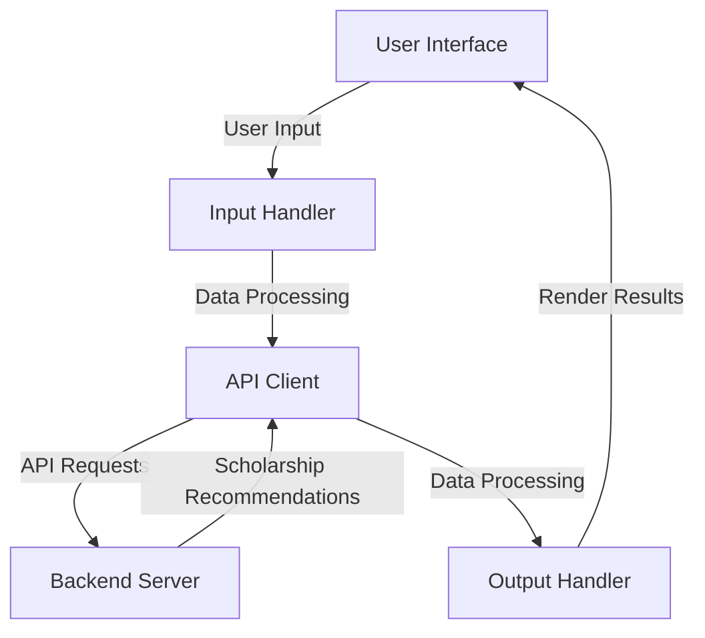
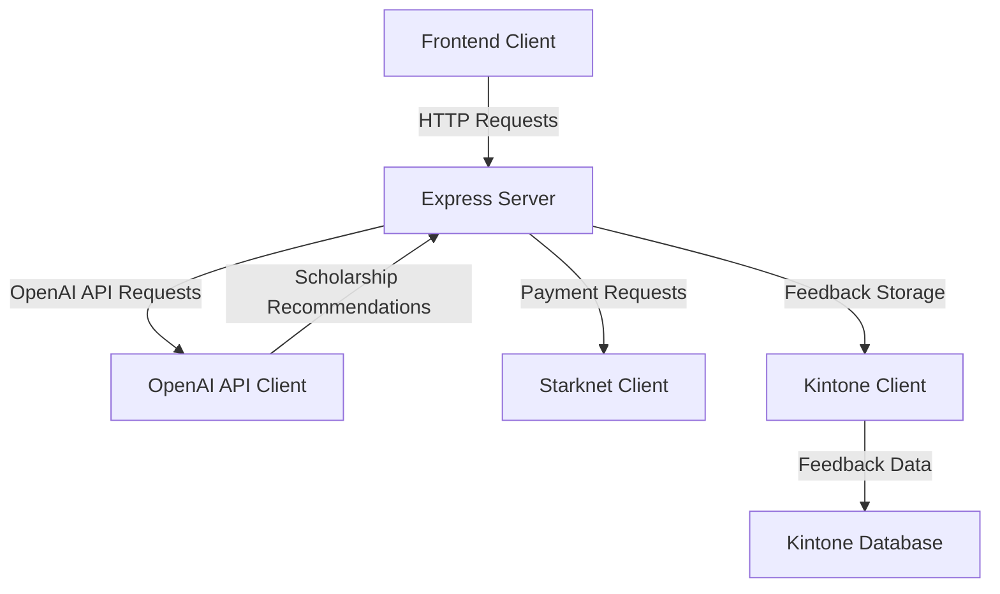
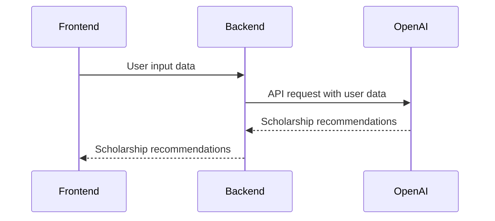
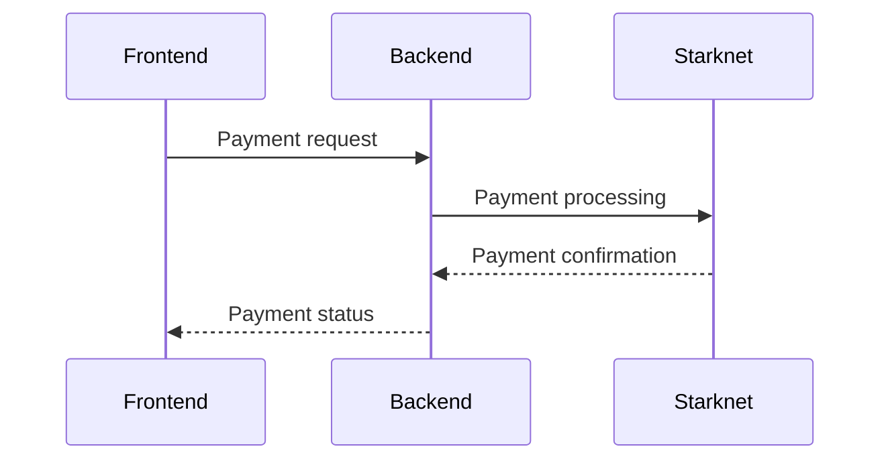
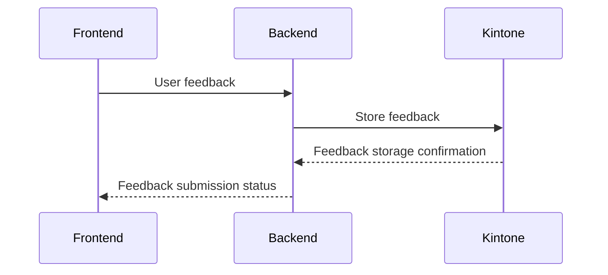

Relevant source files

The following file was used as context for generating this wiki page:

- [README.md](https://github.com/agattani123/Fast-Fa/blob/master/README.md)

# Deployment and Infrastructure

## Introduction

FastFa! is a web application that aims to simplify the process of finding and applying for scholarships by leveraging generative AI technology. The application takes user input, processes it through OpenAI's GPT-4 model, and generates a personalized list of scholarships tailored to the user's background, interests, and financial situation. Additionally, FastFa! incorporates a secure payment method built on Starknet, allowing students to receive scholarships directly from institutions. The application also includes a feedback system integrated with the Kintone database.

## Architecture Overview

FastFa! follows a client-server architecture, with a Node.js and Express.js backend and a frontend built with HTML, CSS, and JavaScript. The application interacts with the OpenAI API to generate scholarship recommendations based on user input. The payment functionality is implemented using Starknet, and user feedback is stored in the Kintone database.

Sources: [README.md](https://github.com/agattani123/Fast-Fa/blob/master/README.md)

## Frontend

The FastFa! frontend is responsible for collecting user input and displaying the generated scholarship recommendations. It is built using HTML, CSS, and JavaScript.

Sources: [README.md](https://github.com/agattani123/Fast-Fa/blob/master/README.md)

## Backend

The FastFa! backend is built using Node.js and Express.js. It handles API requests from the frontend, interacts with the OpenAI API to generate scholarship recommendations, and integrates with the Starknet payment system and Kintone database.

Sources: [README.md](https://github.com/agattani123/Fast-Fa/blob/master/README.md)

## OpenAI Integration

FastFa! leverages the OpenAI API and the GPT-4 model to generate personalized scholarship recommendations based on user input. The backend sends API requests to OpenAI with the user's information, and the API responds with a list of relevant scholarships.

Sources: [README.md](https://github.com/agattani123/Fast-Fa/blob/master/README.md)

## Starknet Payment Integration

FastFa! incorporates a secure payment method built on Starknet, allowing students to receive scholarships directly from institutions. The backend handles payment requests and interacts with the Starknet payment system.

Sources: [README.md](https://github.com/agattani123/Fast-Fa/blob/master/README.md)

## Kintone Feedback Integration

FastFa! includes a feedback system integrated with the Kintone database. User feedback is collected through the frontend, processed by the backend, and stored in the Kintone database.

Sources: [README.md](https://github.com/agattani123/Fast-Fa/blob/master/README.md)

## Conclusion

FastFa! is a web application that aims to simplify the scholarship application process by leveraging generative AI technology. It follows a client-server architecture, with a Node.js and Express.js backend and a frontend built with HTML, CSS, and JavaScript. The application integrates with the OpenAI API to generate personalized scholarship recommendations, incorporates a secure payment method built on Starknet, and includes a feedback system integrated with the Kintone database.