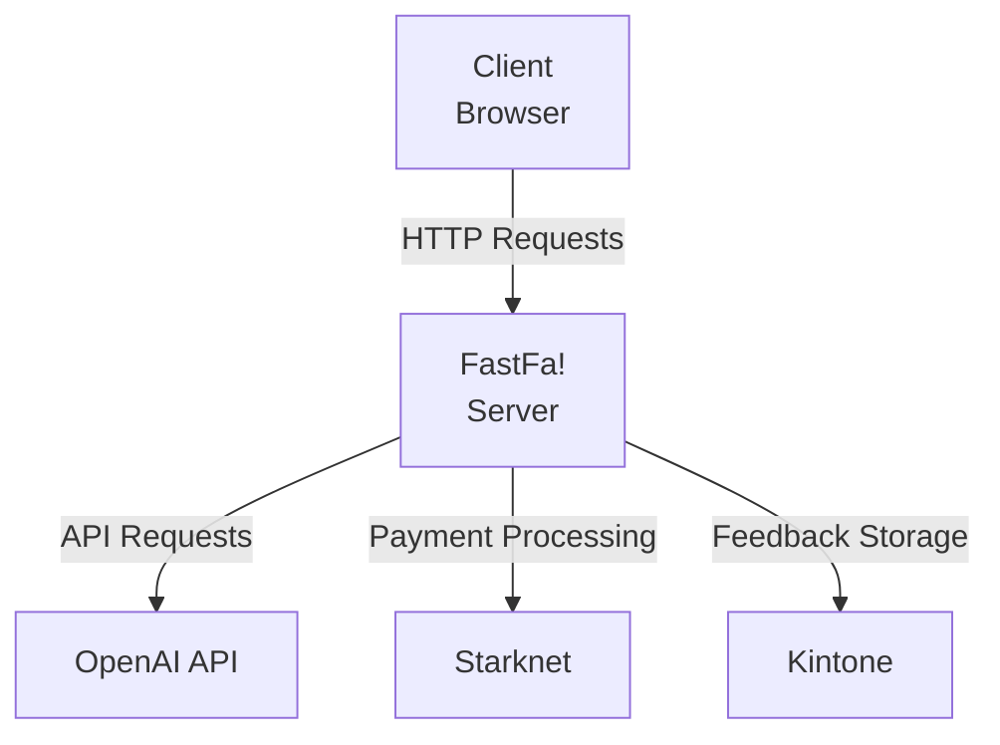
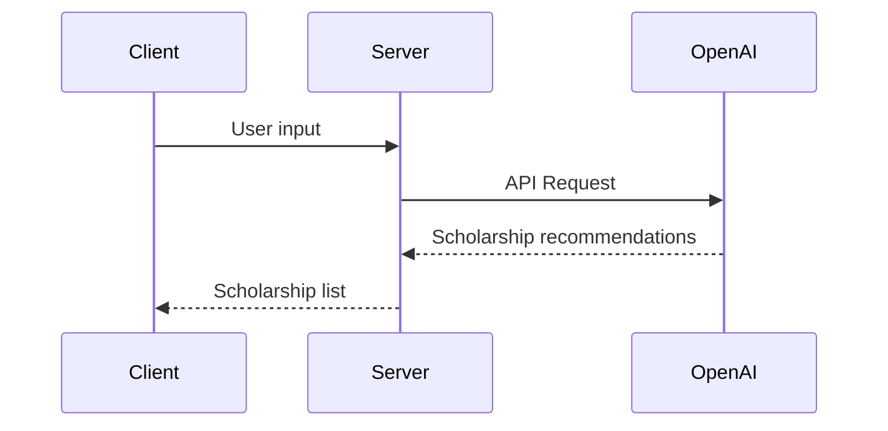
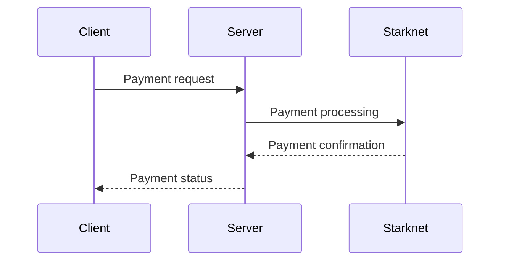
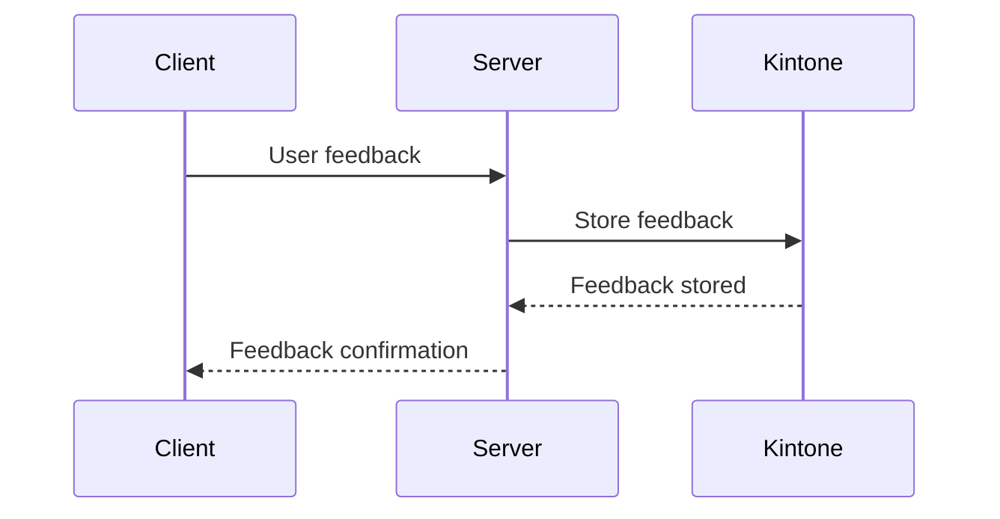

Relevant source files

The following file was used as context for generating this wiki page:

- [README.md](https://github.com/agattani123/Fast-Fa/blob/master/README.md)

# Deployment and Infrastructure

## Introduction

FastFa! is a web application that aims to simplify the process of finding and applying for scholarships. It utilizes OpenAI's GPT-4 model to generate a personalized list of scholarships based on the user's input. The application also integrates with Starknet for secure payment processing and Kintone for storing user feedback. This wiki page focuses on the deployment and infrastructure aspects of the FastFa! project.

## Architecture Overview

FastFa! follows a client-server architecture, with a Node.js and Express.js backend and a frontend built with HTML, CSS, and JavaScript. The application interacts with the OpenAI API to generate scholarship recommendations, and it integrates with Starknet for payment processing and Kintone for storing user feedback.

Sources: [README.md](https://github.com/agattani123/Fast-Fa/blob/master/README.md)

## Backend

The FastFa! backend is built using Node.js and Express.js. It handles the communication with the OpenAI API, Starknet, and Kintone.

### OpenAI Integration

The backend uses the `fetch` API to make requests to the OpenAI API and process the responses. The responses from the OpenAI API are used to generate the list of scholarships tailored to the user's input.

Sources: [README.md](https://github.com/agattani123/Fast-Fa/blob/master/README.md)

### Starknet Integration

The backend integrates with Starknet to handle secure payment processing. This allows students to receive scholarships directly from the institutions.

Sources: [README.md](https://github.com/agattani123/Fast-Fa/blob/master/README.md)

### Kintone Integration

The backend stores user feedback in the Kintone database system. This integration allows the FastFa! team to collect and analyze user feedback for future improvements.

Sources: [README.md](https://github.com/agattani123/Fast-Fa/blob/master/README.md)

## Frontend

The FastFa! frontend is built with HTML, CSS, and JavaScript. It provides a user-friendly interface for users to input their information and receive a list of personalized scholarship recommendations.

### User Input

The frontend collects user input through a form or a series of input fields. This information is then sent to the backend for processing.

### Scholarship Display

The frontend receives the list of scholarship recommendations from the backend and displays them in a user-friendly format, such as a list or a grid.

### Payment Integration

The frontend integrates with the Starknet payment processing system, allowing users to securely make payments for scholarship applications or other related services.

### Feedback Form

The frontend includes a feedback form that allows users to provide feedback about their experience with FastFa!. This feedback is then sent to the backend and stored in the Kintone database.

## Deployment

The FastFa! application can be deployed on various cloud platforms or servers. The deployment process may involve setting up the necessary infrastructure, configuring the application environment, and integrating with the required third-party services (OpenAI API, Starknet, and Kintone).

## Conclusion

FastFa! is a web application that aims to simplify the scholarship application process by leveraging AI and integrating with various third-party services. The deployment and infrastructure of the application involve a client-server architecture, with a Node.js and Express.js backend, a frontend built with HTML, CSS, and JavaScript, and integrations with OpenAI, Starknet, and Kintone. The application can be deployed on various cloud platforms or servers, ensuring scalability and accessibility for users.