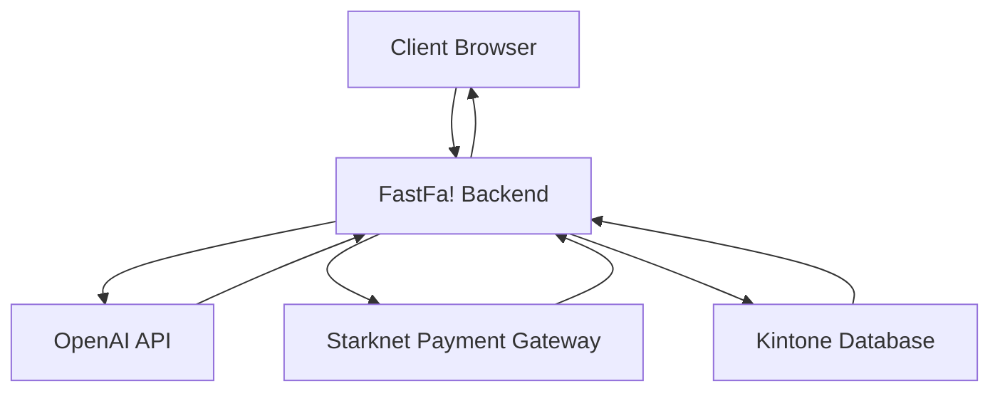
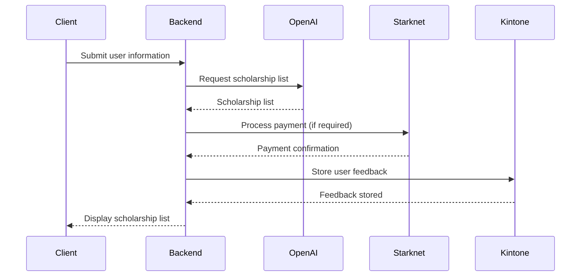

Relevant source files

The following file was used as context for generating this wiki page:

- [README.md](https://github.com/agattani123/Fast-Fa/blob/master/README.md)

# Deployment and Infrastructure

## Introduction

FastFa! is a web application that aims to simplify the scholarship application process for students. It leverages OpenAI's GPT-4 model to generate a personalized list of scholarships based on the user's input. The application also integrates with Starknet for secure payment processing and Kintone for storing user feedback. This wiki page provides an overview of the deployment and infrastructure aspects of the FastFa! project.

## Technology Stack

### Backend

FastFa! uses the following technologies for the backend:

- **Node.js**: A JavaScript runtime environment for executing server-side code.
- **Express.js**: A web application framework for Node.js, used for building the API and handling HTTP requests.
- **Fetch API**: A modern interface for making HTTP requests, used to interact with the OpenAI API.

### Frontend

The frontend of FastFa! is built using:

- **HTML**: The standard markup language for creating web pages.
- **CSS**: A style sheet language used for describing the presentation of web pages.
- **JavaScript**: A programming language used for adding interactivity and dynamic behavior to web pages.

### Payment Integration

FastFa! integrates with Starknet for secure payment processing. Starknet is a decentralized blockchain network that enables fast and secure transactions.

### Feedback Storage

User feedback is stored in the Kintone database system. Kintone is a cloud-based platform for building custom applications and databases.

## Application Architecture

The following diagram illustrates the high-level architecture of the FastFa! application:

1. The client browser sends a request to the FastFa! backend with the user's input.
2. The backend processes the request and sends a request to the OpenAI API to generate a list of scholarships based on the user's input.
3. The OpenAI API responds with the generated list of scholarships, which is processed by the backend.
4. The backend integrates with Starknet for secure payment processing if required.
5. User feedback is stored in the Kintone database by the backend.
6. The backend sends the processed scholarship list back to the client browser for display.

Sources: [README.md](https://github.com/agattani123/Fast-Fa/blob/master/README.md)

## User Flow

The following sequence diagram illustrates the user flow in the FastFa! application:

1. The client submits their personal information and financial needs to the backend.
2. The backend sends a request to the OpenAI API to generate a list of scholarships based on the user's input.
3. The OpenAI API responds with the generated list of scholarships.
4. If payment is required, the backend processes the payment through the Starknet payment gateway.
5. The backend stores user feedback in the Kintone database.
6. The backend sends the processed scholarship list back to the client for display.

Sources: [README.md](https://github.com/agattani123/Fast-Fa/blob/master/README.md)

## Deployment and Infrastructure Components

The following table summarizes the key deployment and infrastructure components of the FastFa! application:

| Component | Description |
| --- | --- |
| Node.js | JavaScript runtime environment for executing server-side code. |
| Express.js | Web application framework for Node.js, used for building the API and handling HTTP requests. |
| OpenAI API | External API used for generating personalized scholarship lists using GPT-4. |
| Starknet | Decentralized blockchain network for secure payment processing. |
| Kintone | Cloud-based platform for building custom applications and databases, used for storing user feedback. |

Sources: [README.md](https://github.com/agattani123/Fast-Fa/blob/master/README.md)

## Conclusion

FastFa! is a web application that aims to simplify the scholarship application process for students. It leverages various technologies and integrations, including OpenAI's GPT-4 model, Starknet for payment processing, and Kintone for storing user feedback. The application follows a client-server architecture, with the backend handling requests, processing data, and integrating with external services. The deployment and infrastructure components work together to provide a seamless experience for users in finding and applying for scholarships.