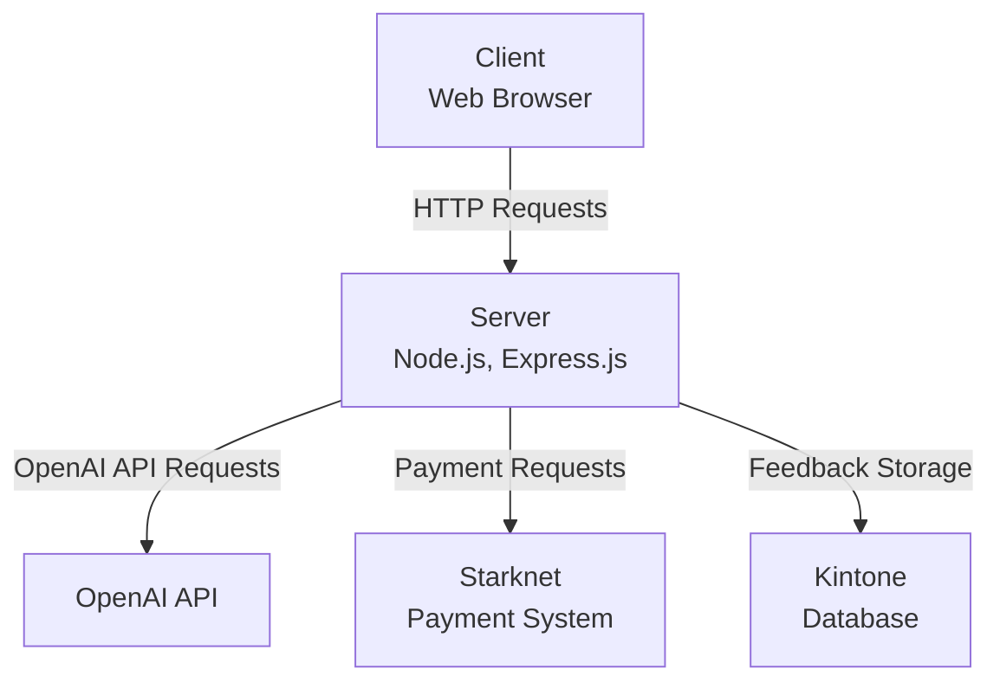
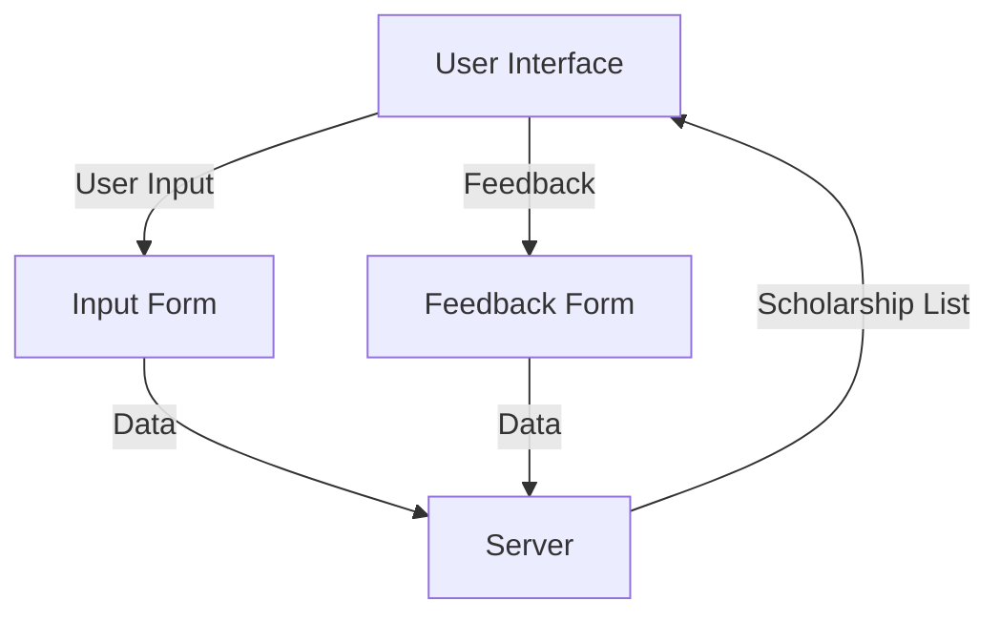
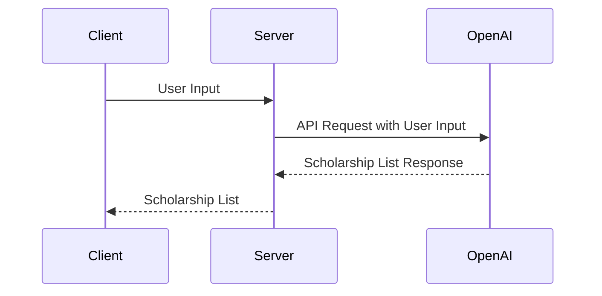
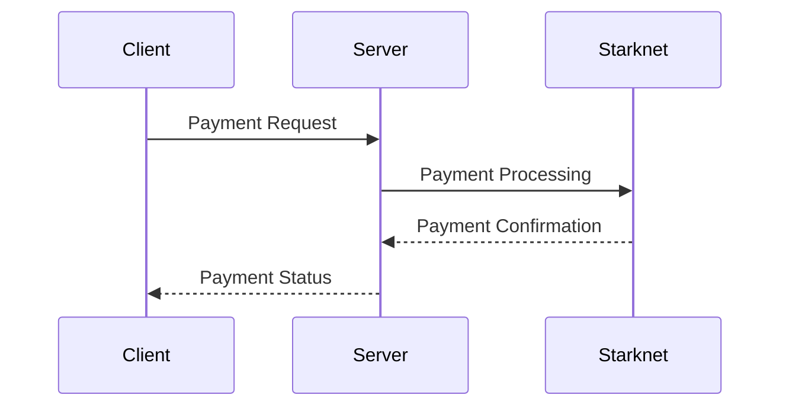
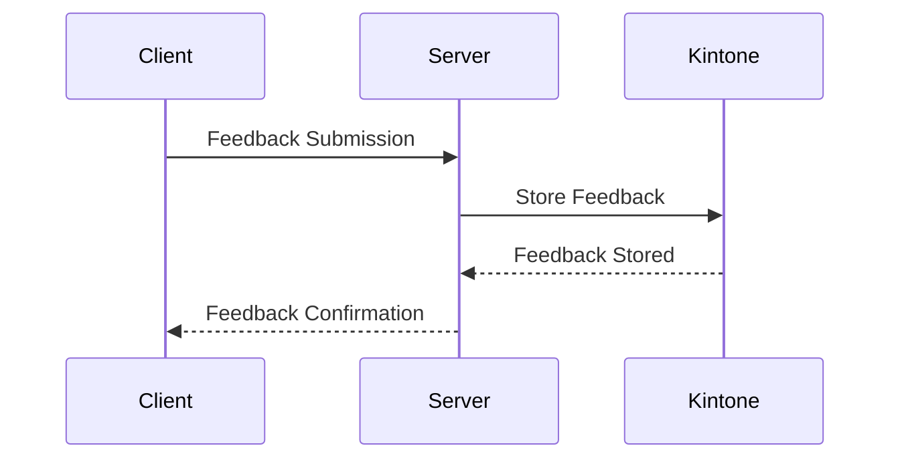

Relevant source files

The following file was used as context for generating this wiki page:

- [README.md](https://github.com/agattani123/Fast-Fa/blob/master/README.md)

# Deployment and Infrastructure

## Introduction

FastFa! is a web application that aims to simplify the process of finding and applying for scholarships by leveraging generative AI. The application takes user input, processes it through OpenAI's GPT-4 model, and generates a personalized list of scholarships tailored to the user's background, interests, and financial situation. Additionally, FastFa! incorporates a secure payment method built on Starknet, allowing students to receive scholarships directly from institutions. The application also includes a feedback system integrated with the Kintone database.

## Architecture Overview

FastFa! follows a client-server architecture, with the frontend built using HTML, CSS, and JavaScript, and the backend implemented using Node.js and Express.js. The application interacts with the OpenAI API to generate scholarship recommendations based on user input. The payment functionality is handled through Starknet, and user feedback is stored in the Kintone database.

Sources: [README.md](https://github.com/agattani123/Fast-Fa/blob/master/README.md)

## Frontend

The FastFa! frontend is responsible for rendering the user interface and handling user interactions. It is built using HTML, CSS, and JavaScript.

### User Interface

The frontend provides a user-friendly interface where users can input their personal information and financial needs. The UI also displays the generated list of scholarships and provides a way for users to submit feedback.

Sources: [README.md](https://github.com/agattani123/Fast-Fa/blob/master/README.md)

## Backend

The FastFa! backend is built using Node.js and Express.js. It handles the communication with the OpenAI API, Starknet payment system, and Kintone database.

### OpenAI Integration

The backend uses the `fetch` API to make requests to the OpenAI API. It processes the user input and sends it to the OpenAI GPT-4 model, which generates a list of scholarships based on the provided information.

Sources: [README.md](https://github.com/agattani123/Fast-Fa/blob/master/README.md)

### Payment System (Starknet)

FastFa! incorporates a secure payment method built on Starknet, allowing students to receive scholarships directly from institutions. The backend handles the communication with the Starknet payment system.

Sources: [README.md](https://github.com/agattani123/Fast-Fa/blob/master/README.md)

### Feedback System (Kintone)

The application includes a feedback system integrated with the Kintone database. The backend handles the storage and retrieval of user feedback from the Kintone database.

Sources: [README.md](https://github.com/agattani123/Fast-Fa/blob/master/README.md)

## Conclusion

FastFa! is a web application that leverages generative AI to simplify the process of finding and applying for scholarships. It follows a client-server architecture, with the frontend handling user interactions and the backend integrating with the OpenAI API, Starknet payment system, and Kintone database. The application aims to provide a user-friendly experience while ensuring secure payment and feedback mechanisms.