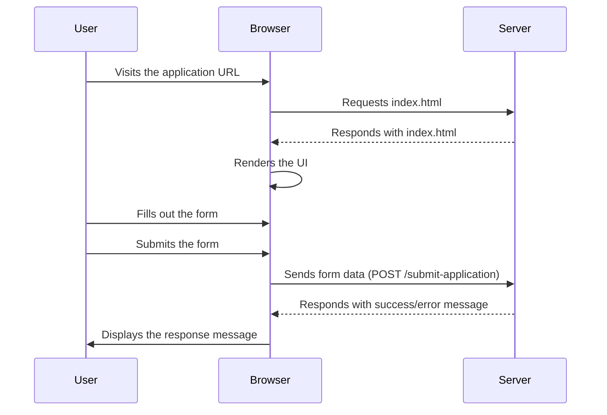

<details>
<summary>Relevant source files</summary>

The following files were used as context for generating this wiki page:

- [scholarship_app/public/index.html](https://github.com/agattani123/Fast-Fa/blob/master/scholarship_app/public/index.html)
- [scholarship_app/public/style.css](https://github.com/agattani123/Fast-Fa/blob/master/scholarship_app/public/style.css)
- [scholarship_app/public/form.js](https://github.com/agattani123/Fast-Fa/blob/master/scholarship_app/public/form.js)
- [scholarship_app/public/script.js](https://github.com/agattani123/Fast-Fa/blob/master/scholarship_app/public/script.js)

</details>

# User Interface

## Introduction

The "User Interface" component of the "Fast-Fa" project is a web-based application that provides a simplified and user-friendly interface for students to apply for scholarships. It aims to streamline the often tedious and complex process of filling out the Free Application for Federal Student Aid (FAFSA) by offering a more intuitive and visually appealing form. The user interface is built using HTML, CSS, and JavaScript, and it interacts with a server-side component (not provided in the given files) to submit the application data.

Sources: [scholarship_app/public/index.html](), [scholarship_app/public/style.css](), [scholarship_app/public/form.js](), [scholarship_app/public/script.js]()

## Frontend Structure

The frontend of the "Fast-Fa" application consists of the following main components:

### HTML Structure

The HTML file (`index.html`) defines the structure and layout of the user interface. It includes a header with the application's title, a main section with a brief introduction and the scholarship application form, and a container div to hold the entire content.

```html
<div class="container">
    <header class="para">
        <h1>fast-fa</h1>
    </header>
    <main>
        <div class="para">
            <p>sick of FAFSA's tedious application process? <br> 
                put in your information below and unlock your future!</p>
        <div class="para">
        <form id="scholarshipForm" action="/submit-application" method="POST">
            <!-- Form fields -->
        </form>
    </main>
</div>
```

Sources: [scholarship_app/public/index.html:14-30]()

### CSS Styles

The CSS file (`style.css`) defines the visual styles and layout for the user interface components. It includes styles for the body, container, header, main content, form fields, and the submit button. The styles also include animations and transitions for a more engaging user experience.

```css
body {
    /* Body styles */
}

.container {
    /* Container styles */
}

.header h1 {
    /* Header styles */
}

.main p {
    /* Main content styles */
}

.row {
    /* Form row styles */
}

.inputBox {
    /* Input field styles */
}

button {
    /* Submit button styles */
}
```

Sources: [scholarship_app/public/style.css:1-97]()

### JavaScript Functionality

The JavaScript files (`form.js` and `script.js`) provide interactivity and functionality to the user interface.

#### Form Submission

The `form.js` file handles the submission of the scholarship application form. It listens for the `submit` event on the form and sends the form data to the server using the `fetch` API.

```javascript
document.getElementById('scholarshipForm').addEventListener('submit', function(event) {
    event.preventDefault();
    const formData = new FormData(this);
    fetch('/submit-application', {
        method: 'POST',
        body: formData
    }).then(response => response.text())
      .then(data => alert(data));
});
```

Sources: [scholarship_app/public/form.js:1-9]()

#### Additional Interactivity

The `script.js` file provides additional interactivity for the user interface, such as adding a hover effect to a button (not present in the provided files).

```javascript
document.getElementById('download-button').addEventListener('mouseover', function() {
    this.style.boxShadow = '0 4px 8px 0 rgba(0,0,0,0.2)';
});

document.getElementById('download-button').addEventListener('mouseout', function() {
    this.style.boxShadow = 'none';
});
```

Sources: [scholarship_app/public/script.js:1-7]()

## User Interface Flow

The user interface flow for the "Fast-Fa" application can be represented by the following sequence diagram:



1. The user visits the application URL in their web browser.
2. The browser requests the `index.html` file from the server.
3. The server responds with the `index.html` file.
4. The browser renders the user interface based on the HTML, CSS, and JavaScript files.
5. The user fills out the scholarship application form.
6. The user submits the form.
7. The browser sends the form data to the server using the `fetch` API and the `/submit-application` endpoint.
8. The server processes the form data and responds with a success or error message.
9. The browser displays the response message to the user.

Sources: [scholarship_app/public/index.html:27](), [scholarship_app/public/form.js:5](), [scholarship_app/public/script.js:16-25]()

## Form Structure

The scholarship application form is defined in the `index.html` file and consists of the following fields:

| Field Name     | Type     | Description                                |
|-----------------|----------|-------------------------------------------|
| `firstName`     | Text     | The first name of the applicant           |
| `lastName`      | Text     | The last name of the applicant            |
| `financial_info`| Textarea | A description of the applicant's financial information |

Sources: [scholarship_app/public/index.html:23-28]()

The form fields are styled using CSS classes (`inputBox`, `row`) to provide a visually appealing layout and input field styling.

```html
<div class="row">
    <div class="inputBox">
        <input type="text" name="firstName" required="required">
        <span>First Name</span>
    </div>
    <div class="inputBox">
        <input type="text" name="lastName" required="required">
        <span>Last Name</span>
    </div>
</div>
<div class="inputBox">
    <textarea name="financial_info" required rows="8"></textarea>
    <span>Description</span>
</div>
```

Sources: [scholarship_app/public/index.html:23-30]()

## Conclusion

The "User Interface" component of the "Fast-Fa" project provides a simplified and user-friendly interface for students to apply for scholarships. It leverages HTML, CSS, and JavaScript to create an engaging and visually appealing experience. The application form collects the necessary information from the user and submits it to the server for further processing. While the provided files do not include the server-side implementation, the user interface component is a crucial part of the overall application, facilitating the initial data collection and submission process.