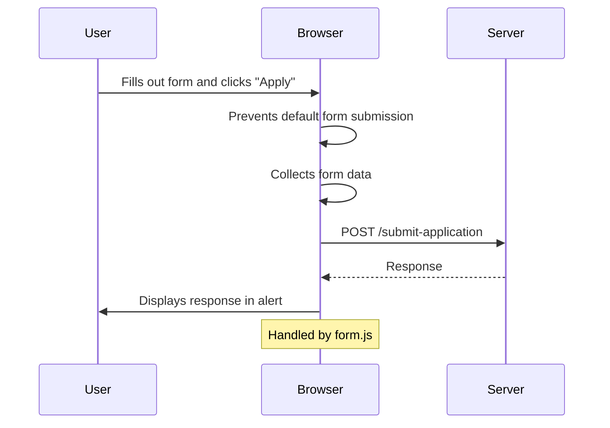

<details>
<summary>Relevant source files</summary>

The following files were used as context for generating this wiki page:

- [scholarship_app/public/index.html](https://github.com/agattani123/Fast-Fa/blob/master/scholarship_app/public/index.html)
- [scholarship_app/public/style.css](https://github.com/agattani123/Fast-Fa/blob/master/scholarship_app/public/style.css)
- [scholarship_app/public/form.js](https://github.com/agattani123/Fast-Fa/blob/master/scholarship_app/public/form.js)

</details>

# User Interface

## Introduction

The "User Interface" component of the Fast-Fa scholarship application project is responsible for providing a user-friendly and visually appealing interface for applicants to submit their information. It consists of an HTML file (`index.html`) that defines the structure and content of the web page, a CSS file (`style.css`) for styling and layout, and a JavaScript file (`form.js`) for handling form submission and interaction.

Sources: [scholarship_app/public/index.html](), [scholarship_app/public/style.css](), [scholarship_app/public/form.js]()

## Page Structure and Content

### HTML Structure

The `index.html` file defines the basic structure of the web page, including the header, main content area, and form elements.

```html
<body>
    <div class="container">
        <header class="para">
            <h1>fast-fa</h1>
        </header>
        <main>
            <div class="para">
                <p>sick of FAFSA's tedious application process? <br> 
                    put in your information below and unlock your future!</p>
            <div class="para">
            <form id="scholarshipForm" action="/submit-application" method="POST">
                <!-- Form fields -->
            </form>
        </main>
    </div>
</body>
```

Sources: [scholarship_app/public/index.html:9-27]()

### Form Fields

The form includes the following input fields:

- First Name (text input)
- Last Name (text input)
- Financial Information (textarea)

```html
<div class="row">
    <div class="inputBox">
        <input type="text" name="firstName" required="required">
        <span>First Name</span>
    </div>
    <div class="inputBox">
        <input type="text" name="lastName" required="required">
        <span>Last Name</span>
    </div>
</div>
<div class="inputBox">
    <textarea name="financial_info" required rows="8"></textarea>
    <span>Description</span>
</div>
```

Sources: [scholarship_app/public/index.html:20-29]()

### Form Submission

The form is set to submit data to the `/submit-application` endpoint using the `POST` method.

```html
<form id="scholarshipForm" action="/submit-application" method="POST">
    <!-- Form fields -->
</form>
```

Sources: [scholarship_app/public/index.html:19]()

## Styling and Layout

The `style.css` file defines the visual styles and layout for the user interface components.

### Overall Layout

The page uses a flexbox layout to center the main container vertically and horizontally on the screen. The container has a maximum width of 600px and includes padding, border-radius, and a box-shadow for a modern and clean appearance.

```css
body {
    display: flex;
    justify-content: center;
    align-items: center;
    height: 100vh;
}

.container {
    width: 90%;
    max-width: 600px;
    background: #ffffff;
    padding: 20px;
    border-radius: 8px;
    box-shadow: 0 4px 6px rgba(0,0,0,0.1);
    text-align: center;
}
```

Sources: [scholarship_app/public/style.css:3-5](), [scholarship_app/public/style.css:16-23]()

### Background Animation

The page background features a gradient animation that transitions between different shades of blue and green.

```css
body {
    background: linear-gradient(-45deg, #3d7ec7, #7f91a9, #4b7c86, #ecf0ef);
    background-size: 400% 400%;
    animation: gradient 10s ease infinite;
}

@keyframes gradient {
    0% { background-position: 0% 50%; }
    50% { background-position: 100% 50%; }
    100% { background-position: 0% 50%; }
}
```

Sources: [scholarship_app/public/style.css:6-7](), [scholarship_app/public/style.css:67-72]()

### Typography

The CSS file defines styles for headings, paragraphs, and form labels, including font families, sizes, colors, and line heights.

```css
.header h1 {
    font-size: 48px;
    color: #5b3c88;
}

.main p, .para {
    margin-bottom: 20px;
    line-height: 1.6;
    font-size: 18px;
    color: midnightblue;
    opacity: 0.75;
}
```

Sources: [scholarship_app/public/style.css:24-27](), [scholarship_app/public/style.css:28-33]()

### Form Styling

The form fields are styled with custom input boxes, including animations and transitions for labels and borders.

```css
.inputBox {
    position: relative;
    flex: 1;
    margin: 0 10px;
}

.inputBox input, .inputBox textarea {
    width: 100%;
    padding: 10px;
    border: 1px solid rgba(255, 255, 255, 0.25);
    background: #f6f8f9;
    border-radius: 5px;
    outline: none;
    color: #0e0c0c;
    font-size: 1em;
}

.inputBox span {
    position: absolute;
    left: 10px;
    top: 10px;
    pointer-events: none;
    font-size: 1em;
    color: rgba(106, 95, 95, 0.25);
    text-transform: uppercase;
    transition: 0.3s;
}

.inputBox input:valid ~ span,
.inputBox input:focus ~ span,
.inputBox textarea:valid ~ span,
.inputBox textarea:focus ~ span {
    color: rgb(157, 157, 201);
    transform: translateY(-20px);
    font-size: 0.65em;
    background: #1d2b3a;
    border-left: 1px solid rgb(25, 25, 112);
    border-right: 1px solid rgb(25, 25, 112);
    padding: 0 10px;
}

.inputBox input:valid,
.inputBox input:focus,
.inputBox textarea:valid,
.inputBox textarea:focus {
    border: 1px solid rgb(25, 25, 112);
}
```

Sources: [scholarship_app/public/style.css:35-36](), [scholarship_app/public/style.css:37-45](), [scholarship_app/public/style.css:46-53](), [scholarship_app/public/style.css:54-64](), [scholarship_app/public/style.css:65-66]()

### Button Styling

The submit button is styled with a background color, hover effect, and transition animation.

```css
button {
    background-color: #5b3c88;
    color: white;
    border: none;
    padding: 10px 20px;
    border-radius: 5px;
    cursor: pointer;
    font-size: 16px;
    transition: background-color 0.3s, transform 0.3s;
}

button:hover {
    background-color: rgb(25, 25, 112);
    transform: scale(1.05);
}
```

Sources: [scholarship_app/public/style.css:73-80](), [scholarship_app/public/style.css:81-83]()

## Form Submission Handling

The `form.js` file contains JavaScript code to handle the form submission process.

```js
document.getElementById('scholarshipForm').addEventListener('submit', function(event) {
    event.preventDefault();
    const formData = new FormData(this);
    fetch('/submit-application', {
        method: 'POST',
        body: formData
    }).then(response => response.text())
      .then(data => alert(data));
});
```

1. The code listens for the `submit` event on the form with the ID `scholarshipForm`.
2. When the form is submitted, the default behavior is prevented using `event.preventDefault()`.
3. The form data is collected using `new FormData(this)`.
4. A `fetch` request is made to the `/submit-application` endpoint using the `POST` method and the form data as the request body.
5. The server's response is converted to text using `response.text()`.
6. The server's response text is displayed in an alert using `alert(data)`.

Sources: [scholarship_app/public/form.js:1-8]()

## Sequence Diagram

The following sequence diagram illustrates the flow of events when the user submits the scholarship application form:



Sources: [scholarship_app/public/form.js](), [scholarship_app/public/index.html:19]()

## Summary

The "User Interface" component of the Fast-Fa scholarship application project provides a visually appealing and user-friendly interface for applicants to submit their information. It includes an HTML file for the page structure and content, a CSS file for styling and layout, and a JavaScript file for handling form submission and interaction with the server. The interface features a responsive design, animated background, custom form input styles, and a smooth form submission process using JavaScript and the Fetch API.