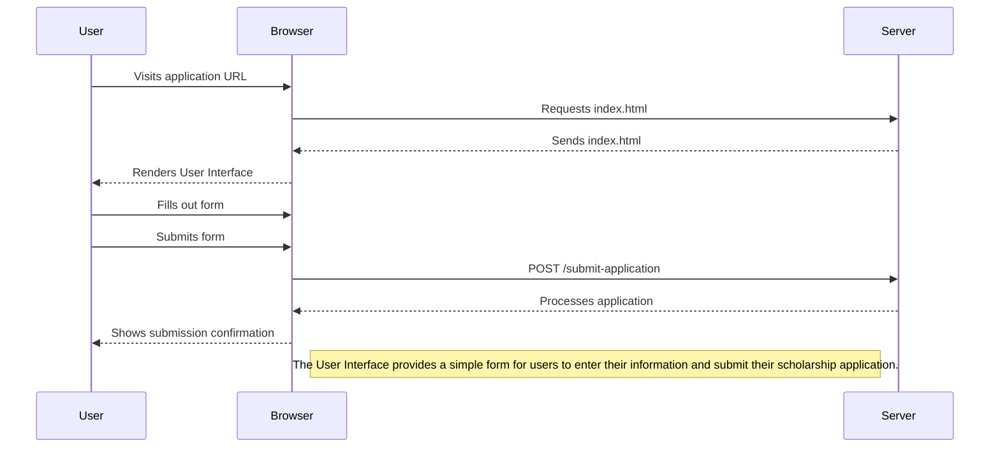

<details>
<summary>Relevant source files</summary>

The following files were used as context for generating this wiki page:

- [scholarship_app/public/index.html](https://github.com/agattani123/Fast-Fa/blob/master/scholarship_app/public/index.html)
- [scholarship_app/public/style.css](https://github.com/agattani123/Fast-Fa/blob/master/scholarship_app/public/style.css)

</details>

# User Interface

## Introduction

The "User Interface" component of the Fast-Fa scholarship application project is responsible for providing a user-friendly and visually appealing interface for applicants to submit their information. It consists of an HTML file (`index.html`) and a CSS file (`style.css`) that work together to create the application's front-end.

The main purpose of the User Interface is to present a simple and straightforward form where users can enter their personal details and financial information. The interface aims to streamline the application process, making it more accessible and less tedious compared to traditional methods.

Sources: [scholarship_app/public/index.html](), [scholarship_app/public/style.css]()

## HTML Structure

The `index.html` file defines the structure and content of the User Interface. It includes a header, a main section with a form, and a container to hold these elements.

### Container and Header

```html
<div class="container">
    <header class="para">
        <h1>fast-fa</h1>
    </header>
    <!-- ... -->
</div>
```

The `container` div serves as a wrapper for the entire User Interface, while the `header` element displays the project's name, "fast-fa".

Sources: [scholarship_app/public/index.html:9-14]()

### Main Section and Form

```html
<main>
    <div class="para">
        <p>sick of FAFSA's tedious application process? <br> 
            put in your information below and unlock your future!</p>
    </div>
    <div class="para">
        <form id="scholarshipForm" action="/submit-application" method="POST">
            <!-- Form fields -->
        </form>
    </div>
</main>
```

The `main` section contains a paragraph explaining the purpose of the application and a `form` element where users can input their information. The form has an `id` of `scholarshipForm`, an `action` attribute specifying the server endpoint for submission (`/submit-application`), and a `method` of `POST`.

Sources: [scholarship_app/public/index.html:16-28]()

### Form Fields

```html
<div class="row">
    <div class="inputBox">
        <input type="text" name="firstName" required="required">
        <span>First Name</span>
    </div>
    <div class="inputBox">
        <input type="text" name="lastName" required="required">
        <span>Last Name</span>
    </div>
</div>
<div class="inputBox">
    <textarea name="financial_info" required rows="8"></textarea>
    <span>Description</span>
</div>
<button type="submit">Apply</button>
```

The form includes the following fields:

- **First Name**: A text input field for the applicant's first name, marked as required.
- **Last Name**: A text input field for the applicant's last name, marked as required.
- **Description**: A textarea field for the applicant to provide financial information, marked as required.
- **Apply Button**: A submit button to send the form data to the server.

The input fields are wrapped in `div` elements with the class `inputBox`, which is used for styling purposes. The `row` class is used to display the first and last name fields side by side.

Sources: [scholarship_app/public/index.html:20-27]()

## CSS Styling

The `style.css` file defines the visual styles and layout for the User Interface. It includes styles for the overall page, container, header, main content, form fields, and button.

### Page and Container Styles

```css
body {
    /* ... */
    display: flex;
    justify-content: center;
    align-items: center;
    height: 100vh;
    background: linear-gradient(-45deg, #3d7ec7, #7f91a9, #4b7c86, #ecf0ef);
    background-size: 400% 400%;
    animation: gradient 10s ease infinite;
}

.container {
    width: 90%;
    max-width: 600px;
    background: #ffffff;
    padding: 20px;
    border-radius: 8px;
    box-shadow: 0 4px 6px rgba(0,0,0,0.1);
    text-align: center;
}
```

The `body` styles set a full-screen height, center the content vertically and horizontally, and apply a smooth gradient animation as the background. The `container` class styles define the appearance of the main wrapper, including its width, background color, padding, border radius, and box shadow.

Sources: [scholarship_app/public/style.css:1-22]()

### Header and Text Styles

```css
.header h1 {
    font-size: 48px;
    color: #5b3c88;
}

.main p {
    margin-bottom: 20px;
    line-height: 1.6;
    font-size: 18px;
    color: midnightblue;
    opacity: 0.75;
}

.para {
    margin-bottom: 20px;
    line-height: 1.6;
    font-size: 18px;
    color: midnightblue;
    opacity: 0.75;
}
```

These styles define the appearance of the header text, main paragraph, and other text elements with the `para` class. They set the font size, color, line height, and opacity for better readability.

Sources: [scholarship_app/public/style.css:24-38]()

### Form Field Styles

```css
.row {
    display: flex;
    justify-content: space-between;
    padding-bottom: 20px;
}

.inputBox {
    position: relative;
    flex: 1;
    margin: 0 10px;
}

.inputBox input, .inputBox textarea {
    width: 100%;
    padding: 10px;
    border: 1px solid rgba(255, 255, 255, 0.25);
    background: #f6f8f9;
    border-radius: 5px;
    outline: none;
    color: #0e0c0c;
    font-size: 1em;
}

.inputBox span {
    position: absolute;
    left: 10px;
    top: 10px;
    pointer-events: none;
    font-size: 1em;
    color: rgba(106, 95, 95, 0.25);
    text-transform: uppercase;
    transition: 0.3s;
}

.inputBox input:valid ~ span,
.inputBox input:focus ~ span,
.inputBox textarea:valid ~ span,
.inputBox textarea:focus ~ span {
    color: rgb(157, 157, 201);
    transform: translateY(-20px);
    font-size: 0.65em;
    background: #1d2b3a;
    border-left: 1px solid rgb(25, 25, 112);
    border-right: 1px solid rgb(25, 25, 112);
    padding: 0 10px;
}

.inputBox input:valid,
.inputBox input:focus,
.inputBox textarea:valid,
.inputBox textarea:focus {
    border: 1px solid rgb(25, 25, 112);
}
```

These styles define the layout and appearance of the form fields. The `row` class is used to display the first and last name fields side by side using flexbox. The `inputBox` class styles handle the positioning and styling of the input fields and their corresponding labels (represented by `span` elements).

The styles also include transitions and visual effects for when the input fields are valid or focused, such as changing the label color, position, and background, as well as adding a border to the input fields.

Sources: [scholarship_app/public/style.css:40-86]()

### Button Styles

```css
button {
    background-color: #5b3c88;
    color: white;
    border: none;
    padding: 10px 20px;
    border-radius: 5px;
    cursor: pointer;
    font-size: 16px;
    transition: background-color 0.3s, transform 0.3s;
}

button:hover {
    background-color: rgb(25, 25, 112);
    transform: scale(1.05);
}
```

These styles define the appearance and behavior of the "Apply" button. The button has a purple background color, white text, no border, and a border radius. It also includes a hover effect that changes the background color and slightly scales up the button when the user hovers over it.

Sources: [scholarship_app/public/style.css:88-99]()

### Background Gradient Animation

```css
@keyframes gradient {
    0% { background-position: 0% 50%; }
    50% { background-position: 100% 50%; }
    100% { background-position: 0% 50%; }
}
```

This CSS animation defines a smooth gradient transition for the background of the `body` element. It moves the gradient position horizontally, creating a subtle animation effect.

Sources: [scholarship_app/public/style.css:101-105]()

## Sequence Diagram



This sequence diagram illustrates the flow of interactions between the user, the browser, and the server when using the User Interface. It shows the initial request for the `index.html` file, rendering of the User Interface, user input and form submission, and the server's processing of the application data.

Sources: [scholarship_app/public/index.html](), [scholarship_app/public/style.css]()

## Conclusion

The User Interface component of the Fast-Fa scholarship application project provides a clean and user-friendly interface for applicants to submit their personal and financial information. It leverages HTML and CSS to create a visually appealing form with input fields for first name, last name, and a description section for financial details. The interface also includes an "Apply" button to submit the form data to the server for processing.

The CSS styles enhance the overall appearance and usability of the interface, with features like a gradient background animation, responsive layout, input field validations, and hover effects on the submit button. The User Interface aims to simplify the application process and encourage more users to apply for scholarships by offering a streamlined and intuitive experience.

Sources: [scholarship_app/public/index.html](), [scholarship_app/public/style.css]()