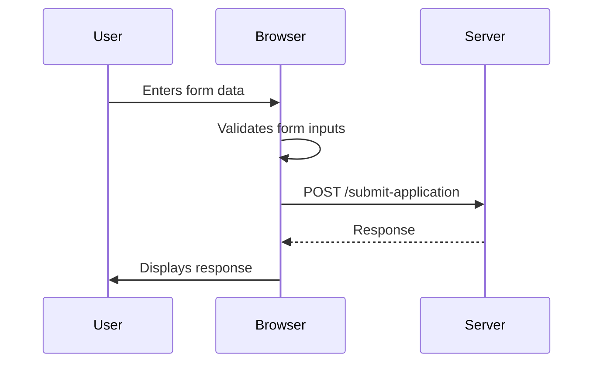

<details>
<summary>Relevant source files</summary>

The following files were used as context for generating this wiki page:

- [scholarship_app/public/index.html](https://github.com/agattani123/Fast-Fa/blob/master/scholarship_app/public/index.html)
- [scholarship_app/public/style.css](https://github.com/agattani123/Fast-Fa/blob/master/scholarship_app/public/style.css)
- [scholarship_app/public/form.js](https://github.com/agattani123/Fast-Fa/blob/master/scholarship_app/public/form.js)
- [scholarship_app/public/script.js](https://github.com/agattani123/Fast-Fa/blob/master/scholarship_app/public/script.js)

</details>

# User Interface

## Introduction

The "User Interface" in this project is a web-based application that provides a simplified and user-friendly interface for students to apply for scholarships. It aims to streamline the often tedious and complex process of filling out financial aid forms like FAFSA. The application consists of a single-page website with a form where users can enter their personal and financial information. Upon submission, the data is sent to a server for further processing.

Sources: [scholarship_app/public/index.html](), [scholarship_app/public/style.css]()

## Frontend Structure

The frontend of the application is built using HTML, CSS, and JavaScript. The main components are:

### HTML Structure

The `index.html` file defines the structure and layout of the user interface. It includes:

- A header with the application's title.
- A main section with a brief introduction and the scholarship application form.
- The form consists of input fields for the user's first name, last name, and a textarea for financial information.
- A submit button to initiate the application submission process.

Sources: [scholarship_app/public/index.html]()

### CSS Styling

The `style.css` file contains the styles that define the visual appearance of the user interface. Key aspects include:

- A responsive layout using flexbox to center the container on the page.
- Styling for the header, main content, form inputs, and submit button.
- Animations and transitions for a more engaging user experience (e.g., gradient background animation, button hover effect).

Sources: [scholarship_app/public/style.css]()

### JavaScript Functionality

The application's client-side functionality is implemented using JavaScript in two separate files:

1. `form.js`:
   - Handles the form submission event.
   - Prevents the default form submission behavior.
   - Creates a `FormData` object with the form data.
   - Sends a POST request to the `/submit-application` endpoint with the form data.
   - Displays an alert with the server's response.

```javascript
document.getElementById('scholarshipForm').addEventListener('submit', function(event) {
    event.preventDefault();
    const formData = new FormData(this);
    fetch('/submit-application', {
        method: 'POST',
        body: formData
    }).then(response => response.text())
      .then(data => alert(data));
});
```

Sources: [scholarship_app/public/form.js:2-9]()

2. `script.js`:
   - Adds a hover effect to the download button (not present in the provided files).
   - Handles the form submission event using the `fetch` API.
   - Sends a POST request to the `/submit-application` endpoint with the form data as JSON.
   - Logs the server's response to the console.

```javascript
document.getElementById('scholarshipForm').addEventListener('submit', function(event) {
    event.preventDefault();

    const firstName = document.querySelector('input[name="firstName"]').value;
    const lastName = document.querySelector('input[name="lastName"]').value;
    const financial_info = document.querySelector('textarea[name="financial_info"]').value;

    fetch('/submit-application', {
        method: 'POST',
        headers: {
            'Content-Type': 'application/json',
        },
        body: JSON.stringify({ firstName, lastName, financial_info }),
    })
    .then(response => response.json())
    .then(data => {
        console.log(data);
    })
    .catch((error) => {
        console.error('Error:', error);
    });
});
```

Sources: [scholarship_app/public/script.js:8-22]()

## Data Flow

The application follows a simple data flow pattern:



1. The user enters their personal and financial information into the form fields.
2. The browser performs client-side validation on the form inputs (e.g., required fields).
3. Upon form submission, the browser sends a POST request to the `/submit-application` endpoint with the form data.
4. The server processes the request and sends a response back to the browser.
5. The browser displays the server's response to the user (either an alert or logs it to the console, depending on the JavaScript file used).

Sources: [scholarship_app/public/form.js:2-9](), [scholarship_app/public/script.js:8-22]()

## Conclusion

The "User Interface" component of this project provides a simple and user-friendly way for students to apply for scholarships by filling out a form with their personal and financial information. The frontend is built using HTML, CSS, and JavaScript, with a focus on creating an engaging and responsive experience. The application follows a straightforward data flow, where the user's input is sent to a server for further processing upon form submission.