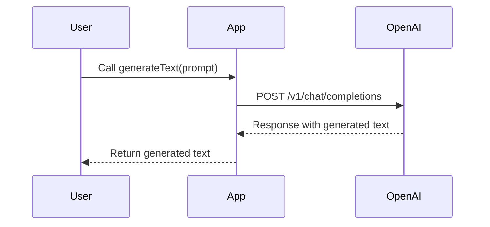
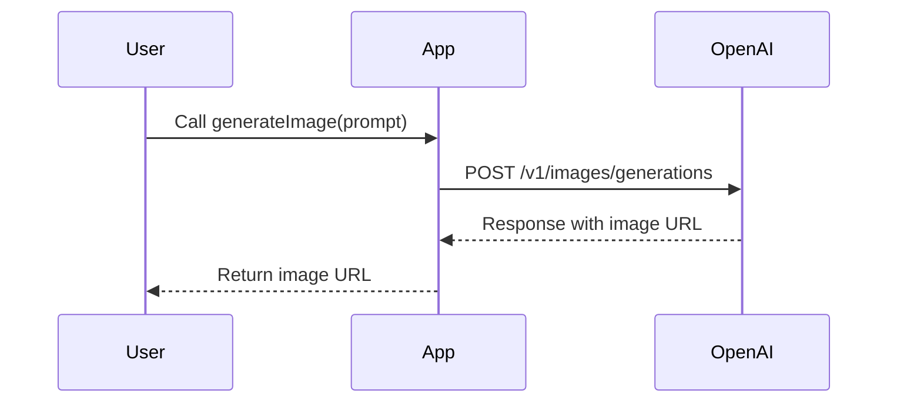

<details>
<summary>Relevant source files</summary>

The following files were used as context for generating this wiki page:

- [scholarship_app/AiHelper.js](https://github.com/agattani123/Fast-Fa/blob/master/scholarship_app/AiHelper.js)
- [scholarship_app/creds.js](https://github.com/agattani123/Fast-Fa/blob/master/scholarship_app/creds.js)

</details>

# OpenAI Integration

## Introduction

The "OpenAI Integration" feature within this project provides a set of utility functions to interact with the OpenAI APIs, specifically for generating text using GPT-4 and generating images using DALL-E 2. These functions can be used throughout the application to leverage the capabilities of OpenAI's language and image generation models.

Sources: [scholarship_app/AiHelper.js]()

## Utility Functions

### `fetchFromOpenAI`

This function is a utility function responsible for making API requests to the OpenAI APIs. It takes two parameters:

1. `url`: The URL of the OpenAI API endpoint to fetch from.
2. `payload`: The request payload to be sent to the API.

The function sends a POST request to the specified `url` with the provided `payload` in the request body. It includes the necessary headers, such as the OpenAI API key for authentication and the `Content-Type` header. The response from the API is then parsed as JSON and returned.

Sources: [scholarship_app/AiHelper.js:2-16]()

## Text Generation

### `generateText`

The `generateText` function is responsible for generating text using the OpenAI GPT-4 model. It takes a single parameter:

1. `prompt`: The prompt or input text for which the GPT-4 model should generate a response.

The function constructs a payload object with the provided `prompt` and sends it to the OpenAI Chat Completions API endpoint using the `fetchFromOpenAI` utility function. The response from the API is then extracted and returned as the generated text.



Sources: [scholarship_app/AiHelper.js:19-28]()

## Image Generation

### `generateImage`

The `generateImage` function is responsible for generating images using the OpenAI DALL-E 2 model. It takes a single parameter:

1. `prompt`: The prompt or description for the image to be generated.

The function constructs a payload object with the provided `prompt` and other configuration options, such as the model to use (`dall-e-2`), the number of images to generate (`n`), and the size of the generated images (`256x256`). This payload is then sent to the OpenAI Image Generations API endpoint using the `fetchFromOpenAI` utility function. The response from the API contains the URL of the generated image, which is returned by the function.



Sources: [scholarship_app/AiHelper.js:31-41]()

## Example Usage

The `AiHelper.js` file includes an example usage of the `generateText` and `generateImage` functions. It demonstrates how to call these functions with different prompts and handle the responses.

```javascript
(async () => {
  try {
    const textPrompt = "Explain quantum mechanics in simple terms";
    const imagePrompt = "Picture of a cute cat";

    const textResponse = await generateText(textPrompt);
    console.log("Text Response:", textResponse);

    const imageUrl = await generateImage(imagePrompt);
    console.log("Image URL:", imageUrl);
  } catch (error) {
    console.log(error.message);
  }
})();
```

Sources: [scholarship_app/AiHelper.js:44-57]()

## Configuration

The OpenAI API key is stored in the `creds.js` file and imported into the `AiHelper.js` module. This key is used for authentication when making requests to the OpenAI APIs.

```javascript
export default {
    openAiKey: APIKEY,
};
```

Sources: [scholarship_app/creds.js]()

## Conclusion

The "OpenAI Integration" feature provides a convenient way to leverage the capabilities of OpenAI's language and image generation models within the application. The `generateText` and `generateImage` functions can be used throughout the codebase to generate text or images based on provided prompts, enabling various use cases such as content generation, image captioning, or creative applications.