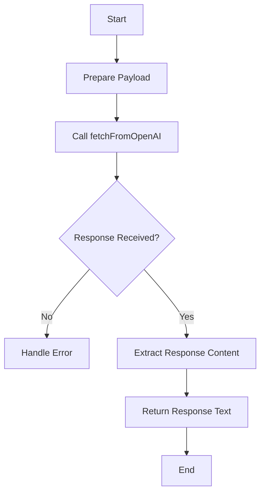
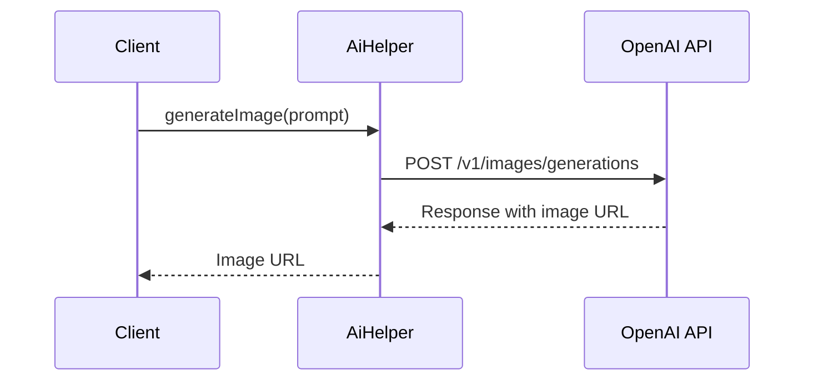

<details>
<summary>Relevant source files</summary>

The following files were used as context for generating this wiki page:

- [scholarship_app/AiHelper.js](https://github.com/agattani123/Fast-Fa/blob/master/scholarship_app/AiHelper.js)
- [scholarship_app/creds.js](https://github.com/agattani123/Fast-Fa/blob/master/scholarship_app/creds.js)

</details>

# OpenAI Integration

## Introduction

The OpenAI Integration module provides functionality to interact with the OpenAI APIs, specifically for generating text using GPT-4 and generating images using DALL-E 2. This integration allows the application to leverage the powerful language and image generation capabilities of OpenAI's models.

Sources: [scholarship_app/AiHelper.js]()

## Text Generation with GPT-4

### Overview

The `generateText` function is responsible for generating text based on a given prompt using the OpenAI GPT-4 model. It utilizes the OpenAI Chat Completions API to generate human-like responses to the provided prompt.

Sources: [scholarship_app/AiHelper.js:11-22]()

### Flow Diagram



1. The function starts by preparing the payload object with the necessary parameters, including the GPT-4 model and the user's prompt.
2. The `fetchFromOpenAI` function is called with the appropriate API endpoint URL and the prepared payload.
3. If the API call is successful, the response content is extracted from the received data.
4. The generated text is returned as the result of the `generateText` function.
5. If an error occurs during the API call, an error is thrown and handled appropriately.

Sources: [scholarship_app/AiHelper.js:11-22]()

## Image Generation with DALL-E 2

### Overview

The `generateImage` function is responsible for generating an image based on a given prompt using the OpenAI DALL-E 2 model. It utilizes the OpenAI Image Generations API to generate images based on the provided text prompt.

Sources: [scholarship_app/AiHelper.js:24-33]()

### Sequence Diagram



1. The client calls the `generateImage` function with a text prompt.
2. The `generateImage` function prepares the payload with the DALL-E 2 model, the prompt, and other parameters.
3. The `fetchFromOpenAI` function is called with the Image Generations API endpoint URL and the prepared payload.
4. The OpenAI API responds with the generated image URL.
5. The image URL is returned to the client.

Sources: [scholarship_app/AiHelper.js:24-33]()

## Utility Functions

### `fetchFromOpenAI`

The `fetchFromOpenAI` function is a utility function responsible for making API requests to the OpenAI APIs. It handles the authentication, request payload, and response parsing.

```javascript
async function fetchFromOpenAI(url, payload) {
  try {
    const response = await fetch(url, {
      method: "POST",
      headers: {
        Authorization: `Bearer ${process.env.OPENAI_API_KEY}`,
        "Content-Type": "application/json",
      },
      body: JSON.stringify(payload),
    });
    return response.json();
  } catch (error) {
    console.error("Error fetching from OpenAI:", error);
    throw new Error("Failed to fetch from OpenAI API");
  }
}
```

1. The function takes the API endpoint URL and the request payload as arguments.
2. It sends a POST request to the specified URL with the payload and the necessary headers, including the OpenAI API key for authentication.
3. If the request is successful, it returns the parsed JSON response.
4. If an error occurs during the request, it logs the error and throws a new error.

Sources: [scholarship_app/AiHelper.js:1-14]()

### API Key Configuration

The OpenAI API key is imported from the `creds.js` file and used for authentication in the `fetchFromOpenAI` function.

```javascript
import { openAiKey } from "./creds.js";
```

Sources: [scholarship_app/AiHelper.js:14](), [scholarship_app/creds.js]()

## Example Usage

The `AiHelper.js` file provides an example usage of the `generateText` and `generateImage` functions:

```javascript
(async () => {
  try {
    const textPrompt = "Explain quantum mechanics in simple terms";
    const imagePrompt = "Picture of a cute cat";

    const textResponse = await generateText(textPrompt);
    console.log("Text Response:", textResponse);

    const imageUrl = await generateImage(imagePrompt);
    console.log("Image URL:", imageUrl);
  } catch (error) {
    console.log(error.message);
  }
})();
```

1. The example code defines prompts for text generation and image generation.
2. The `generateText` function is called with the text prompt, and the generated text response is logged to the console.
3. The `generateImage` function is called with the image prompt, and the generated image URL is logged to the console.
4. Any errors that occur during the process are caught and logged to the console.

Sources: [scholarship_app/AiHelper.js:36-50]()

## Conclusion

The OpenAI Integration module provides a convenient way to leverage the powerful language and image generation capabilities of OpenAI's GPT-4 and DALL-E 2 models. It encapsulates the API communication and payload preparation, allowing developers to easily integrate these functionalities into their applications. The module also includes utility functions for handling API requests and configuration management.