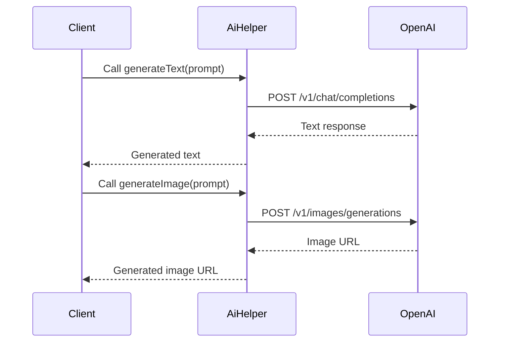

<details>
<summary>Relevant source files</summary>

The following files were used as context for generating this wiki page:

- [scholarship_app/AiHelper.js](https://github.com/agattani123/Fast-Fa/blob/master/scholarship_app/AiHelper.js)
- [scholarship_app/creds.js](https://github.com/agattani123/Fast-Fa/blob/master/scholarship_app/creds.js)

</details>

# OpenAI Integration

## Introduction

The "OpenAI Integration" feature within this project provides a set of utility functions to interact with the OpenAI APIs, specifically for generating text using GPT-4 and generating images using DALL-E 2. This integration allows the application to leverage the powerful natural language processing and image generation capabilities offered by OpenAI's AI models.

Sources: [scholarship_app/AiHelper.js]()

## OpenAI API Utility

The `fetchFromOpenAI` function is a utility function responsible for making API requests to the OpenAI servers. It takes two arguments: the API endpoint URL and the payload data to be sent in the request body.

```javascript
async function fetchFromOpenAI(url, payload) {
  // ...
}
```

The function performs the following steps:

1. Sends a POST request to the provided `url` with the `payload` data in the request body.
2. Includes the necessary headers, such as the OpenAI API key for authentication and the `Content-Type` header.
3. Returns the response data as JSON if the request is successful.
4. Handles any errors that occur during the request and throws an appropriate error message.

Sources: [scholarship_app/AiHelper.js:1-15]()

## Text Generation with GPT-4

The `generateText` function utilizes the OpenAI GPT-4 model to generate text based on a given prompt.

```javascript
async function generateText(prompt) {
  // ...
}
```

Here's how the function works:

1. Defines the API endpoint URL for the OpenAI chat completions API.
2. Constructs the payload object with the `gpt-4` model and the provided `prompt` as the initial user message.
3. Calls the `fetchFromOpenAI` function with the API endpoint URL and the payload.
4. Returns the generated text response from the API.

Sources: [scholarship_app/AiHelper.js:17-27]()

## Image Generation with DALL-E 2

The `generateImage` function utilizes the OpenAI DALL-E 2 model to generate an image based on a given prompt.

```javascript
async function generateImage(prompt) {
  // ...
}
```

Here's how the function works:

1. Defines the API endpoint URL for the OpenAI image generations API.
2. Constructs the payload object with the `dall-e-2` model, the provided `prompt`, the number of images to generate (`n=1`), and the image size (`256x256`).
3. Calls the `fetchFromOpenAI` function with the API endpoint URL and the payload.
4. Returns the URL of the generated image from the API response.

Sources: [scholarship_app/AiHelper.js:29-39]()

## Example Usage

The provided code includes an example usage of the `generateText` and `generateImage` functions within an asynchronous IIFE (Immediately Invoked Function Expression).

```javascript
(async () => {
  try {
    const textPrompt = "Explain quantum mechanics in simple terms";
    const imagePrompt = "Picture of a cute cat";

    const textResponse = await generateText(textPrompt);
    console.log("Text Response:", textResponse);

    const imageUrl = await generateImage(imagePrompt);
    console.log("Image URL:", imageUrl);
  } catch (error) {
    console.log(error.message);
  }
})();
```

1. The `textPrompt` and `imagePrompt` variables hold the prompts for text and image generation, respectively.
2. The `generateText` function is called with the `textPrompt`, and the generated text response is logged to the console.
3. The `generateImage` function is called with the `imagePrompt`, and the URL of the generated image is logged to the console.
4. Any errors that occur during the process are caught and logged to the console.

Sources: [scholarship_app/AiHelper.js:41-54]()

## Configuration

The OpenAI API key is imported from the `creds.js` file and used for authentication when making requests to the OpenAI APIs.

```javascript
import { openAiKey } from "./creds.js";
```

The `openAiKey` variable holds the actual API key value, which should be kept secure and not committed to version control.

Sources: [scholarship_app/AiHelper.js:3](), [scholarship_app/creds.js]()

## Sequence Diagram



The sequence diagram illustrates the flow of interactions between the client code, the `AiHelper` module, and the OpenAI APIs for both text and image generation:

1. The client code calls the `generateText` function with a text prompt.
2. The `AiHelper` module sends a POST request to the OpenAI chat completions API with the prompt.
3. OpenAI responds with the generated text, which is returned to the client.
4. The client code calls the `generateImage` function with an image prompt.
5. The `AiHelper` module sends a POST request to the OpenAI image generations API with the prompt.
6. OpenAI responds with the URL of the generated image, which is returned to the client.

Sources: [scholarship_app/AiHelper.js]()

## Conclusion

The "OpenAI Integration" feature provides a convenient way to leverage the powerful natural language processing and image generation capabilities of OpenAI's AI models within this project. By utilizing the `generateText` and `generateImage` functions, developers can easily generate text and images based on provided prompts, enabling a wide range of potential use cases and applications.