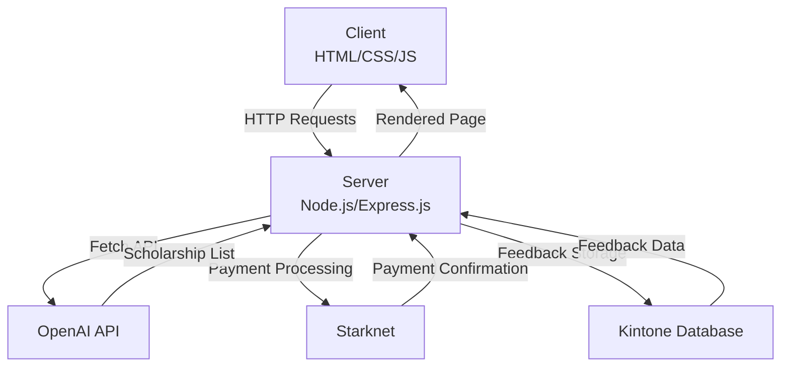
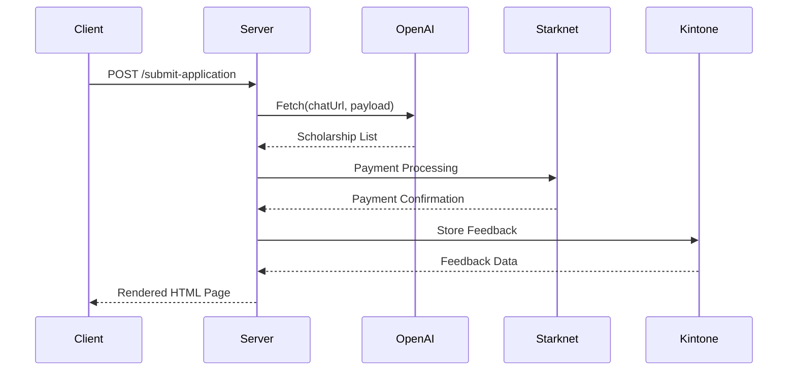

<details>
<summary>Relevant source files</summary>

The following files were used as context for generating this wiki page:

- [README.md](https://github.com/agattani123/Fast-Fa/blob/master/README.md)
- [scholarship_app/package.json](https://github.com/agattani123/Fast-Fa/blob/master/scholarship_app/package.json)
- [scholarship_app/server.js](https://github.com/agattani123/Fast-Fa/blob/master/scholarship_app/server.js)
</details>

# Getting Started

## Introduction

FastFa! is a web application that aims to simplify the process of finding and applying for scholarships. It leverages OpenAI's GPT-4 model to generate a personalized list of scholarship opportunities based on the user's input, such as their financial situation, interests, and background. The application also integrates with Starknet for secure payment processing, allowing students to receive scholarships directly from institutions.

The core functionality of FastFa! revolves around the "Getting Started" process, where users provide their personal information and financial details. This information is then processed by the application's backend, which communicates with the OpenAI API to generate a tailored list of scholarship opportunities. The generated list is presented to the user, along with relevant details and links to apply for each scholarship.

## Application Architecture

FastFa! follows a client-server architecture, with the frontend built using HTML, CSS, and JavaScript, and the backend implemented using Node.js and Express.js. The application's main components and their interactions can be represented by the following diagram:



Sources: [README.md](https://github.com/agattani123/Fast-Fa/blob/master/README.md), [scholarship_app/server.js](https://github.com/agattani123/Fast-Fa/blob/master/scholarship_app/server.js)

## Server-side Logic

The server-side logic of FastFa! is implemented in the `server.js` file, which sets up an Express.js server and handles incoming HTTP requests. The main functionality is encapsulated in the `/submit-application` route, which is responsible for processing the user's input and generating the scholarship list.

Here's a high-level overview of the server-side flow:



Sources: [scholarship_app/server.js](https://github.com/agattani123/Fast-Fa/blob/master/scholarship_app/server.js)

### OpenAI Integration

The `generateText` function in `server.js` is responsible for communicating with the OpenAI API. It takes a prompt as input, which is constructed based on the user's financial information, and sends a POST request to the OpenAI chat completion endpoint. The response from the API is then parsed and returned as the generated scholarship list.

```javascript
async function generateText(prompt) {
  const chatUrl = "https://open-ai.com/v1/chat/completions";
  const payload = {
    model: "open-ai",
    messages: [
      {
        role: "user",
        content: prompt,
      },
    ],
  };

  const data = await fetchFromGemini(chatUrl, payload);
  return data.choices[0].message.content;
}
```

Sources: [scholarship_app/server.js:23-35](https://github.com/agattani123/Fast-Fa/blob/master/scholarship_app/server.js#L23-L35)

### Starknet Integration

The application integrates with Starknet for secure payment processing, allowing students to receive scholarships directly from institutions. However, the specific implementation details of this integration are not provided in the given source files.

### Kintone Integration

FastFa! stores user feedback in the Kintone database system. The `server.js` file includes a reference to the Kintone integration, but the implementation details are not provided in the given source files.

## Frontend and User Interface

The frontend of FastFa! is built using HTML, CSS, and JavaScript. The main user interface is rendered as an HTML page, which is dynamically generated on the server-side and sent to the client.

The rendered HTML page includes the following key elements:

- A container div with a heading and an unordered list to display the generated scholarship opportunities.
- Each scholarship opportunity is represented as a list item (`<li>`) with the following fields:
  - Scholarship name
  - "Why me?" description
  - Prize amount
  - Deadline
  - "Apply" button (rendered as a hyperlink)
- The page also includes two navigation buttons:
  - A "Home" button that redirects the user to the `index.html` page.
  - A "Feedback" button that opens a feedback form in a new window.

The page is styled with CSS, including a gradient background animation and responsive design elements. The "Apply" buttons are styled with hover effects and a distinct color scheme.

```html
<!DOCTYPE html>
<html>
<head>
    <style>
        /* CSS styles */
    </style>
</head>
<body>
    <button class="button-nav home-button" onclick="location.href='index.html';">Home</button>
    <button class="button-nav feedback-button" onclick="window.open('https://forms.gle/2KvT9ztjWGgbKuGX9', '_blank');">Feedback</button>
    <div class="container">
        <h1>we got you, ${firstName} :)</h1>
        <ul class="scholarship-list">${modifiedOutput}</ul>
    </div>
</body>
</html>
```

Sources: [scholarship_app/server.js:104-181](https://github.com/agattani123/Fast-Fa/blob/master/scholarship_app/server.js#L104-L181)

## Conclusion

FastFa! is a web application that aims to simplify the process of finding and applying for scholarships by leveraging OpenAI's GPT-4 model and integrating with Starknet for secure payment processing. The application follows a client-server architecture, with the server-side logic implemented using Node.js and Express.js, and the frontend built with HTML, CSS, and JavaScript. The core functionality revolves around the "Getting Started" process, where users provide their personal and financial information, which is then used to generate a tailored list of scholarship opportunities.