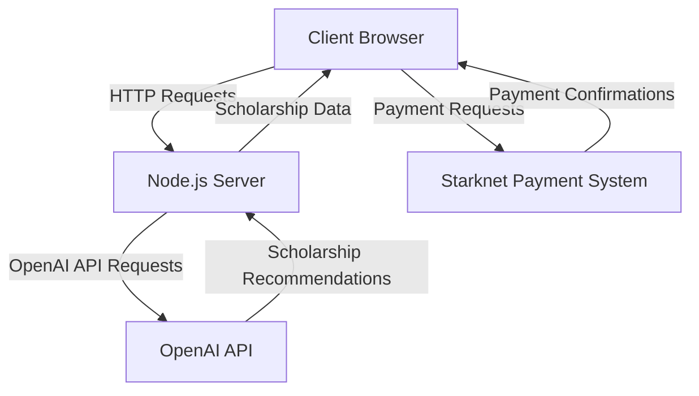

<details>
<summary>Relevant source files</summary>

The following files were used as context for generating this wiki page:

- [README.md](https://github.com/agattani123/Fast-Fa/blob/master/README.md)
- [scholarship_app/package.json](https://github.com/agattani123/Fast-Fa/blob/master/scholarship_app/package.json)
- [scholarship_app/server.js](https://github.com/agattani123/Fast-Fa/blob/master/scholarship_app/server.js)
- [scholarship_app/AiHelper.js](https://github.com/agattani123/Fast-Fa/blob/master/scholarship_app/AiHelper.js)
- [scholarship_app/public/index.html](https://github.com/agattani123/Fast-Fa/blob/master/scholarship_app/public/index.html)

</details>

# Getting Started

## Introduction

FastFa! is a web application that aims to simplify the process of finding and applying for scholarships. It leverages OpenAI's GPT-4 model to generate a personalized list of scholarships based on a student's background, interests, and financial situation. The application also includes a secure payment method built on Starknet, allowing students to receive scholarships directly from institutions.

Sources: [README.md](https://github.com/agattani123/Fast-Fa/blob/master/README.md)

## Architecture Overview

FastFa! follows a client-server architecture, with the frontend built using HTML, CSS, and JavaScript, and the backend implemented using Node.js and Express.js. The application interacts with the OpenAI API to generate scholarship recommendations and utilizes Starknet for secure payment processing.



Sources: [README.md](https://github.com/agattani123/Fast-Fa/blob/master/README.md), [scholarship_app/package.json](https://github.com/agattani123/Fast-Fa/blob/master/scholarship_app/package.json)

## Frontend

The frontend of FastFa! is built using HTML, CSS, and JavaScript. It provides a user interface for students to input their personal information and receive a list of tailored scholarship recommendations.

### User Interface

The main user interface is defined in the `index.html` file, which includes input fields for collecting user data and a section to display the generated scholarship recommendations.

```html
<!-- index.html -->
<form id="userForm">
  <!-- Input fields for user data -->
</form>

<div id="scholarshipList">
  <!-- Scholarship recommendations will be displayed here -->
</div>
```

Sources: [scholarship_app/public/index.html](https://github.com/agattani123/Fast-Fa/blob/master/scholarship_app/public/index.html)

### Frontend Logic

The frontend logic is implemented in JavaScript and handles user input, making API requests to the backend, and displaying the scholarship recommendations.

```javascript
// Frontend JavaScript code
const form = document.getElementById('userForm');
const scholarshipList = document.getElementById('scholarshipList');

form.addEventListener('submit', async (event) => {
  event.preventDefault();
  const userData = new FormData(form);

  // Send user data to the backend
  const response = await fetch('/generate', {
    method: 'POST',
    body: userData
  });

  const scholarships = await response.json();

  // Display scholarship recommendations
  scholarshipList.innerHTML = '';
  scholarships.forEach(scholarship => {
    const li = document.createElement('li');
    li.textContent = scholarship;
    scholarshipList.appendChild(li);
  });
});
```

Sources: [scholarship_app/public/index.html](https://github.com/agattani123/Fast-Fa/blob/master/scholarship_app/public/index.html)

## Backend

The backend of FastFa! is built using Node.js and Express.js. It handles API requests from the frontend, interacts with the OpenAI API to generate scholarship recommendations, and manages the secure payment system using Starknet.

### Server Setup

The server is set up in the `server.js` file, where Express.js is configured, and routes are defined.

```javascript
// server.js
const express = require('express');
const bodyParser = require('body-parser');
const app = express();
const port = 3000;

app.use(bodyParser.urlencoded({ extended: true }));
app.use(express.static('public'));

// Route for handling scholarship generation requests
app.post('/generate', async (req, res) => {
  // ...
});

app.listen(port, () => {
  console.log(`Server is running on port ${port}`);
});
```

Sources: [scholarship_app/server.js](https://github.com/agattani123/Fast-Fa/blob/master/scholarship_app/server.js)

### OpenAI Integration

The `AiHelper.js` module handles the integration with the OpenAI API. It makes requests to the API with the user's data and processes the response to generate a list of scholarship recommendations.

```javascript
// AiHelper.js
const { Configuration, OpenAIApi } = require('openai');

const configuration = new Configuration({
  apiKey: process.env.OPENAI_API_KEY
});

const openai = new OpenAIApi(configuration);

async function generateScholarships(userData) {
  const prompt = `Based on the following user data: ${userData}, generate a list of scholarships that would be suitable for this student.`;

  const response = await openai.createCompletion({
    model: 'text-davinci-003',
    prompt: prompt,
    max_tokens: 2048,
    temperature: 0.5
  });

  const scholarships = response.data.choices[0].text.trim().split('\n');
  return scholarships;
}

module.exports = { generateScholarships };
```

Sources: [scholarship_app/AiHelper.js](https://github.com/agattani123/Fast-Fa/blob/master/scholarship_app/AiHelper.js)

### Payment Integration

The payment integration with Starknet is likely handled in the backend, but the provided source files do not contain details about this implementation.

## Conclusion

FastFa! aims to simplify the scholarship application process by leveraging OpenAI's GPT-4 model to generate personalized scholarship recommendations based on a student's background and financial situation. The application follows a client-server architecture, with a frontend built using HTML, CSS, and JavaScript, and a backend implemented using Node.js and Express.js. The backend integrates with the OpenAI API to generate scholarship recommendations and utilizes Starknet for secure payment processing.

Sources: [README.md](https://github.com/agattani123/Fast-Fa/blob/master/README.md)