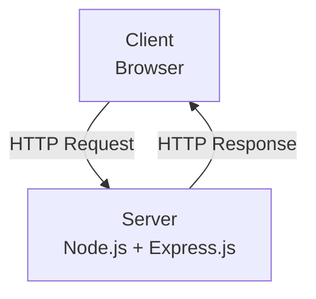
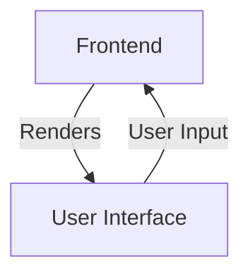
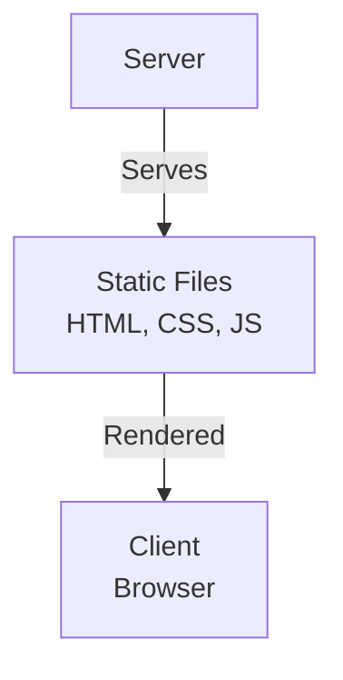
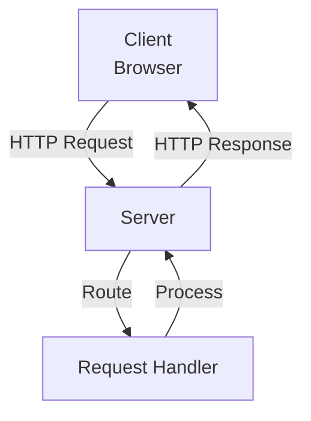
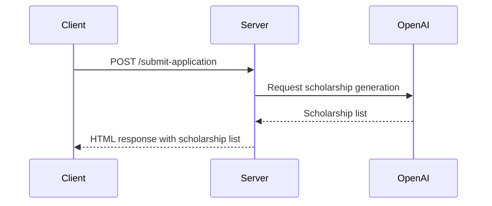
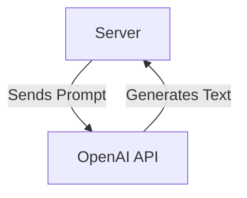

<details>
<summary>Relevant source files</summary>

The following files were used as context for generating this wiki page:

- [README.md](https://github.com/agattani123/Fast-Fa/blob/master/README.md)
- [scholarship_app/package.json](https://github.com/agattani123/Fast-Fa/blob/master/scholarship_app/package.json)
- [scholarship_app/server.js](https://github.com/agattani123/Fast-Fa/blob/master/scholarship_app/server.js)
</details>

# Getting Started

## Introduction

FastFa! is a web application that aims to simplify the process of finding and applying for scholarships. It leverages OpenAI's GPT-4 model to generate a personalized list of scholarship opportunities based on the user's input, such as financial information, interests, and background. The application also integrates with Starknet for secure payment processing, allowing students to receive scholarships directly from institutions.

The core functionality of FastFa! revolves around the "Getting Started" process, where users provide their personal and financial details, and the application generates a tailored list of scholarship opportunities. This wiki page will explore the architecture, components, and data flow involved in this process.

## Application Overview

FastFa! is built using Node.js and Express.js for the backend, and HTML, CSS, and JavaScript for the frontend. The application follows a client-server architecture, where the frontend communicates with the backend through HTTP requests and responses.



Sources: [scholarship_app/server.js]()

## Frontend

The frontend of FastFa! is responsible for rendering the user interface and handling user interactions. It consists of HTML, CSS, and JavaScript files served from the `public` directory.



Sources: [scholarship_app/server.js:11]()

## Backend

The backend of FastFa! is built using Node.js and Express.js. It handles the following key responsibilities:

1. **Serving Static Files**: The backend serves static files (HTML, CSS, JavaScript) from the `public` directory using the `express.static` middleware.



Sources: [scholarship_app/server.js:11]()

2. **Handling HTTP Requests**: The backend listens for incoming HTTP requests and routes them to the appropriate handler functions.



Sources: [scholarship_app/server.js:14-16, 44-47]()

3. **Generating Scholarship List**: The backend handles the core functionality of generating a personalized list of scholarship opportunities based on the user's input.



Sources: [scholarship_app/server.js:27-43, 48-89]()

## OpenAI Integration

FastFa! integrates with the OpenAI API to generate the personalized scholarship list. The `generateText` function in the backend sends a prompt to the OpenAI API, which includes the user's financial information and specific instructions for generating the scholarship list.



Sources: [scholarship_app/server.js:27-43]()

## Starknet Integration

FastFa! integrates with Starknet for secure payment processing, allowing students to receive scholarships directly from institutions. However, the provided source files do not contain any implementation details or configurations related to the Starknet integration.

## Kintone Integration

FastFa! includes a feedback form that opens in a new window, linking to a Google Forms URL. This form is likely used to collect user feedback, which is then stored in the Kintone database system mentioned in the README file. However, the provided source files do not contain any implementation details or configurations related to the Kintone integration.

```html
<button class="button-nav feedback-button" onclick="window.open('https://forms.gle/2KvT9ztjWGgbKuGX9', '_blank');">Feedback</button>
```

Sources: [scholarship_app/server.js:83]()

## Key Components and Features

| Component | Description |
| --- | --- |
| Frontend | Renders the user interface and handles user interactions. |
| Backend | Handles HTTP requests, serves static files, and generates the scholarship list. |
| OpenAI Integration | Leverages the OpenAI API to generate personalized scholarship lists based on user input. |
| Starknet Integration | Provides secure payment processing for receiving scholarships (implementation details not provided). |
| Kintone Integration | Collects user feedback through a Google Forms link (implementation details not provided). |

Sources: [README.md](), [scholarship_app/server.js]()

## Conclusion

FastFa! is a web application that aims to simplify the process of finding and applying for scholarships. It leverages OpenAI's GPT-4 model to generate a personalized list of scholarship opportunities based on the user's input. The application follows a client-server architecture, with the frontend handling user interactions and the backend processing requests and generating the scholarship list. While the provided source files do not contain implementation details for the Starknet and Kintone integrations, they demonstrate the core functionality of generating the scholarship list and rendering the user interface.