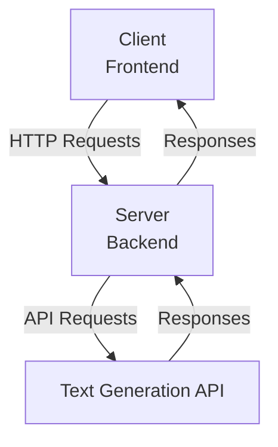
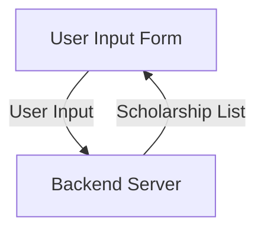
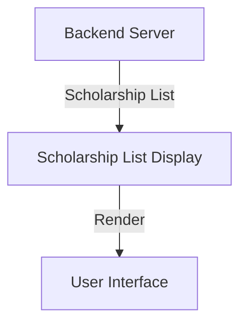
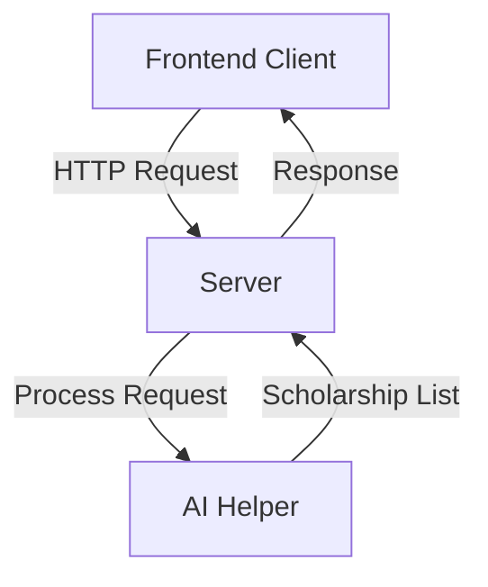
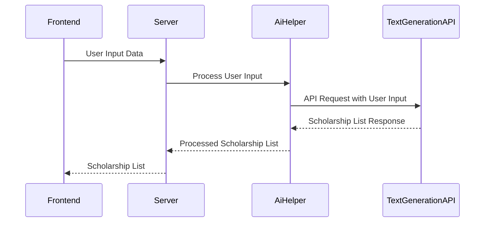
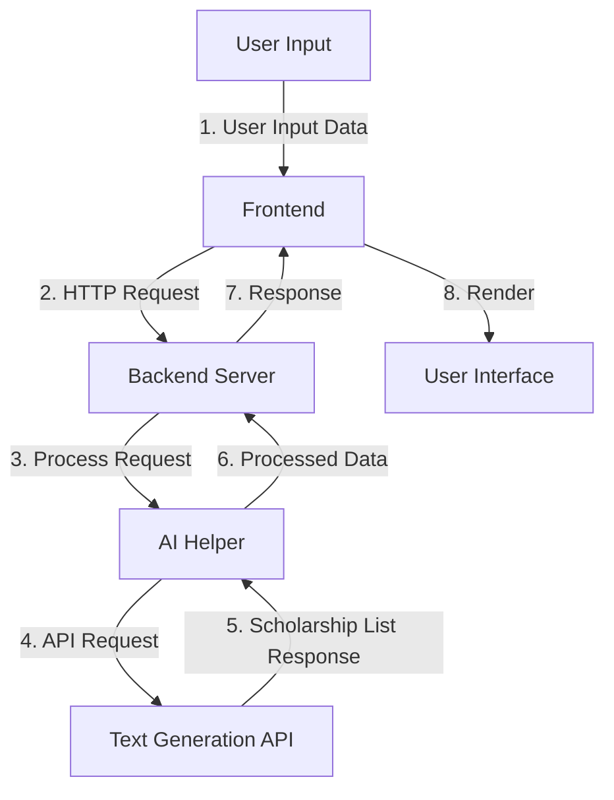

<page>

Relevant source files

The following files were used as context for generating this wiki page:

- [README.md](https://github.com/agattani123/Fast-Fa/blob/master/README.md)
- [scholarship_app/package.json](https://github.com/agattani123/Fast-Fa/blob/master/scholarship_app/package.json)
- [scholarship_app/AiHelper.js](https://github.com/agattani123/Fast-Fa/blob/master/scholarship_app/AiHelper.js)
- [scholarship_app/server.js](https://github.com/agattani123/Fast-Fa/blob/master/scholarship_app/server.js)
- [scholarship_app/public/index.html](https://github.com/agattani123/Fast-Fa/blob/master/scholarship_app/public/index.html)

# Getting Started

## Introduction

FastFa! is a web application designed to simplify the process of finding and applying for scholarships. It leverages a text generation API, likely the Gemini API, to generate a personalized list of scholarships based on the user's input, such as personal information, financial needs, and interests. The application aims to streamline the often tedious and time-consuming task of searching for relevant scholarships, making it easier for students to access financial aid opportunities.

The application consists of a frontend built with HTML, CSS, and JavaScript, and a backend built with Node.js and Express.js. The backend handles the communication with the text generation API, processing the user's input and generating the scholarship list. The frontend provides a user-friendly interface for users to input their information and view the generated scholarship list.

Sources: [README.md](https://github.com/agattani123/Fast-Fa/blob/master/README.md)

## Architecture Overview

The FastFa! application follows a client-server architecture, with the frontend acting as the client and the backend serving as the server. The frontend is responsible for rendering the user interface and handling user interactions, while the backend handles the business logic and communication with external services, such as the text generation API.

Sources: [README.md](https://github.com/agattani123/Fast-Fa/blob/master/README.md), [scholarship_app/package.json](https://github.com/agattani123/Fast-Fa/blob/master/scholarship_app/package.json)

## Frontend

The frontend of FastFa! is built using HTML, CSS, and JavaScript. It provides a user-friendly interface for users to input their personal information, financial needs, and interests. The frontend communicates with the backend via HTTP requests, sending the user's input data and receiving the generated scholarship list in response.

### Frontend Components

#### User Input Form

The user input form is the primary component of the frontend, allowing users to enter their information. It consists of various input fields, such as name, email, academic details, financial situation, and interests.

Sources: [scholarship_app/public/index.html](https://github.com/agattani123/Fast-Fa/blob/master/scholarship_app/public/index.html)

#### Scholarship List Display

The scholarship list display component is responsible for rendering the list of scholarships generated by the backend. It receives the scholarship data from the backend and presents it in a user-friendly format, such as a list or cards.

Sources: [scholarship_app/public/index.html](https://github.com/agattani123/Fast-Fa/blob/master/scholarship_app/public/index.html)

## Backend

The backend of FastFa! is built using Node.js and Express.js. It handles the communication with the text generation API, processes the user's input data, and generates the scholarship list based on the API's response.

### Backend Components

#### Server

The server component is the entry point of the backend application. It sets up the Express.js server, defines the API routes, and handles incoming HTTP requests from the frontend.

Sources: [scholarship_app/server.js](https://github.com/agattani123/Fast-Fa/blob/master/scholarship_app/server.js)

#### AI Helper

The AI Helper component is responsible for communicating with the text generation API and processing the user's input data. It sends a request to the API with the user's information and receives a response containing the generated scholarship list. The AI Helper then processes the response and formats the data for the server to send back to the frontend.

Sources: [scholarship_app/AiHelper.js](https://github.com/agattani123/Fast-Fa/blob/master/scholarship_app/AiHelper.js)

## Data Flow

The data flow in the FastFa! application follows a straightforward sequence:

1. The user inputs their personal information, financial needs, and interests into the frontend form.
2. The frontend sends an HTTP request to the backend server with the user's input data.
3. The backend server receives the request and passes the user's input data to the AI Helper component.
4. The AI Helper component formats the user's input data and sends a request to the text generation API.
5. The text generation API processes the request and generates a list of scholarships based on the user's input.
6. The text generation API sends the scholarship list response back to the AI Helper component.
7. The AI Helper component processes the response and formats the scholarship list data.
8. The AI Helper component sends the processed scholarship list data back to the backend server.
9. The backend server sends the scholarship list data as a response to the frontend.
10. The frontend receives the scholarship list data and renders it in the user interface.

Sources: [README.md](https://github.com/agattani123/Fast-Fa/blob/master/README.md), [scholarship_app/AiHelper.js](https://github.com/agattani123/Fast-Fa/blob/master/scholarship_app/AiHelper.js), [scholarship_app/server.js](https://github.com/agattani123/Fast-Fa/blob/master/scholarship_app/server.js)

## Dependencies

The FastFa! application relies on the following dependencies:

| Dependency   | Description                                                  |
|--------------|--------------------------------------------------------------|
| Express.js   | A web application framework for Node.js                     |
| Body-Parser  | A middleware for parsing incoming request bodies in Node.js |

Sources: [scholarship_app/package.json](https://github.com/agattani123/Fast-Fa/blob/master/scholarship_app/package.json)

## Conclusion

FastFa! is a web application that aims to simplify the process of finding and applying for scholarships by leveraging a text generation API, likely the Gemini API. It provides a user-friendly interface for users to input their personal information, financial needs, and interests, and generates a personalized list of scholarships based on the API's response. The application follows a client-server architecture, with a frontend built using HTML, CSS, and JavaScript, and a backend built using Node.js and Express.js. By streamlining the scholarship search process, FastFa! aims to make it easier for students to access financial aid opportunities and reduce the time and effort required to find relevant scholarships.
</page>