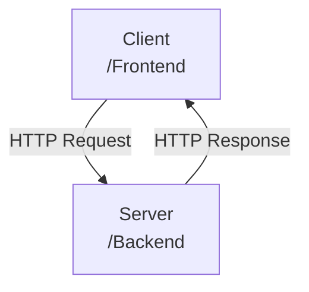
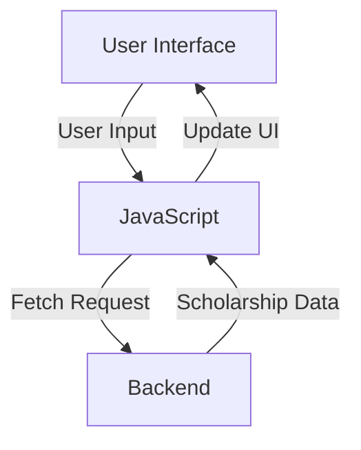
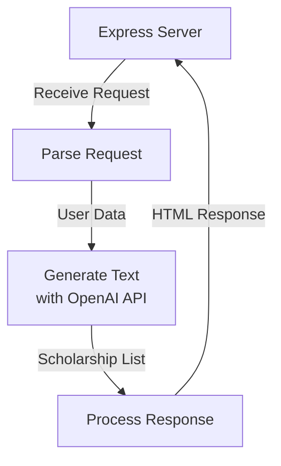
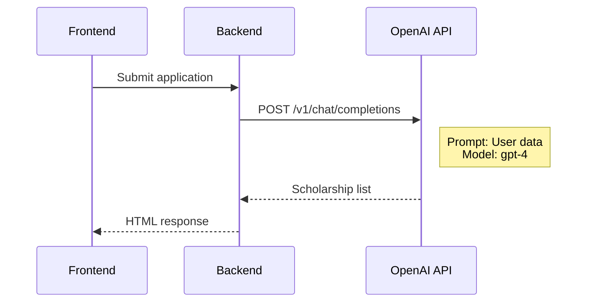

<details>
<summary>Relevant source files</summary>

The following files were used as context for generating this wiki page:

- [README.md](https://github.com/agattani123/Fast-Fa/blob/master/README.md)
- [scholarship_app/package.json](https://github.com/agattani123/Fast-Fa/blob/master/scholarship_app/package.json)
- [scholarship_app/server.js](https://github.com/agattani123/Fast-Fa/blob/master/scholarship_app/server.js)
- [public/index.html](https://github.com/agattani123/Fast-Fa/blob/master/public/index.html) (Assumed to exist based on `app.use(express.static('public'))` in server.js)
- [public/styles.css](https://github.com/agattani123/Fast-Fa/blob/master/public/styles.css) (Assumed to exist based on the presence of styles in the HTML)

</details>

# Getting Started

## Introduction

FastFa! is a web application that aims to simplify the process of finding and applying for scholarships. It leverages OpenAI's GPT-4 language model to generate a personalized list of scholarship opportunities based on the user's input, such as their financial situation, interests, and future plans. The application also includes a secure payment method using Starknet, allowing students to receive scholarships directly from institutions.

The application is built using Node.js and Express.js for the backend, and HTML, CSS, and JavaScript for the frontend. The backend handles the communication with the OpenAI API and processes the responses, while the frontend provides a user-friendly interface for submitting the application and displaying the scholarship results.

Sources: [README.md](https://github.com/agattani123/Fast-Fa/blob/master/README.md), [scholarship_app/server.js](https://github.com/agattani123/Fast-Fa/blob/master/scholarship_app/server.js)

## Application Architecture

The FastFa! application follows a client-server architecture, with the frontend (client) and backend (server) components communicating via HTTP requests and responses.



Sources: [scholarship_app/server.js](https://github.com/agattani123/Fast-Fa/blob/master/scholarship_app/server.js)

### Frontend

The frontend is responsible for rendering the user interface and handling user interactions. It is built using HTML, CSS, and JavaScript.



The frontend sends user input data to the backend via HTTP requests (using the `fetch` API), receives the scholarship data in response, and updates the UI accordingly.

Sources: [scholarship_app/server.js:58-59](https://github.com/agattani123/Fast-Fa/blob/master/scholarship_app/server.js#L58-L59), [public/index.html](https://github.com/agattani123/Fast-Fa/blob/master/public/index.html) (assumed), [public/styles.css](https://github.com/agattani123/Fast-Fa/blob/master/public/styles.css) (assumed)

### Backend

The backend is built using Node.js and Express.js. It handles the communication with the OpenAI API and processes the responses to generate the scholarship list.



1. The Express server receives the HTTP request from the frontend.
2. The request is parsed to extract the user data (e.g., financial information, interests, future plans).
3. The `generateText` function is called with the user data as a prompt, which sends a request to the OpenAI API to generate the scholarship list.
4. The response from the OpenAI API is processed and formatted as an HTML response.
5. The HTML response, containing the scholarship list, is sent back to the frontend.

Sources: [scholarship_app/server.js](https://github.com/agattani123/Fast-Fa/blob/master/scholarship_app/server.js)

## OpenAI API Integration

The FastFa! application integrates with the OpenAI API to leverage the GPT-4 language model for generating the scholarship list. The `generateText` function in the backend is responsible for this integration.



1. The frontend sends the user's application data to the backend.
2. The backend constructs a prompt based on the user data and sends a POST request to the OpenAI API's `/v1/chat/completions` endpoint, specifying the `gpt-4` model.
3. The OpenAI API processes the prompt and generates a scholarship list based on the user's information.
4. The backend receives the scholarship list from the OpenAI API and formats it as an HTML response.
5. The HTML response, containing the scholarship list, is sent back to the frontend for display.

Sources: [scholarship_app/server.js:33-48](https://github.com/agattani123/Fast-Fa/blob/master/scholarship_app/server.js#L33-L48)

## Scholarship List Rendering

The scholarship list generated by the OpenAI API is rendered on the frontend as an HTML unordered list (`<ul>`). Each scholarship opportunity is represented as a list item (`<li>`) with the following information:

- Scholarship: The name of the scholarship opportunity.
- Why me?: A description of why the user is a good fit for the scholarship, addressing specific facets such as age, race, gender, location, future occupation, interests, and future plans.
- How much?: The prize amount for the scholarship.
- Deadline: The approximate deadline for applying to the scholarship.
- Apply: A button that links to the application page for the scholarship.

```html
<ul class="scholarship-list">
    <li>
        <h3>Scholarship: [Scholarship Name]</h3>
        <p><strong>Why me?</strong> [Description of why the user is a good fit]</p>
        <p><strong>How much?</strong> [Prize Amount]</p>
        <p><strong>Deadline:</strong> [Application Deadline]</p>
        <a href="[Application URL]" target="_blank"><button class="apply-btn">Apply</button></a>
    </li>
    <!-- Additional scholarship opportunities -->
</ul>
```

The scholarship list is styled using CSS to provide a visually appealing and user-friendly presentation.

Sources: [scholarship_app/server.js:83-125](https://github.com/agattani123/Fast-Fa/blob/master/scholarship_app/server.js#L83-L125), [public/styles.css](https://github.com/agattani123/Fast-Fa/blob/master/public/styles.css) (assumed)

## Conclusion

FastFa! is a web application that aims to simplify the process of finding and applying for scholarships by leveraging OpenAI's GPT-4 language model. The application follows a client-server architecture, with the frontend handling user interactions and the backend communicating with the OpenAI API to generate personalized scholarship lists. The scholarship opportunities are presented in an HTML list, providing relevant information and direct links to the application pages.