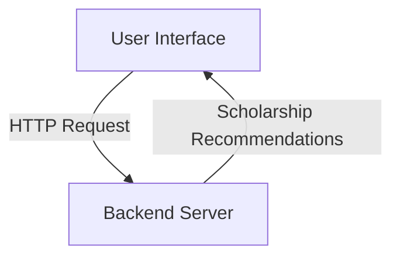
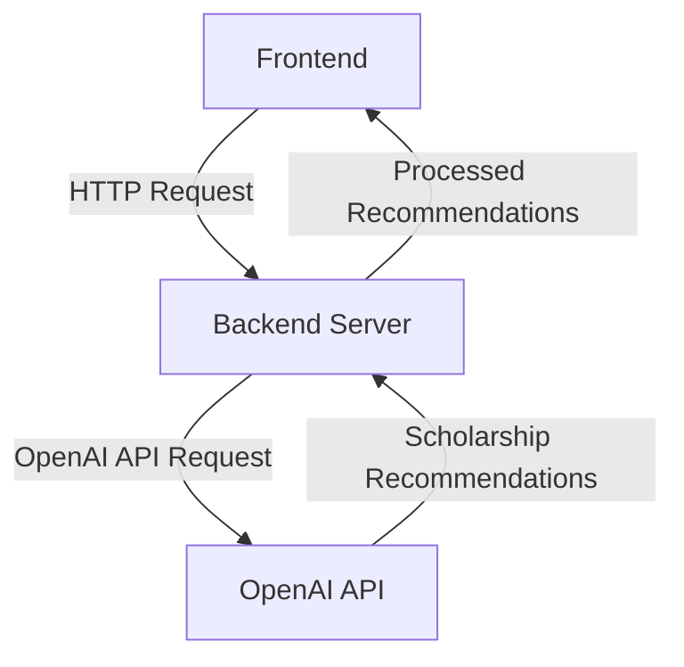
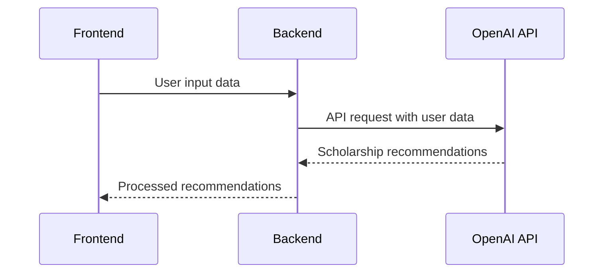
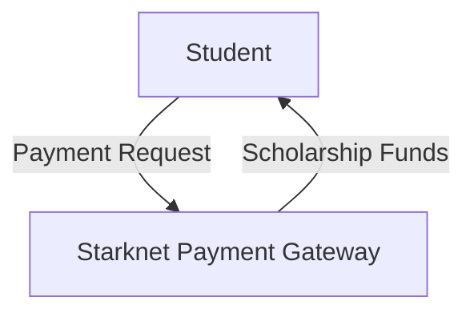
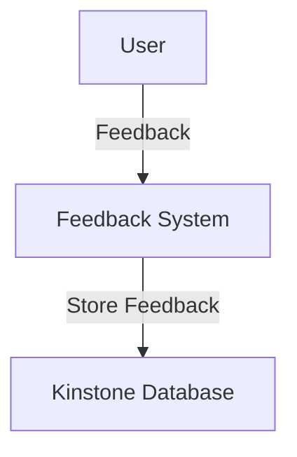

Relevant source files

The following file was used as context for generating this wiki page:

- [README.md](https://github.com/agattani123/Fast-Fa/blob/master/README.md)

# Introduction

FastFa! is a web application that aims to simplify the process of finding and applying for scholarships by leveraging the power of artificial intelligence (AI). It provides a user-friendly interface where students can input their personal information, academic background, and financial needs, and the application generates a tailored list of scholarships based on their specific circumstances.

## Overview

FastFa! is built using JavaScript, with Node.js and Express.js for the backend, and HTML, CSS, and JavaScript for the frontend. The application integrates with the OpenAI API, utilizing the GPT-4 model to process user input and generate relevant scholarship recommendations. Additionally, FastFa! incorporates a secure payment method through Starknet, allowing students to receive scholarships directly from institutions. The application also includes a feedback system that stores responses in the Kinstone database.

## Architecture

### Frontend

The frontend of FastFa! is built using HTML, CSS, and JavaScript. It provides a user interface where students can input their personal information, academic details, and financial needs. The frontend communicates with the backend through HTTP requests, sending user input data and receiving the generated scholarship recommendations.

Sources: [README.md](https://github.com/agattani123/Fast-Fa/blob/master/README.md)

### Backend

The backend of FastFa! is built using Node.js and Express.js. It serves as the intermediary between the frontend and the OpenAI API. When the backend receives user input from the frontend, it processes the data and sends a request to the OpenAI API using the fetch API. The response from the OpenAI API, containing the generated scholarship recommendations, is then processed and sent back to the frontend for display.

Sources: [README.md](https://github.com/agattani123/Fast-Fa/blob/master/README.md)

### OpenAI Integration

FastFa! integrates with the OpenAI API, specifically utilizing the GPT-4 model. The user input data is sent to the OpenAI API, which processes the information and generates a list of relevant scholarship recommendations based on the user's specific circumstances.

Sources: [README.md](https://github.com/agattani123/Fast-Fa/blob/master/README.md)

### Payment Integration

FastFa! incorporates a secure payment method through Starknet, allowing students to receive scholarships directly from institutions. The payment integration ensures a seamless and secure process for students to access and manage their scholarship funds.

Sources: [README.md](https://github.com/agattani123/Fast-Fa/blob/master/README.md)

### Feedback System

The application includes a feedback system that stores user responses in the Kinstone database. This feature allows FastFa! to collect feedback from users, which can be used to improve the application and enhance the overall user experience.

Sources: [README.md](https://github.com/agattani123/Fast-Fa/blob/master/README.md)

## Key Features

| Feature | Description |
| --- | --- |
| Personalized Scholarship Recommendations | FastFa! generates a tailored list of scholarships based on the user's personal information, academic background, and financial needs. |
| OpenAI Integration | The application leverages the power of OpenAI's GPT-4 model to process user input and generate relevant scholarship recommendations. |
| Secure Payment Integration | FastFa! incorporates a secure payment method through Starknet, allowing students to receive scholarships directly from institutions. |
| Feedback System | The application includes a feedback system that stores user responses in the Kinstone database, enabling continuous improvement and user experience enhancement. |

Sources: [README.md](https://github.com/agattani123/Fast-Fa/blob/master/README.md)

## Conclusion

FastFa! is a innovative web application that aims to simplify the process of finding and applying for scholarships by leveraging the power of artificial intelligence. With its user-friendly interface, personalized scholarship recommendations, secure payment integration, and feedback system, FastFa! provides a comprehensive solution for students seeking financial aid opportunities. The application's integration with OpenAI's GPT-4 model and Starknet's payment gateway ensures accurate and relevant recommendations, as well as a secure and seamless scholarship management process.