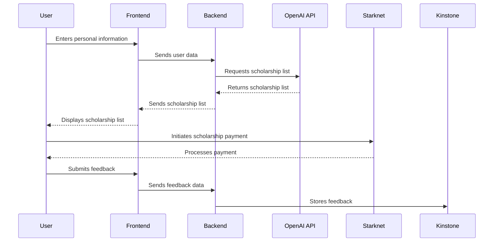

Relevant source files

The following file was used as context for generating this wiki page:

- [README.md](https://github.com/agattani123/Fast-Fa/blob/master/README.md)

# Introduction

FastFa! is a web application that aims to simplify the process of finding and applying for scholarships by leveraging artificial intelligence (AI) technology. The primary goal of FastFa! is to provide students with a personalized list of scholarships tailored to their background, interests, and financial situation, eliminating the need for extensive manual research and application processes.

## Overview

FastFa! utilizes OpenAI's GPT-4 language model to process user input, such as personal information and financial needs, and generate a list of relevant scholarships. The application's frontend is built using HTML, CSS, and JavaScript, while the backend is powered by Node.js and Express.js. Additionally, FastFa! incorporates a secure payment method through Starknet, allowing students to receive scholarships directly from institutions. The application also includes a feedback system integrated with the Kinstone database.

Sources: [README.md](https://github.com/agattani123/Fast-Fa/blob/master/README.md)

## Architecture

### Frontend

The frontend of FastFa! is responsible for collecting user input and displaying the generated scholarship list. It is built using standard web technologies:

- **HTML**: Provides the structure and layout of the user interface.
- **CSS**: Handles the styling and visual presentation of the application.
- **JavaScript**: Enables interactivity, form validation, and communication with the backend.

Sources: [README.md](https://github.com/agattani123/Fast-Fa/blob/master/README.md)

### Backend

The backend of FastFa! is built using Node.js and Express.js, a popular JavaScript runtime and web application framework, respectively. Its primary responsibilities include:

1. **API Integration**: Handling requests to the OpenAI API for generating scholarship lists based on user input.
2. **Data Processing**: Processing the responses from the OpenAI API and preparing the data for display on the frontend.
3. **Payment Integration**: Integrating with Starknet to facilitate secure scholarship payments.
4. **Feedback Storage**: Storing user feedback in the Kinstone database system.

Sources: [README.md](https://github.com/agattani123/Fast-Fa/blob/master/README.md)

### Data Flow

The overall data flow in FastFa! can be represented as follows:

Sources: [README.md](https://github.com/agattani123/Fast-Fa/blob/master/README.md)

## Key Components

### OpenAI Integration

FastFa! leverages the OpenAI GPT-4 language model to generate personalized scholarship lists based on user input. The backend sends a request to the OpenAI API with the user's information, and the API responds with a list of relevant scholarships.

Sources: [README.md](https://github.com/agattani123/Fast-Fa/blob/master/README.md)

### Starknet Payment Integration

To facilitate secure scholarship payments, FastFa! integrates with Starknet, a decentralized blockchain network. This integration allows students to receive scholarships directly from institutions through a secure payment method.

Sources: [README.md](https://github.com/agattani123/Fast-Fa/blob/master/README.md)

### Kinstone Feedback Storage

FastFa! includes a feedback system that allows users to provide feedback on their experience with the application. This feedback is stored in the Kinstone database system, which is likely a third-party service or internal database used by the development team.

Sources: [README.md](https://github.com/agattani123/Fast-Fa/blob/master/README.md)

## Conclusion

FastFa! is a innovative web application that aims to streamline the scholarship application process by leveraging AI technology. By providing personalized scholarship lists based on user input, FastFa! aims to save students time and effort in finding relevant scholarship opportunities. The application's integration with secure payment methods and feedback storage systems further enhances its functionality and user experience.

Sources: [README.md](https://github.com/agattani123/Fast-Fa/blob/master/README.md)