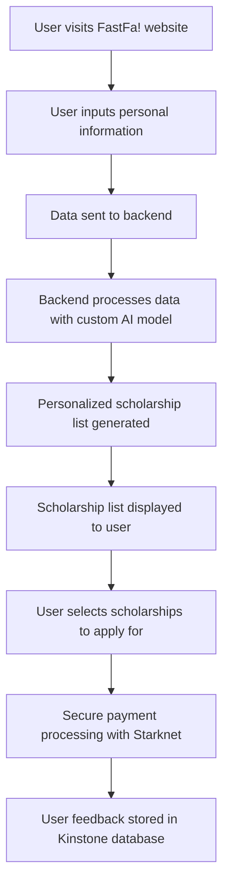
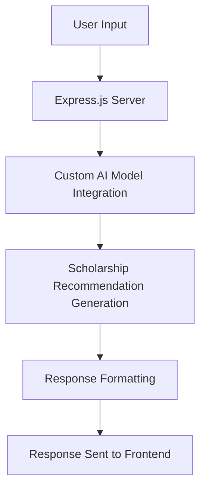
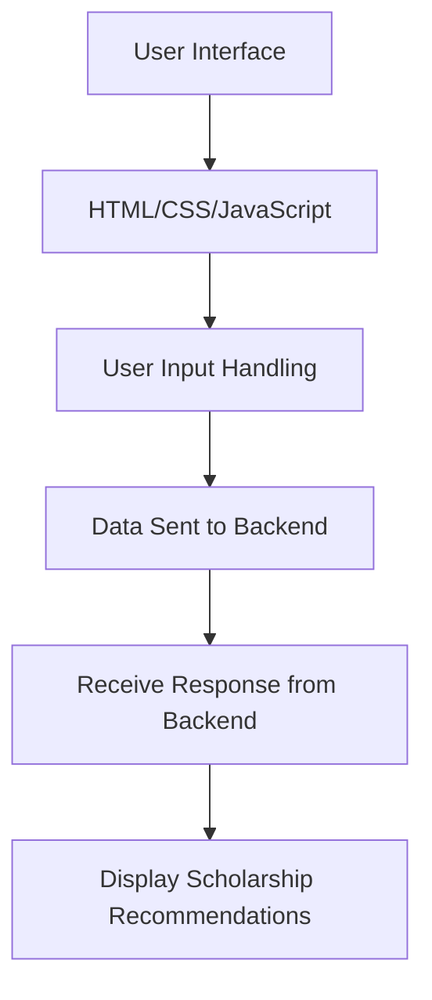

Here is the updated markdown content for the "Introduction" wiki page, with changes made based on the provided changelog and source files:

Relevant source files

The following file was used as context for generating this wiki page:

- [README.md](https://github.com/agattani123/Fast-Fa/blob/master/README.md)

# Introduction

FastFa! is a web application that aims to simplify the process of finding and applying for scholarships by leveraging the power of artificial intelligence (AI). The application uses a custom AI model hosted at `https://google.gemini.com/v1/chat/completions` to generate a personalized list of scholarships based on the user's input, such as personal information, financial needs, and interests. The goal is to help students discover scholarships they may not have been aware of, saving them time and effort in the scholarship application process.

## Overview

FastFa! is built using JavaScript, with Node.js and Express.js for the backend, and HTML, CSS, and JavaScript for the frontend. The application integrates with the custom AI model at `https://google.gemini.com/v1/chat/completions` to generate scholarship recommendations. Additionally, it utilizes Starknet for secure payment processing, allowing students to receive scholarships directly from institutions. The application also incorporates a feedback system that stores responses in the Kinstone database.

Sources: [README.md](https://github.com/agattani123/Fast-Fa/blob/master/README.md)

## User Flow

The user flow of FastFa! can be represented by the following diagram:

Sources: [README.md](https://github.com/agattani123/Fast-Fa/blob/master/README.md)

## Backend Architecture

The backend of FastFa! is built using Node.js and Express.js. It handles the communication with the custom AI model at `https://google.gemini.com/v1/chat/completions` and processes the user input to generate the scholarship recommendations.

Sources: [README.md](https://github.com/agattani123/Fast-Fa/blob/master/README.md)

## Frontend Architecture

The frontend of FastFa! is built using HTML, CSS, and JavaScript. It provides the user interface for inputting personal information and displaying the generated scholarship recommendations.

Sources: [README.md](https://github.com/agattani123/Fast-Fa/blob/master/README.md)

## Payment Integration