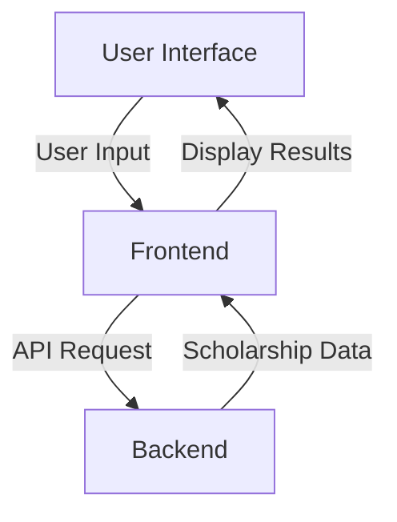
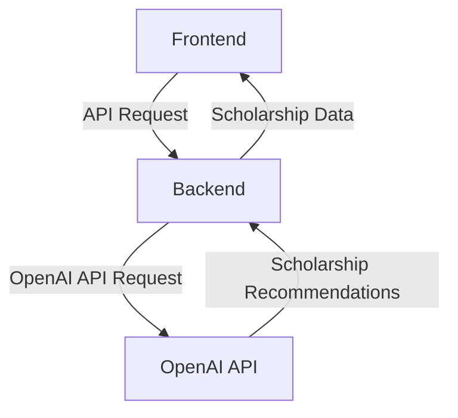
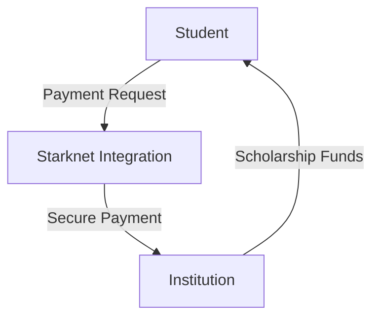
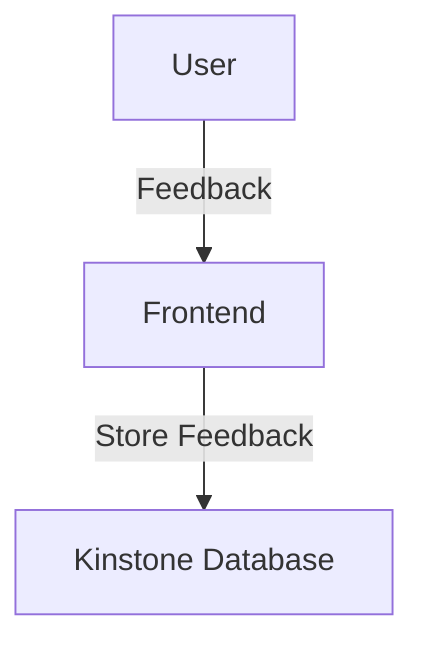

Relevant source files

The following file was used as context for generating this wiki page:

- [README.md](https://github.com/agattani123/Fast-Fa/blob/master/README.md)

# Introduction

FastFa! is a web application that aims to simplify the process of finding and applying for scholarships by leveraging the power of generative AI. It takes a student's personal information and financial needs as input, processes it through OpenAI's GPT-4 model, and generates a tailored list of scholarships that match the student's specific circumstances.

## Overview

The application is built using JavaScript, with Node.js and Express.js for the backend, and HTML, CSS, and JavaScript for the frontend. It utilizes the OpenAI API to generate personalized scholarship recommendations based on the user's input. The payment method is implemented using Starknet, allowing students to securely receive scholarships directly from institutions. Additionally, user feedback is stored in the Kinstone database system.

## Architecture

### Frontend

The frontend of FastFa! is responsible for collecting user input and displaying the generated scholarship recommendations. It is built using HTML, CSS, and JavaScript.

Sources: [README.md:3-5]()

### Backend

The backend of FastFa! is built using Node.js and Express.js. It handles the communication with the OpenAI API, processes the user input, and generates the scholarship recommendations.

Sources: [README.md:3-5]()

### Payment Integration

FastFa! integrates with Starknet to provide a secure payment method for students to receive scholarships directly from institutions.

Sources: [README.md:5]()

### Feedback Storage

User feedback is stored in the Kinstone database system for future analysis and improvements.

Sources: [README.md:5]()

## Key Components

| Component | Description |
| --- | --- |
| User Interface | Collects user input and displays scholarship recommendations |
| Frontend | Handles user interactions and communicates with the backend |
| Backend | Processes user input, generates scholarship recommendations using OpenAI API |
| OpenAI API Integration | Utilizes OpenAI's GPT-4 model for generating personalized recommendations |
| Starknet Integration | Provides a secure payment method for receiving scholarships |
| Kinstone Database | Stores user feedback for analysis and improvements |

Sources: [README.md:3-5]()

## Challenges and Accomplishments

One of the main challenges faced during the development of FastFa! was integrating the OpenAI API and ensuring accurate and relevant responses. Additionally, ensuring a user-friendly and intuitive application design was a priority.

The team is proud of creating a tool that can potentially help many students find scholarships they may not have been aware of. The AI integration, which allows for a high degree of personalization and accuracy in the results, is also a notable accomplishment. Furthermore, the beautiful UI gradient and feedback page integrated with the Kinstone backend were additional features that the team is proud of.

Sources: [README.md:7-9]()

## Future Plans

In the future, the team plans to expand FastFa! by adding more features, such as a detailed breakdown of each scholarship and a feature that allows users to track their applications. Additionally, they aim to improve the AI model to ensure more accurate and personalized results.

Sources: [README.md:11]()

## Conclusion

FastFa! is a web application that leverages generative AI to simplify the process of finding and applying for scholarships. By taking a student's personal information and financial needs as input, it generates a tailored list of scholarships that match the student's specific circumstances. The application integrates with OpenAI's GPT-4 model, Starknet for secure payments, and the Kinstone database for storing user feedback. With its user-friendly design and innovative approach, FastFa! aims to make the scholarship application process more accessible and efficient for students.