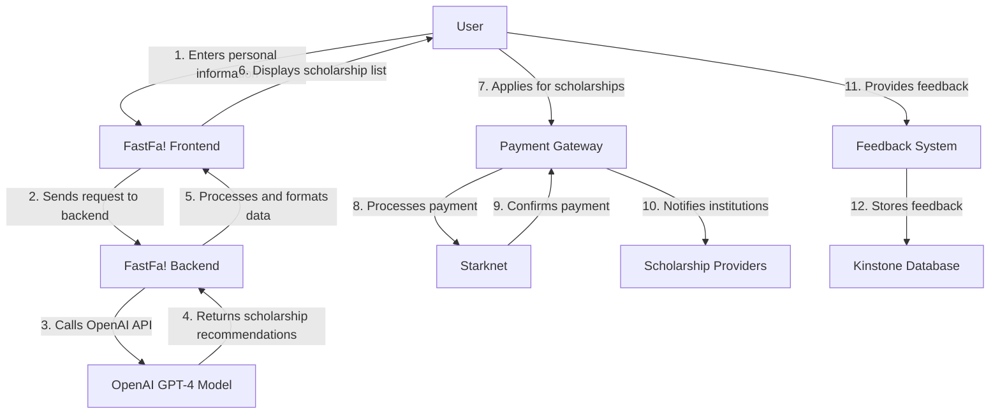
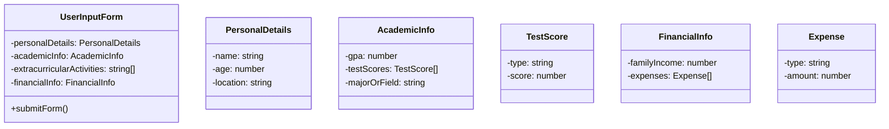
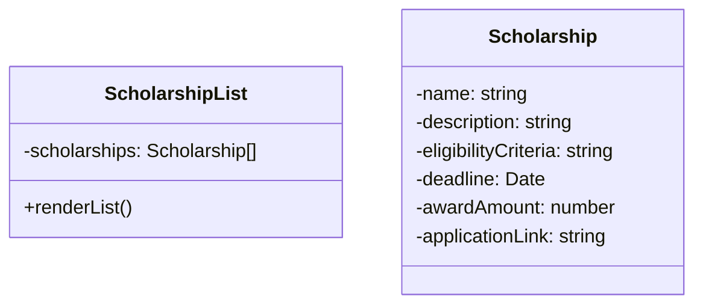
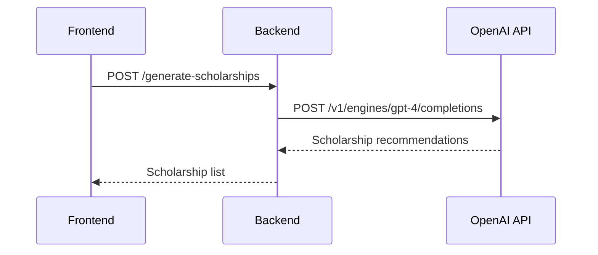
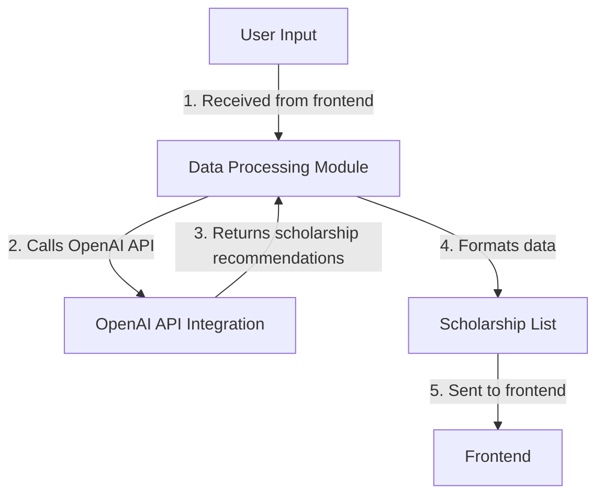
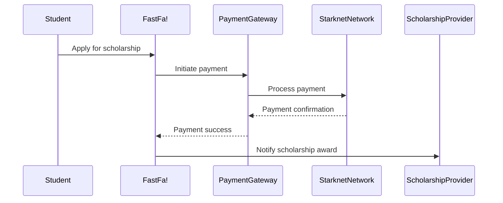
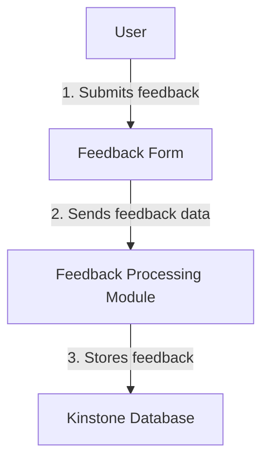

Relevant source files

The following file was used as context for generating this wiki page:

- [README.md](https://github.com/agattani123/Fast-Fa/blob/master/README.md)

# Introduction

FastFa! is a web application that aims to simplify the process of finding and applying for scholarships by leveraging the power of generative AI. It provides a user-friendly interface where students can input their personal information, interests, and financial needs, and the application generates a tailored list of scholarships based on this data. The application utilizes OpenAI's GPT-4 model to process the user input and match it with relevant scholarship opportunities, including obscure and local scholarships that might be difficult to find through traditional search methods.

## Application Overview

FastFa! is built using JavaScript, with Node.js and Express.js powering the backend, and HTML, CSS, and JavaScript for the frontend. The application integrates with the OpenAI API to leverage the GPT-4 model for generating personalized scholarship recommendations. Additionally, it incorporates a secure payment method built on Starknet, allowing students to receive scholarships directly from institutions. The application also includes a feedback system that stores responses in the Kinstone database.

Sources: [README.md](https://github.com/agattani123/Fast-Fa/blob/master/README.md)

## Frontend

The FastFa! frontend is built using HTML, CSS, and JavaScript. It provides a user-friendly interface for students to input their personal information, such as academic background, extracurricular activities, financial situation, and other relevant details.

### User Input Form

The user input form is the primary component of the frontend, allowing users to enter their information. It may include fields for:

- Personal details (name, age, location)
- Academic information (GPA, test scores, major/field of study)
- Extracurricular activities and interests
- Financial information (family income, expenses, etc.)
- Any other relevant details

Sources: [README.md](https://github.com/agattani123/Fast-Fa/blob/master/README.md)

### Scholarship List Display

The frontend is responsible for displaying the list of scholarships generated by the backend based on the user's input. This may include:

- Scholarship name and description
- Eligibility criteria
- Application deadline
- Award amount
- Link to the scholarship website or application form

Sources: [README.md](https://github.com/agattani123/Fast-Fa/blob/master/README.md)

## Backend

The FastFa! backend is built using Node.js and Express.js. It serves as the intermediary between the frontend and the OpenAI API, handling user input, processing the AI-generated scholarship recommendations, and returning the formatted data to the frontend.

### API Integration

The backend integrates with the OpenAI API to leverage the GPT-4 model for generating personalized scholarship recommendations based on the user's input.

Sources: [README.md](https://github.com/agattani123/Fast-Fa/blob/master/README.md)

### Data Processing

The backend processes the user input and the AI-generated scholarship recommendations to format the data for display on the frontend.

Sources: [README.md](https://github.com/agattani123/Fast-Fa/blob/master/README.md)

## Payment Gateway Integration

FastFa! incorporates a secure payment method built on Starknet, allowing students to receive scholarships directly from institutions. When a student applies for a scholarship, the payment gateway facilitates the transfer of funds from the scholarship provider to the student's account.

Sources: [README.md](https://github.com/agattani123/Fast-Fa/blob/master/README.md)

## Feedback System

FastFa! includes a feedback system that allows users to provide feedback on their experience with the application. The feedback is stored in the Kinstone database for future analysis and improvement.

Sources: [README.md](https://github.com/agattani123/Fast-Fa/blob/master/README.md)

## Conclusion

FastFa! is a innovative web application that leverages the power of generative AI to simplify the process of finding and applying for scholarships. By integrating with the OpenAI API and utilizing the GPT-4 model, it provides personalized scholarship recommendations based on the user's input. The application also incorporates a secure payment gateway built on Starknet and a feedback system that stores user feedback in the Kinstone database. With its user-friendly interface and advanced AI capabilities, FastFa! aims to make the scholarship application process more efficient and accessible for students.