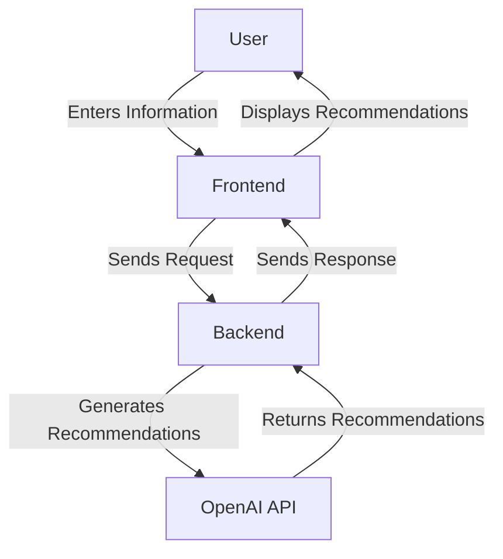
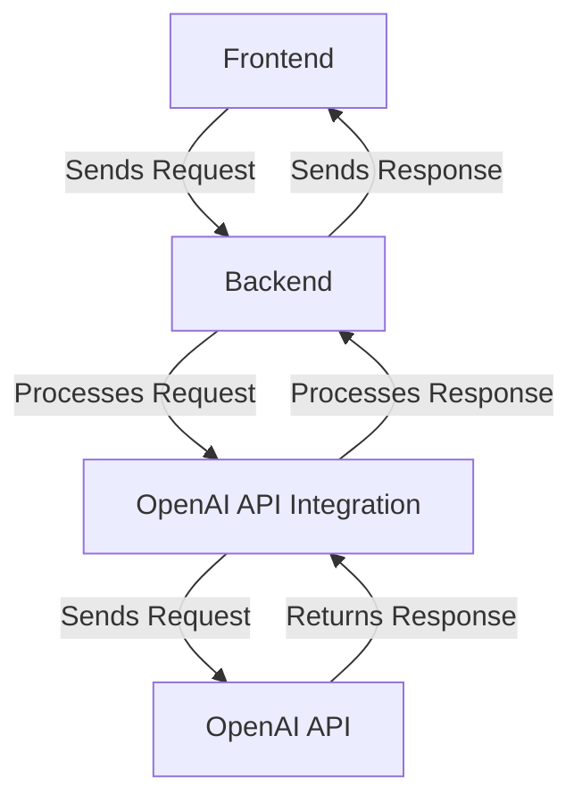
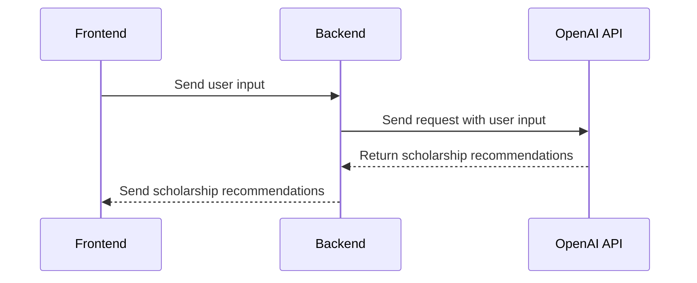
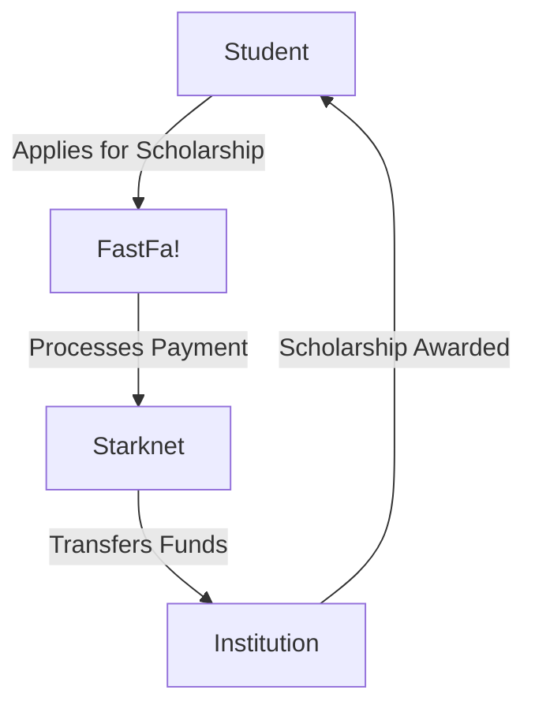
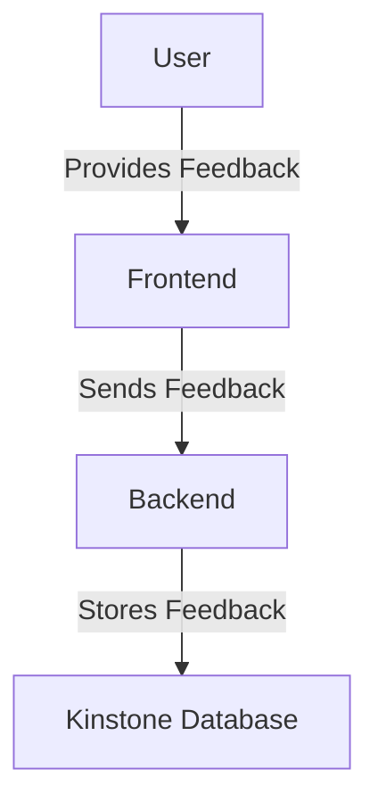

Relevant source files

The following file was used as context for generating this wiki page:

- [README.md](https://github.com/agattani123/Fast-Fa/blob/master/README.md)

# Introduction

FastFa! is a web application that aims to simplify the process of finding and applying for scholarships by leveraging the power of generative AI. It takes a student's personal information and financial needs as input, and uses OpenAI's GPT-4 model to generate a tailored list of scholarships that match the user's specific circumstances.

## Overview

The application is built using JavaScript, with Node.js and Express.js for the backend, and HTML, CSS, and JavaScript for the frontend. It utilizes the OpenAI API to process user input and generate personalized scholarship recommendations. The payment method is implemented using Starknet, allowing students to securely receive scholarships directly from institutions. Additionally, user feedback is stored in the Kinstone database system.

## Architecture

### Frontend

The frontend of FastFa! is responsible for collecting user input and displaying the generated scholarship recommendations. It is built using HTML, CSS, and JavaScript, providing a user-friendly interface for interacting with the application.

Sources: [README.md:5-7](), [README.md:12-13]()

### Backend

The backend of FastFa! is built using Node.js and Express.js. It acts as an intermediary between the frontend and the OpenAI API, handling the communication and processing of user input and scholarship recommendations.

Sources: [README.md:5-7](), [README.md:12-13]()

### OpenAI API Integration

FastFa! integrates with the OpenAI API to leverage the power of GPT-4 for generating personalized scholarship recommendations based on user input.

Sources: [README.md:5-7](), [README.md:12-13]()

### Payment Integration

FastFa! utilizes Starknet for secure payment processing, allowing students to receive scholarships directly from institutions.

Sources: [README.md:7]()

### Feedback Storage

User feedback is stored in the Kinstone database system, potentially for future analysis and improvement of the application.

Sources: [README.md:7]()

## Key Features

| Feature | Description |
| --- | --- |
| Personalized Scholarship Recommendations | Generates a list of scholarships tailored to the user's background, interests, and financial situation using OpenAI's GPT-4 model. |
| Secure Payment Integration | Utilizes Starknet for secure payment processing, allowing students to receive scholarships directly from institutions. |
| Feedback Storage | Stores user feedback in the Kinstone database system for potential future analysis and improvement. |

Sources: [README.md:2-7](), [README.md:12-13]()

## Challenges and Lessons Learned

One of the main challenges faced during the development of FastFa! was integrating the OpenAI API and ensuring accurate and relevant responses. Additionally, ensuring a user-friendly and intuitive application design required careful planning and implementation.

Through this project, the team learned more about working with AI and how tailoring it to specific use cases, such as education, can be extremely beneficial for society. They also gained insights into the complexities of financial aid and scholarship applications, and how technology can be used to simplify these processes.

Sources: [README.md:14-15](), [README.md:17-18]()

## Future Enhancements

The team plans to expand FastFa! with additional features, such as a more detailed breakdown of each scholarship and a feature that allows users to track their applications. They also aim to improve the AI model to ensure more accurate and personalized results.

Sources: [README.md:19-20]()

## Conclusion

FastFa! is a web application that leverages the power of generative AI to simplify the process of finding and applying for scholarships. By taking a student's personal information and financial needs as input, it generates a tailored list of scholarships that match the user's specific circumstances. With its secure payment integration and feedback storage system, FastFa! aims to provide a comprehensive solution for students seeking financial aid.