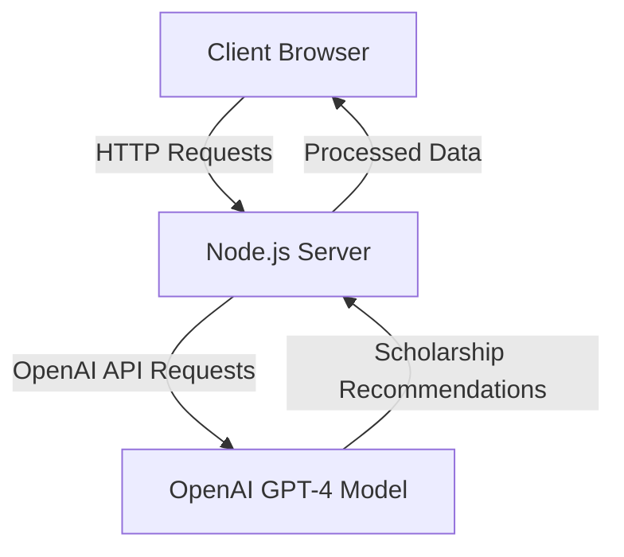
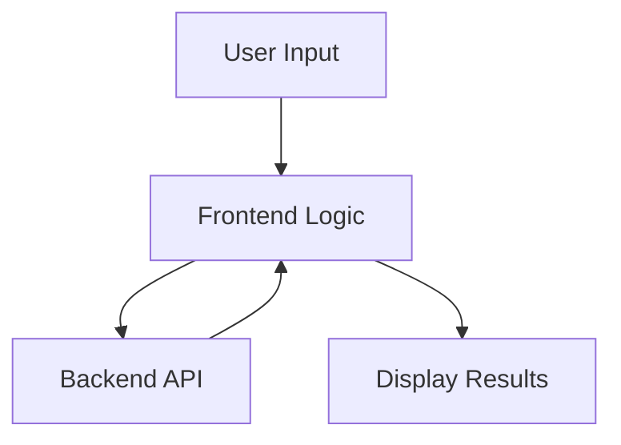
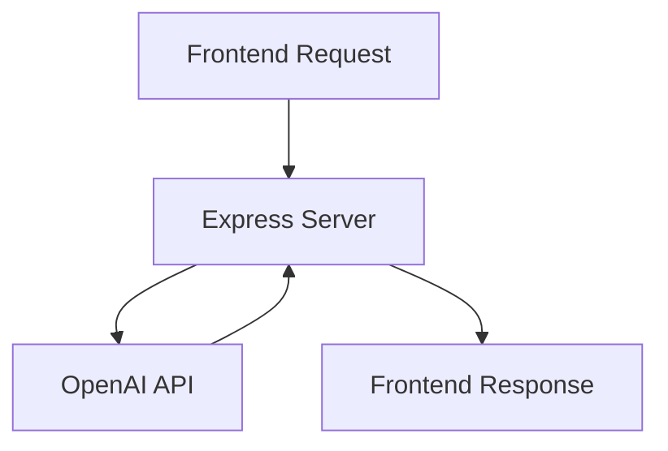
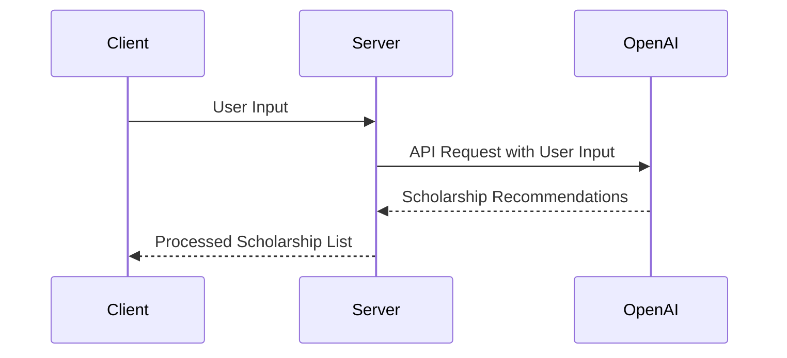
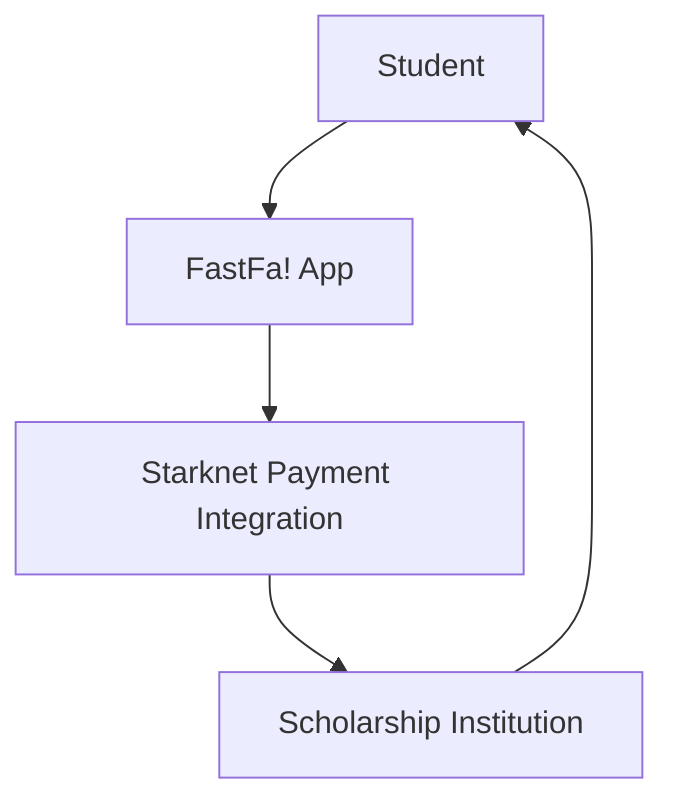
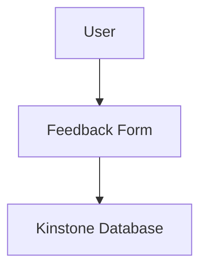

Relevant source files

The following file was used as context for generating this wiki page:

- [README.md](https://github.com/agattani123/Fast-Fa/blob/master/README.md)

# Introduction

FastFa! is a web application that aims to simplify the process of finding and applying for scholarships by leveraging the power of generative AI. It provides a user-friendly interface where students can input their personal information, interests, and financial needs, and the application generates a tailored list of scholarships based on their specific circumstances.

## Overview

The primary goal of FastFa! is to address the challenges students face when searching for and applying to scholarships. The traditional process can be time-consuming, overwhelming, and often leads to missed opportunities due to the vast number of scholarships available and the difficulty in finding relevant ones. FastFa! aims to streamline this process by utilizing OpenAI's GPT-4 model to analyze the user's input and generate a personalized list of scholarships that match their profile.

## Architecture

FastFa! follows a client-server architecture, with the frontend built using HTML, CSS, and JavaScript, and the backend implemented using Node.js and Express.js. The application interacts with the OpenAI API to leverage the GPT-4 model for generating scholarship recommendations.

Sources: [README.md](https://github.com/agattani123/Fast-Fa/blob/master/README.md)

## Frontend

The frontend of FastFa! is responsible for collecting user input and displaying the generated scholarship recommendations. It is built using standard web technologies such as HTML, CSS, and JavaScript.

Sources: [README.md](https://github.com/agattani123/Fast-Fa/blob/master/README.md)

## Backend

The backend of FastFa! is built using Node.js and Express.js. It serves as the intermediary between the frontend and the OpenAI API, handling the communication and processing of data.

Sources: [README.md](https://github.com/agattani123/Fast-Fa/blob/master/README.md)

## OpenAI Integration

FastFa! integrates with the OpenAI API to leverage the GPT-4 model for generating scholarship recommendations. The backend sends user input to the OpenAI API, which processes the data and returns a list of relevant scholarships based on the user's profile.

Sources: [README.md](https://github.com/agattani123/Fast-Fa/blob/master/README.md)

## Payment Integration

FastFa! incorporates a secure payment method built on Starknet, which allows students to receive scholarships directly from institutions. This feature aims to streamline the scholarship application and disbursement process.

Sources: [README.md](https://github.com/agattani123/Fast-Fa/blob/master/README.md)

## Feedback and Data Storage

FastFa! includes a feedback system that allows users to provide their input and suggestions. The feedback responses are stored in the Kinstone database system for future analysis and improvement.

Sources: [README.md](https://github.com/agattani123/Fast-Fa/blob/master/README.md)

## Conclusion

FastFa! is a innovative web application that leverages the power of generative AI to simplify the scholarship application process for students. By integrating with the OpenAI API and utilizing the GPT-4 model, FastFa! provides personalized scholarship recommendations based on the user's input. Additionally, it incorporates secure payment integration and a feedback system to enhance the overall user experience and facilitate continuous improvement.

Sources: [README.md](https://github.com/agattani123/Fast-Fa/blob/master/README.md)