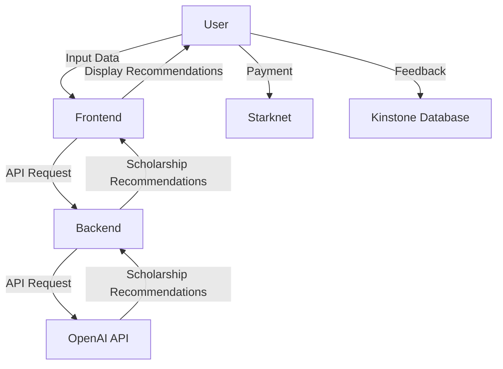
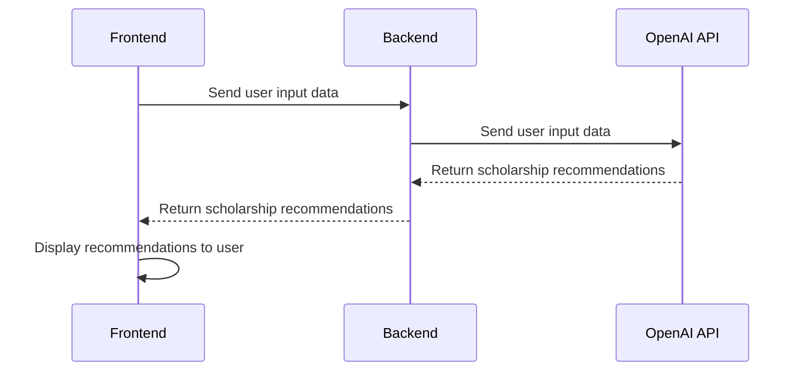
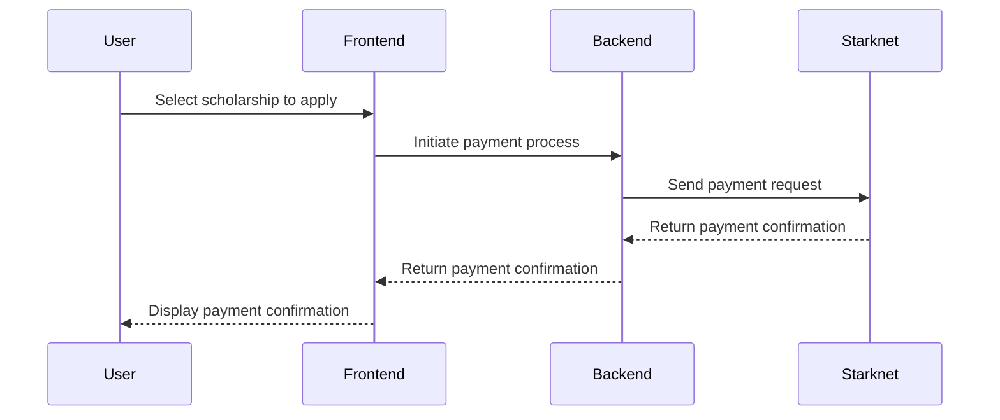
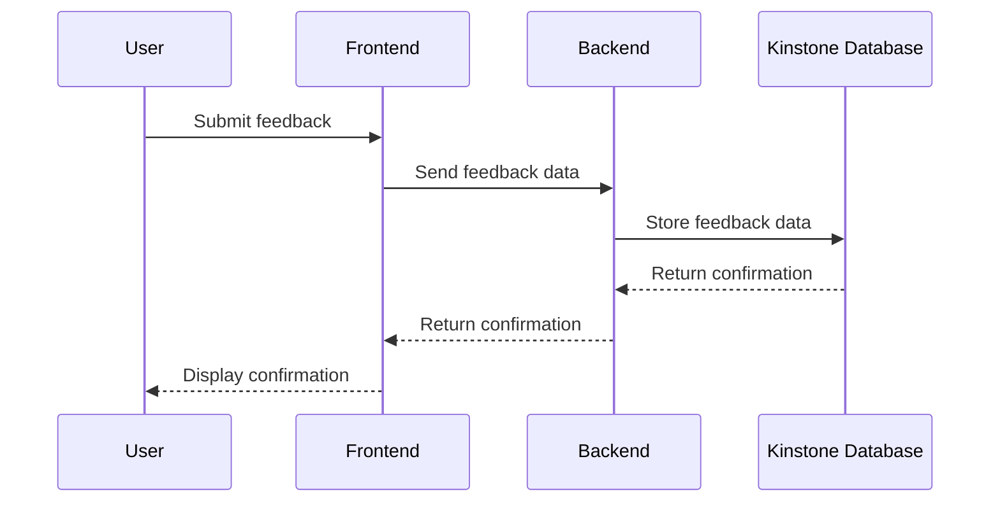

Relevant source files

The following file was used as context for generating this wiki page:

- [README.md](https://github.com/agattani123/Fast-Fa/blob/master/README.md)

# Architecture Overview

## Introduction

FastFa! is a web application designed to simplify the process of finding and applying for scholarships. It leverages OpenAI's GPT-4 model to generate a personalized list of scholarships based on the user's input, such as personal information, financial needs, and interests. The application aims to streamline the scholarship application process, which can often be time-consuming and overwhelming, by providing tailored recommendations and facilitating secure payments through Starknet. Additionally, FastFa! incorporates a feedback system that stores user responses in the Kinstone database.

Sources: [README.md](https://github.com/agattani123/Fast-Fa/blob/master/README.md)

## Application Architecture

### Frontend

The frontend of FastFa! is built using HTML, CSS, and JavaScript. It provides a user-friendly interface for users to input their personal information and receive a list of recommended scholarships. The frontend communicates with the backend through API calls to fetch and display the scholarship recommendations.

Sources: [README.md](https://github.com/agattani123/Fast-Fa/blob/master/README.md)

### Backend

The backend of FastFa! is built using Node.js and Express.js. It serves as the intermediary between the frontend and the OpenAI API, handling the user input and processing it through the GPT-4 model to generate scholarship recommendations. The backend also manages the integration with Starknet for secure payments and the Kinstone database for storing user feedback.

Sources: [README.md](https://github.com/agattani123/Fast-Fa/blob/master/README.md)

### Data Flow

The data flow in FastFa! follows these steps:

1. The user inputs their personal information and financial needs through the frontend interface.
2. The frontend sends a request to the backend with the user's input data.
3. The backend processes the user's input and sends a request to the OpenAI API with the relevant data.
4. The OpenAI API generates a list of scholarship recommendations based on the input data using the GPT-4 model.
5. The backend receives the scholarship recommendations from the OpenAI API and sends them back to the frontend.
6. The frontend displays the list of recommended scholarships to the user.
7. If the user chooses to apply for a scholarship, the payment process is facilitated through the integration with Starknet.
8. User feedback is collected and stored in the Kinstone database.

Sources: [README.md](https://github.com/agattani123/Fast-Fa/blob/master/README.md)

## OpenAI Integration

FastFa! integrates with the OpenAI API to leverage the GPT-4 model for generating scholarship recommendations. The backend sends a request to the OpenAI API with the user's input data, and the API responds with a list of scholarships tailored to the user's specific circumstances.

Sources: [README.md](https://github.com/agattani123/Fast-Fa/blob/master/README.md)

## Payment Integration (Starknet)

FastFa! incorporates a secure payment method through Starknet, which allows students to receive scholarships directly from the institutions. When a user selects a scholarship to apply for, the payment process is facilitated through the integration with Starknet.

Sources: [README.md](https://github.com/agattani123/Fast-Fa/blob/master/README.md)

## Feedback System (Kinstone Database)

FastFa! collects user feedback and stores it in the Kinstone database. This feedback can be used to improve the application and provide better scholarship recommendations in the future.

Sources: [README.md](https://github.com/agattani123/Fast-Fa/blob/master/README.md)

## Key Components

| Component | Description |
| --- | --- |
| Frontend | User interface built with HTML, CSS, and JavaScript |
| Backend | Server-side logic built with Node.js and Express.js |
| OpenAI API Integration | Integration with OpenAI's GPT-4 model for generating scholarship recommendations |
| Starknet Integration | Integration with Starknet for secure payment processing |
| Kinstone Database Integration | Integration with Kinstone database for storing user feedback |

Sources: [README.md](https://github.com/agattani123/Fast-Fa/blob/master/README.md)

## Conclusion

FastFa! is a web application that aims to simplify the scholarship application process by leveraging OpenAI's GPT-4 model to generate personalized scholarship recommendations based on user input. It incorporates secure payment processing through Starknet and a feedback system that stores user responses in the Kinstone database. The application's architecture is designed to provide a seamless user experience while ensuring data privacy and security.

Sources: [README.md](https://github.com/agattani123/Fast-Fa/blob/master/README.md)