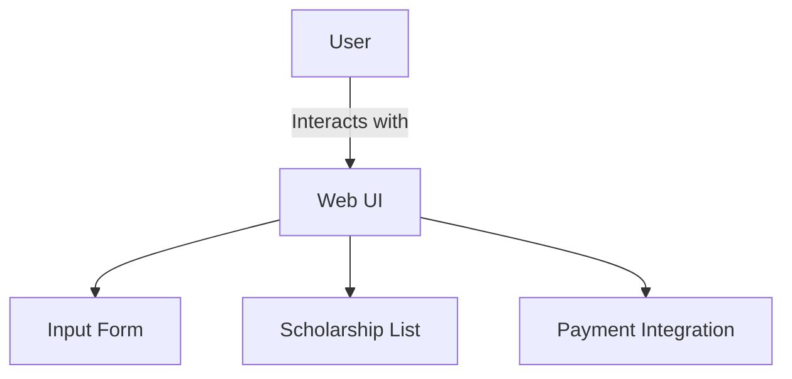
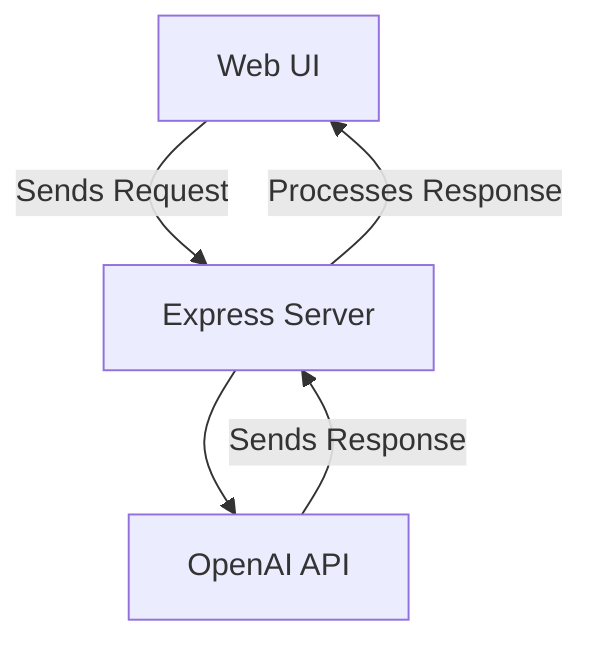
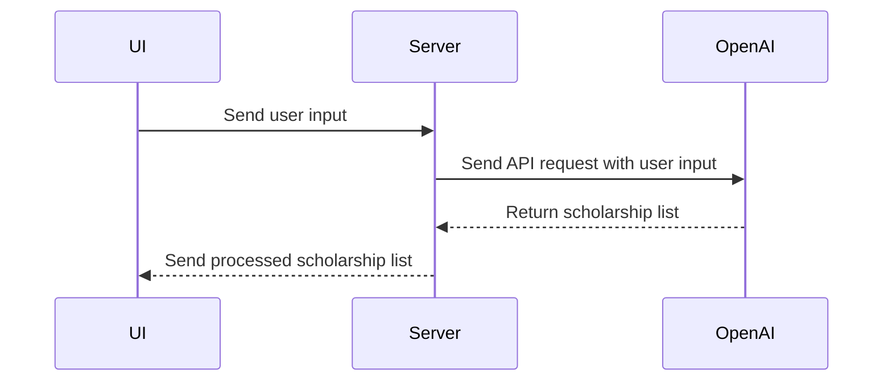
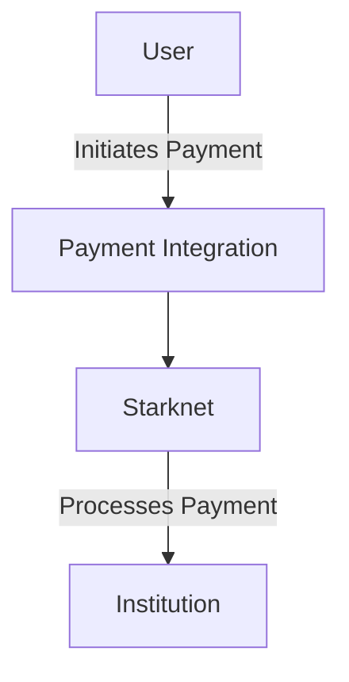
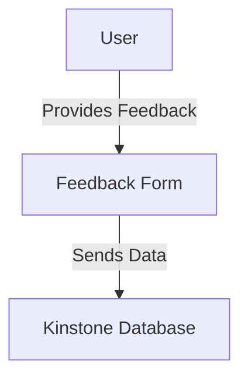

Relevant source files

The following file was used as context for generating this wiki page:

- [README.md](https://github.com/agattani123/Fast-Fa/blob/master/README.md)

# Architecture Overview

## Introduction

FastFa! is a web application that aims to simplify the process of finding and applying for scholarships. It leverages OpenAI's GPT-4 model to generate a personalized list of scholarships based on the user's input. The application also integrates with Starknet for secure payment processing and Kinstone for storing user feedback. This overview provides an architectural breakdown of the FastFa! system, its components, data flow, and key implementation details.

## Frontend Architecture

### User Interface

The frontend of FastFa! is built using HTML, CSS, and JavaScript. It provides a user-friendly interface for users to input their personal information and financial needs. The UI also displays the list of generated scholarships and facilitates the payment process through Starknet integration.

Sources: [README.md:3-5](), [README.md:8-9]()

## Backend Architecture

### Server and API Integration

The backend of FastFa! is built using Node.js and Express.js. It serves as the intermediary between the frontend and the OpenAI API, handling the API requests and processing the responses.

Sources: [README.md:3-4](), [README.md:8]()

### OpenAI Integration

FastFa! integrates with the OpenAI API to leverage the GPT-4 model for generating personalized scholarship lists. The user's input is sent to the OpenAI API, which processes the data and returns a list of relevant scholarships.

Sources: [README.md:2-3](), [README.md:8]()

## Payment Integration

FastFa! utilizes Starknet for secure payment processing, allowing users to receive scholarships directly from institutions.

Sources: [README.md:4]()

## Feedback Storage

User feedback is stored in the Kinstone database system, which is integrated into the FastFa! application.

Sources: [README.md:10]()

## Key Components and Features

| Component | Description |
| --- | --- |
| Web UI | User-friendly interface for input and displaying results |
| Express Server | Handles API requests and responses |
| OpenAI Integration | Leverages GPT-4 model for scholarship generation |
| Starknet Integration | Secure payment processing for scholarship disbursement |
| Kinstone Integration | Stores user feedback in a database |

Sources: [README.md:2-10]()

## Conclusion

FastFa! is a comprehensive web application that aims to simplify the scholarship application process by leveraging AI and integrating with various third-party services. Its architecture consists of a frontend built with HTML, CSS, and JavaScript, a backend built with Node.js and Express.js, and integrations with OpenAI for AI-powered scholarship generation, Starknet for secure payment processing, and Kinstone for storing user feedback.

Sources: [README.md]()