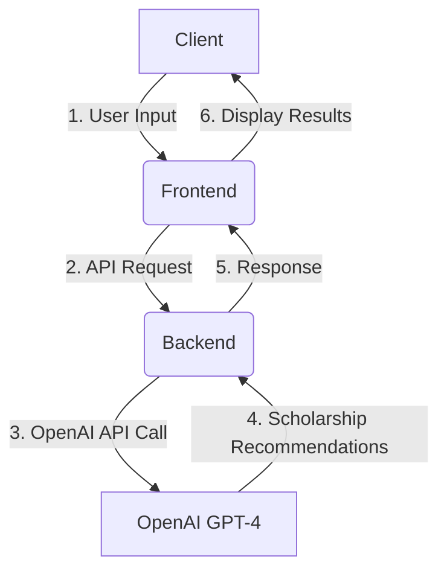
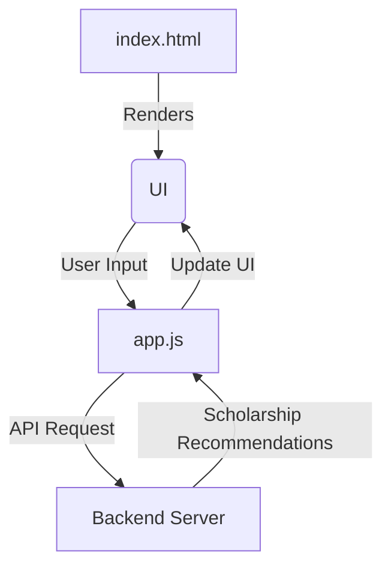
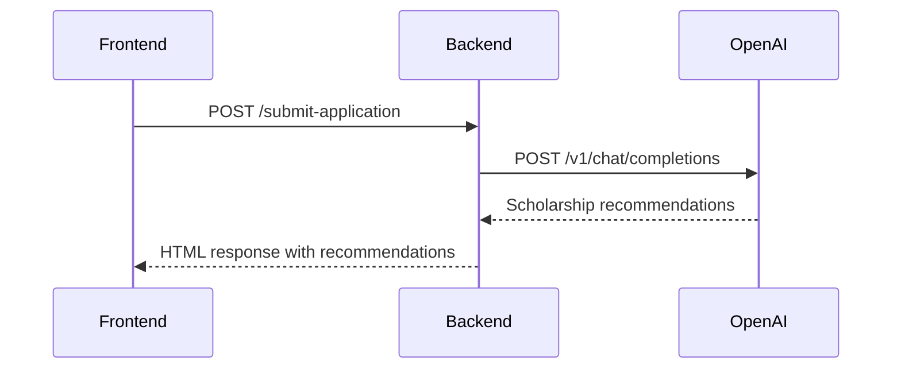
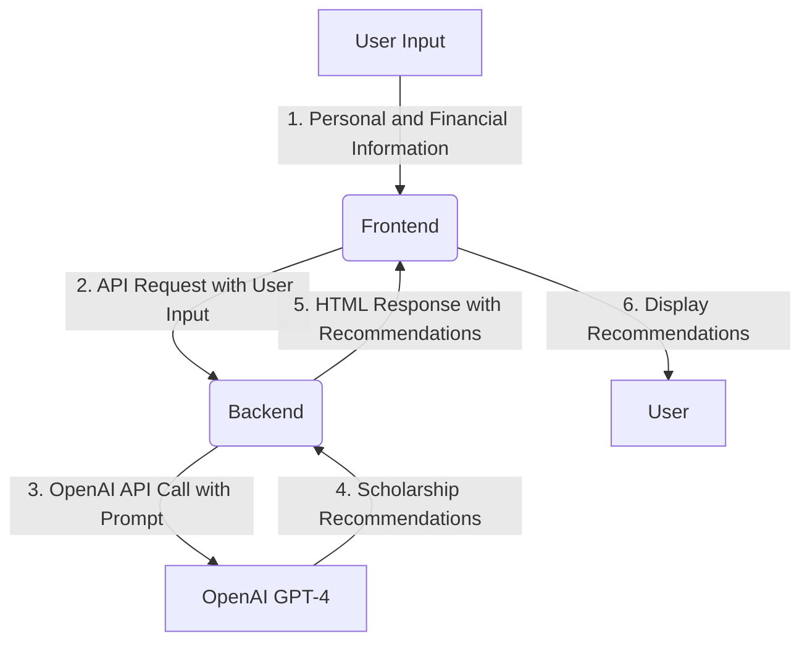

Relevant source files

The following files were used as context for generating this wiki page:

- [README.md](https://github.com/agattani123/Fast-Fa/blob/master/README.md)
- [scholarship_app/server.js](https://github.com/agattani123/Fast-Fa/blob/master/scholarship_app/server.js)
- [public/index.html](https://github.com/agattani123/Fast-Fa/blob/master/public/index.html)
- [public/styles.css](https://github.com/agattani123/Fast-Fa/blob/master/public/styles.css)
- [public/app.js](https://github.com/agattani123/Fast-Fa/blob/master/public/app.js)

# Architecture Overview

## Introduction

FastFa! is a web application designed to simplify the process of finding and applying for scholarships. It leverages OpenAI's GPT-4 language model to generate personalized scholarship recommendations based on the user's input. The application aims to provide a user-friendly interface for students to discover relevant scholarship opportunities tailored to their specific circumstances.

Sources: [README.md](https://github.com/agattani123/Fast-Fa/blob/master/README.md)

## Application Architecture

FastFa! follows a client-server architecture, with the frontend built using HTML, CSS, and JavaScript, and the backend implemented using Node.js and Express.js. The application flow can be summarized as follows:

1. The user interacts with the frontend, providing personal information and financial details.
2. The frontend sends an API request to the backend server with the user's input.
3. The backend server processes the request and makes a call to the OpenAI API using the user's input as a prompt.
4. The OpenAI GPT-4 model generates personalized scholarship recommendations based on the prompt.
5. The backend server receives the recommendations from OpenAI and sends them back to the frontend.
6. The frontend displays the scholarship recommendations to the user.

Sources: [README.md](https://github.com/agattani123/Fast-Fa/blob/master/README.md), [scholarship_app/server.js](https://github.com/agattani123/Fast-Fa/blob/master/scholarship_app/server.js)

## Frontend Architecture

The frontend of FastFa! is built using HTML, CSS, and JavaScript. It provides a user interface for capturing user input and displaying the scholarship recommendations generated by the backend.

1. The `index.html` file serves as the entry point and renders the user interface.
2. The user interacts with the UI, providing personal information and financial details.
3. The `app.js` file handles the user input and sends an API request to the backend server.
4. The backend server processes the request and returns the scholarship recommendations.
5. The `app.js` file updates the UI with the received scholarship recommendations.

Sources: [public/index.html](https://github.com/agattani123/Fast-Fa/blob/master/public/index.html), [public/app.js](https://github.com/agattani123/Fast-Fa/blob/master/public/app.js), [public/styles.css](https://github.com/agattani123/Fast-Fa/blob/master/public/styles.css)

## Backend Architecture

The backend of FastFa! is built using Node.js and Express.js. It serves as the intermediary between the frontend and the OpenAI API, handling API requests and responses.

1. The frontend sends a POST request to the `/submit-application` endpoint with the user's input.
2. The backend processes the request and sends a POST request to the OpenAI API's `/v1/chat/completions` endpoint with the user's input as a prompt.
3. The OpenAI API responds with personalized scholarship recommendations based on the prompt.
4. The backend receives the recommendations and sends an HTML response back to the frontend, containing the scholarship recommendations.

The backend also serves static files from the `public` directory, allowing the frontend to access the necessary HTML, CSS, and JavaScript files.

Sources: [scholarship_app/server.js](https://github.com/agattani123/Fast-Fa/blob/master/scholarship_app/server.js)

## Data Flow

The data flow in FastFa! can be summarized as follows:

1. The user provides personal and financial information through the frontend interface.
2. The frontend sends an API request to the backend with the user's input.
3. The backend constructs a prompt based on the user's input and sends it to the OpenAI API.
4. The OpenAI GPT-4 model generates personalized scholarship recommendations based on the prompt.
5. The backend receives the recommendations and sends an HTML response back to the frontend, containing the scholarship recommendations.
6. The frontend displays the scholarship recommendations to the user.

Sources: [README.md](https://github.com/agattani123/Fast-Fa/blob/master/README.md), [scholarship_app/server.js](https://github.com/agattani123/Fast-Fa/blob/master/scholarship_app/server.js), [public/app.js](https://github.com/agattani123/Fast-Fa/blob/master/public/app.js)

## Security and Payment Integration

FastFa! integrates with Starknet for secure payment processing, allowing students to receive scholarships directly from institutions. The payment integration is mentioned in the README file, but the implementation details are not provided in the given source files.

Sources: [README.md](https://github.com/agattani123/Fast-Fa/blob/master/README.md)

## Feedback and Analytics

FastFa! includes a feedback system integrated with the Kintone backend. Users can provide feedback through a form, which is likely stored and processed in the Kintone database. However, the implementation details of the feedback system are not available in the provided source files.

Sources: [README.md](https://github.com/agattani123/Fast-Fa/blob/master/README.md)

## Conclusion

FastFa! is a web application that leverages OpenAI's GPT-4 language model to provide personalized scholarship recommendations to students. It follows a client-server architecture, with the frontend handling user input and displaying results, and the backend acting as an intermediary between the frontend and the OpenAI API. The application aims to simplify the scholarship application process by tailoring recommendations to the user's specific circumstances.