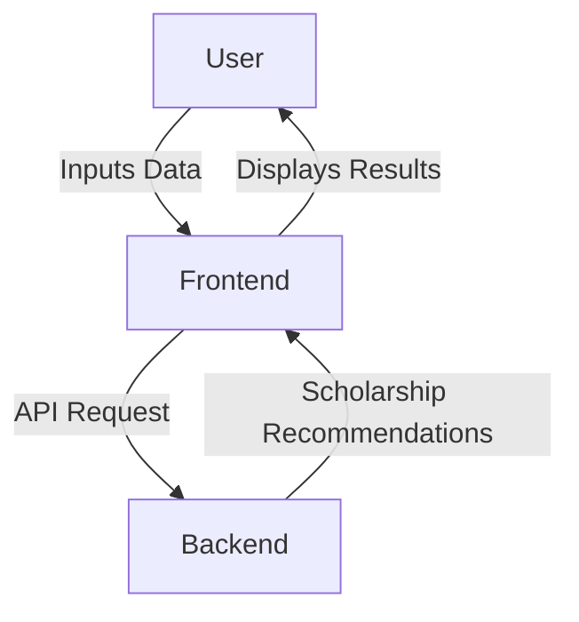
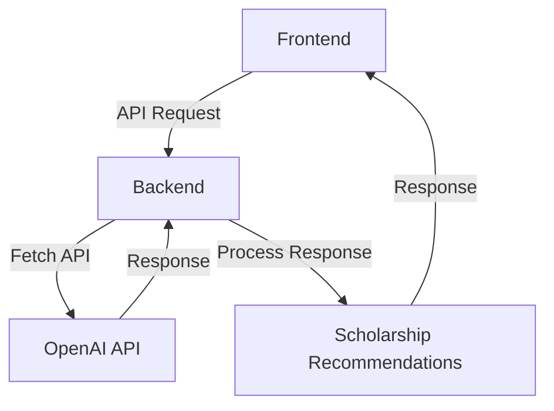
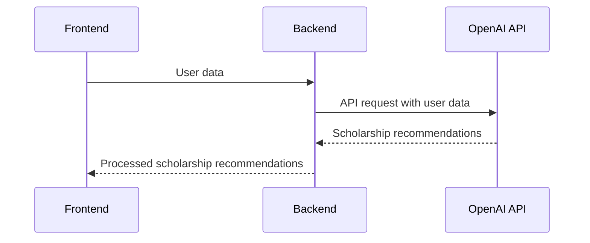
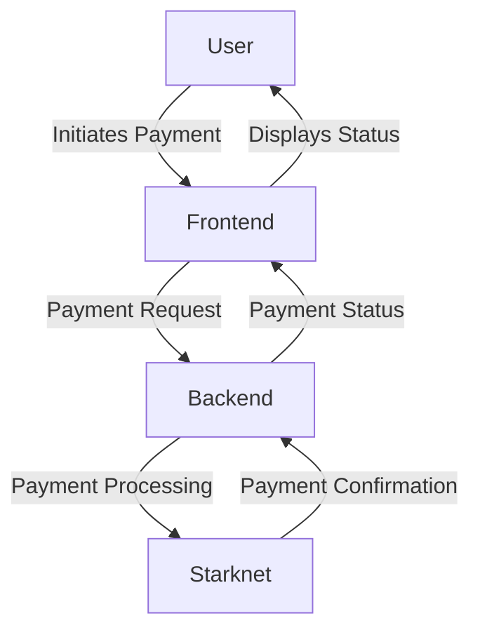
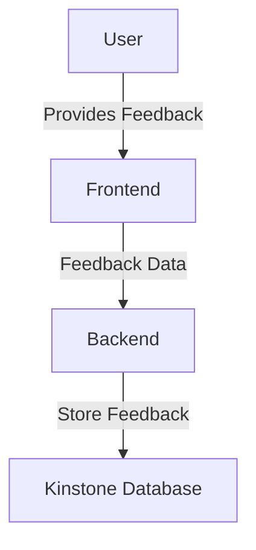

Relevant source files

The following file was used as context for generating this wiki page:

- [README.md](https://github.com/agattani123/Fast-Fa/blob/master/README.md)

# Architecture Overview

## Introduction

FastFa! is a web application that aims to simplify the process of finding and applying for scholarships by leveraging the power of generative AI. The application takes user input, processes it through OpenAI's GPT-4 model, and generates a personalized list of scholarships tailored to the user's background, interests, and financial situation. The application also integrates with Starknet for secure payment processing, allowing students to receive scholarships directly from institutions. Additionally, user feedback is stored in the Kinstone database system.

## Application Architecture

### Frontend

The frontend of FastFa! is built using HTML, CSS, and JavaScript. It provides a user-friendly interface for users to input their personal information and preferences. The frontend communicates with the backend via API calls to fetch scholarship recommendations and handle user interactions.

Sources: [README.md:11-12]()

### Backend

The backend of FastFa! is built using Node.js and Express.js. It acts as an intermediary between the frontend and the OpenAI API, handling the communication and processing of user data.

Sources: [README.md:11-12]()

### OpenAI Integration

FastFa! integrates with the OpenAI API to leverage the power of generative AI models, specifically GPT-4. The backend sends user data to the OpenAI API, which processes the information and generates a list of relevant scholarship recommendations.

Sources: [README.md:11-12]()

### Payment Processing (Starknet)

FastFa! integrates with Starknet for secure payment processing, allowing students to receive scholarships directly from institutions. The payment flow likely involves the following steps:

1. User selects desired scholarships and initiates payment process.
2. Frontend communicates with the backend to initiate payment.
3. Backend interacts with Starknet to process the payment securely.
4. Upon successful payment, the scholarship funds are transferred to the user's account.

Sources: [README.md:12]()

### Feedback Storage (Kinstone)

FastFa! stores user feedback in the Kinstone database system. The feedback flow likely involves the following steps:

1. User provides feedback through the frontend.
2. Frontend sends the feedback data to the backend.
3. Backend processes and stores the feedback data in the Kinstone database.

Sources: [README.md:12]()

## Key Components and Features

| Component | Description |
| --- | --- |
| Frontend | User-friendly interface for inputting data and displaying scholarship recommendations |
| Backend | Handles communication between frontend, OpenAI API, and other services |
| OpenAI Integration | Leverages GPT-4 model to generate personalized scholarship recommendations |
| Payment Processing (Starknet) | Secure payment processing for receiving scholarships |
| Feedback Storage (Kinstone) | Stores user feedback in the Kinstone database system |

Sources: [README.md:11-12]()

## Conclusion

FastFa! is a web application that aims to simplify the scholarship application process by leveraging generative AI and integrating with various services for secure payment processing and feedback storage. The application's architecture is designed to provide a seamless user experience while ensuring data privacy and security.